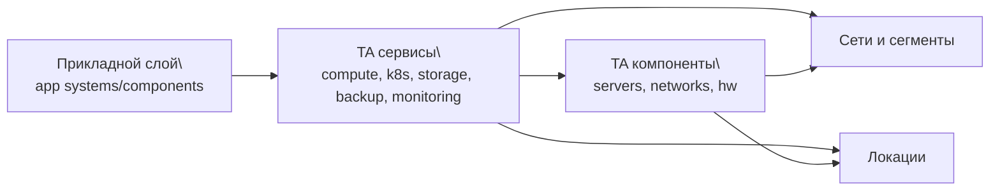
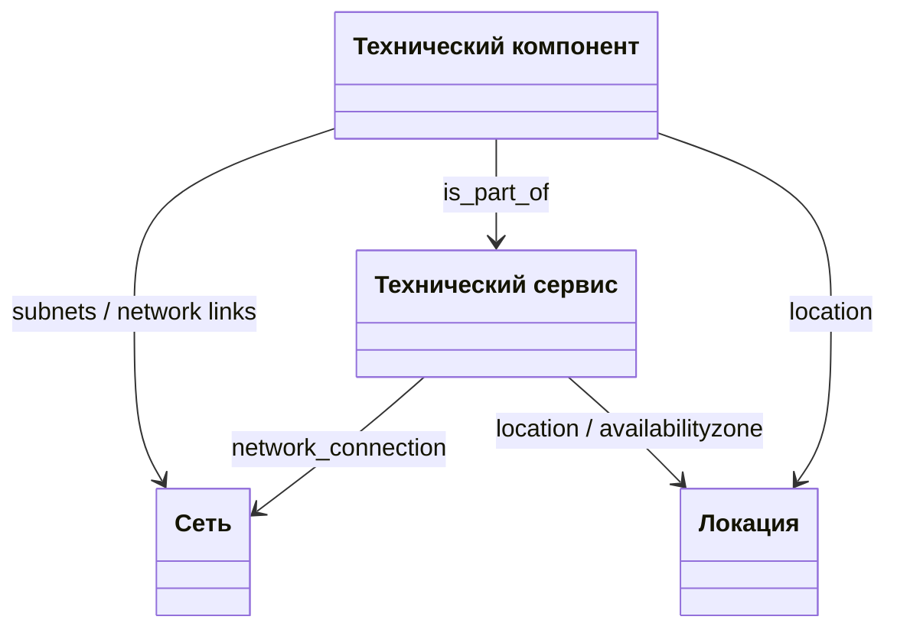

# Зачем вести техническую документацию

Этот документ отвечает на базовый вопрос: зачем вообще системно вести модель технической архитектуры, а не хранить информацию в разрозненных таблицах и описаниях.

## Что дает полноценное ведение документации

| Что получаем | Практическая польза |
|---|---|
| Единый источник истины | Архитекторы, эксплуатация и владельцы сервисов смотрят на один и тот же контур, а не на разные версии данных |
| Автоматизированные проверки | Можно регулярно запускать проверки полноты и связности, а не искать ошибки вручную |
| Построение схем и визуализаций | Из одних и тех же данных строятся диаграммы, карточки и таблицы без ручной перерисовки |
| Поиск противоречий | Быстро выявляются разрывы ссылок, дубли объектов, конфликтующие локации и несогласованные связи |
| Контроль изменений | Понятно, что изменилось в контуре и на что это влияет |
| Ускорение онбординга | Новый участник быстрее понимает, как устроена инфраструктура и где находится нужный объект |

## Какие проверки становятся возможными

1. Проверка наличия обязательных сущностей в контуре.
2. Проверка связности (`dc -> network -> service -> component`).
3. Проверка ссылочной целостности (все ссылки ведут на существующие объекты).
4. Проверка согласованности между реестрами и карточками.
5. Проверка готовности контура к использованию в аналитике и схемах.

## Почему это важно для ежедневной работы

Без формализованной модели обычно возникают:

- дубли одной и той же сущности под разными именами;
- неполные карточки и «пустые» блоки в интерфейсе;
- разные трактовки одного и того же сервиса у разных команд;
- высокая стоимость любого изменения.

С формализованной документацией эти риски заметно снижаются, потому что данные валидируются и используются повторно во всех представлениях.

## Как слой TA связывается с прикладным слоем

Связь идет не напрямую «приложение -> сервер», а через технические сервисы и их компоненты.

### Основные точки связи

| Где в TA | Поле связи с прикладным слоем | Что связываем |
|---|---|---|
| `seaf.company.ta.services.compute_services` | `app_components` | Прикладные системы/компоненты, которые используют вычислительный сервис |
| `seaf.company.ta.services.k8s` | `app_components` | Прикладные системы, размещенные на кластере Kubernetes |
| `seaf.company.ta.services.k8s_deployments` | `app_components` | Конкретные прикладные компоненты, развернутые в deployment |
| `seaf.company.ta.services.storages` | `app_components` | Какие прикладные системы используют хранилище |
| `seaf.company.ta.services.backups` | `app_components` | Какие прикладные системы покрыты резервным копированием |
| `seaf.company.ta.services.monitorings` | `app_components` | Какие прикладные системы покрыты мониторингом |

Практический смысл: можно пройти путь от прикладной системы до технической реализации и обратно.

## Короткий глоссарий: сервисы и компоненты

| Термин | Где в модели | Что это | Зачем нужен |
|---|---|---|---|
| Технический сервис | `seaf.company.ta.services.*` | Логическая техническая функция (например, вычислительный сервис, сеть, мониторинг) | Описывает **что** предоставляет инфраструктура |
| Технический компонент | `seaf.company.ta.components.*` | Конкретный ресурс исполнения (сервер, сетевое устройство, СХД, пользовательское устройство) | Описывает **на чем** реализуется сервис |

### Главное отличие

- **Сервис** — уровень функции и ответственности.
- **Компонент** — уровень реализации и ресурсов.

### Как они связываются

Базовая связь: компонент входит в сервис через `is_part_of`.

### Пример на практике

- `seaf.company.ta.services.compute_services` — описывает вычислительный сервис как функцию.
- `seaf.company.ta.components.servers` — описывает серверы, на которых этот сервис работает.

Такое разделение позволяет одновременно видеть бизнес-смысл сервиса и его техническую реализацию.
