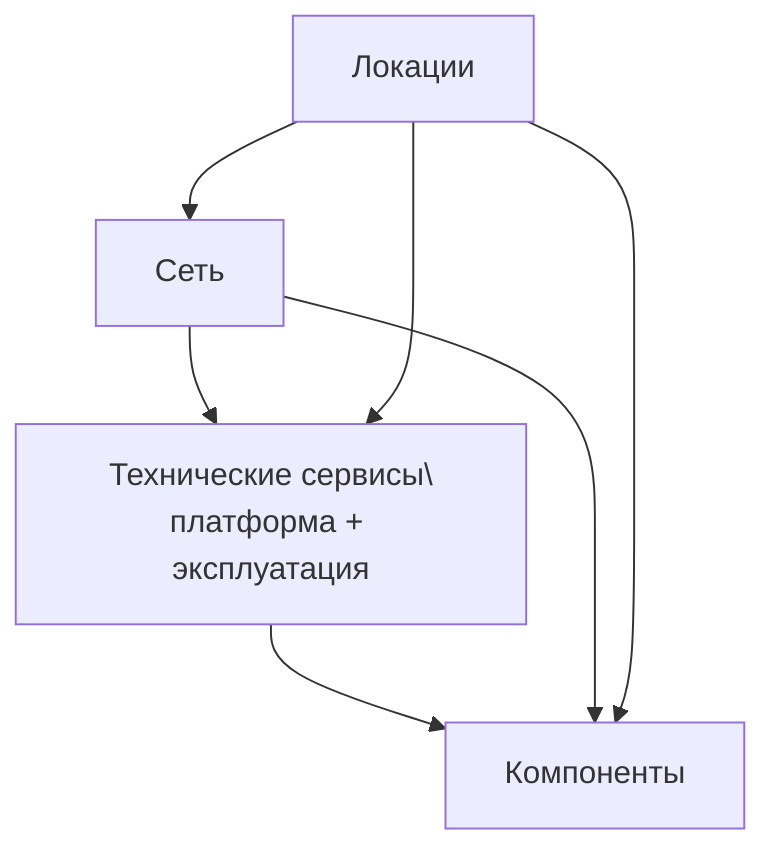

# С чего начинать заполнение модели

Документ задает практический порядок заполнения, который минимизирует разрывы связей и "пустые" карточки.

## 1. Принцип заполнения

Заполняйте модель по зависимостям: сначала фундамент, затем то, что на него ссылается.

## 2. Порядок заполнения по слоям

| Слой | Файлы | Что должно быть готово до слоя | Критерий завершения слоя |
|---|---|---|---|
| Локации | `dc_region.yaml`, `dc_az.yaml`, `dc.yaml`, `dc_office.yaml` | Ничего | Сформирована иерархия `region -> az -> dc/office` |
| Сеть | `network_segment.yaml`, `network.yaml`, `network_links.yaml` | Локации | У каждой сети заполнены `segment` и `location`, а каждая пара `location + zone` в `network_segment.yaml` уникальна |
| Технические сервисы (платформа + эксплуатация) | `compute_service.yaml`, `cluster_virtualization.yaml`, `storage.yaml`, `software.yaml`, `k8s.yaml`, `backup.yaml`, `monitoring.yaml`, `kb.yaml`, `environment.yaml`, `stand.yaml`, `logical_link.yaml` | Локации и сеть | У сервисов заполнены связи с сетью/локацией и эксплуатационные атрибуты |
| Компоненты | `server.yaml`, `network_component.yaml`, `hw_storage.yaml`, `user_device.yaml`, `k8s_*` | Технические сервисы | У компонентов заполнены `is_part_of` и сетевые связи |

## 3. Справочник всех сущностей технической архитектуры

| Сущность | Файл | Для чего нужна | Ключевые связи (минимум) |
|---|---|---|---|
| `seaf.company.ta.services.dc_regions` | `dc_region.yaml` | Регионы размещения | Используется в `dc_az.region`, `dc_office.region` |
| `seaf.company.ta.services.dc_azs` | `dc_az.yaml` | Зоны доступности | `region` |
| `seaf.company.ta.services.dcs` | `dc.yaml` | ЦОДы | `availabilityzone` |
| `seaf.company.ta.services.dc_offices` | `dc_office.yaml` | Офисные площадки | `region` |
| `seaf.company.ta.services.network_segments` | `network_segment.yaml` | Сегменты сети и зоны | `location` |
| `seaf.company.ta.services.networks` | `network.yaml` | Сети LAN/WAN | `segment`, `location` |
| `seaf.company.ta.components.networks` | `network_component.yaml` | Сетевые устройства | `network_connection`, `location` |
| `seaf.company.ta.services.network_links` | `network_links.yaml` | Каналы/линии между сетями | `network_connection` |
| `seaf.company.ta.services.cluster_virtualizations` | `cluster_virtualization.yaml` | Платформы виртуализации | `network_connection`, `location` и/или `availabilityzone` |
| `seaf.company.ta.components.hw_storages` | `hw_storage.yaml` | Аппаратные СХД | `network_connection`, `location` |
| `seaf.company.ta.services.storages` | `storage.yaml` | Сервисы хранения данных | `softwares`, `network_connection`, `location`/`availabilityzone` |
| `seaf.company.ta.services.softwares` | `software.yaml` | ПО технического слоя | Используется в `storages.softwares`, `k8s.softwares` |
| `seaf.company.ta.components.servers` | `server.yaml` | Серверы (физические и виртуальные) | `is_part_of`, `subnets`, `location` |
| `seaf.company.ta.services.compute_services` | `compute_service.yaml` | Вычислительные сервисы | `network_connection`, `location`/`availabilityzone`, `high_availability` |
| `seaf.company.ta.services.k8s` | `k8s.yaml` | Кластеры Kubernetes | `network_connection`, `softwares`, `location`/`availabilityzone` |
| `seaf.company.ta.components.k8s_namespaces` | `k8s_namespaces.yaml` | Namespace в K8s | `cluster` |
| `seaf.company.ta.components.k8s_nodes` | `k8s_nodes.yaml` | Ноды Kubernetes | `cluster`, `zone` |
| `seaf.company.ta.services.k8s_deployments` | `k8s_deployments.yaml` | Deployments в K8s | `cluster`, `namespace` |
| `seaf.company.ta.components.k8s_hpa` | `k8s_hpa.yaml` | HPA для deployments | `cluster`, `target` |
| `seaf.company.ta.services.backups` | `backup.yaml` | Резервное копирование | `network_connection`, `app_components` |
| `seaf.company.ta.services.monitorings` | `monitoring.yaml` | Мониторинг | `network_connection`, `app_components` |
| `seaf.company.ta.services.kbs` | `kb.yaml` | Средства ИБ | `network_connection`, `protected_services` |
| `seaf.company.ta.services.environments` | `environment.yaml` | Окружения | Используется в `stand.env` |
| `seaf.company.ta.services.stands` | `stand.yaml` | Стенды | `env` |
| `seaf.company.ta.services.logical_links` | `logical_link.yaml` | Логические связи между объектами | `source`, `target` |
| `seaf.company.ta.components.user_devices` | `user_device.yaml` | Пользовательские устройства | `network_connection`, `location` |

## 4. Схема зависимостей слоев



## 5. Шаблон минимального контура

```yaml
seaf.company.ta.services.dc_regions:
  myorg.dc_region.main:
    title: Region Main

seaf.company.ta.services.dc_azs:
  myorg.dc_az.main:
    title: AZ Main
    region: myorg.dc_region.main

seaf.company.ta.services.dcs:
  myorg.dc.main01:
    title: Main DC 01
    availabilityzone: myorg.dc_az.main
```

```yaml
seaf.company.ta.services.network_segments:
  myorg.segment.main.int:
    title: INT
    location: myorg.dc.main01
    zone: INT-NET

seaf.company.ta.services.networks:
  myorg.network.main.int.10_10_10_0:
    title: Main INT
    type: LAN
    ipnetwork: 10.10.10.0/24
    segment:
      - myorg.segment.main.int
    location:
      - myorg.dc.main01
```

```yaml
seaf.company.ta.services.compute_services:
  myorg.compute_service.app01:
    title: App 01
    service_type: Серверы приложений и т.д.
    availabilityzone:
      - myorg.dc_az.main
    location:
      - myorg.dc.main01
    network_connection:
      - myorg.network.main.int.10_10_10_0
    high_availability:
      type: Нет
      capacity_reservation_type: Отсутствует
      capacity_management: Отсутствует

seaf.company.ta.components.servers:
  myorg.server.virtual.app01:
    title: VM App 01
    type: Виртуальный
    location:
      - myorg.dc.main01
    is_part_of:
      - myorg.compute_service.app01
    subnets:
      - myorg.network.main.int.10_10_10_0
```

## 6. Контрольный чек-лист после каждого слоя

- [ ] Все новые ID уникальны и соответствуют одному шаблону.
- [ ] Все ссылки ведут только на существующие объекты.
- [ ] Карточки ключевых объектов открываются без пустых критичных блоков.
- [ ] Локации, сети и сервисы согласованы между собой.
- [ ] В `network_segment.yaml` нет двух сегментов с одинаковой парой `location + zone`.

## 7. Правило без исключений

Не добавляйте объект следующего слоя, пока не подтверждена целостность текущего.
