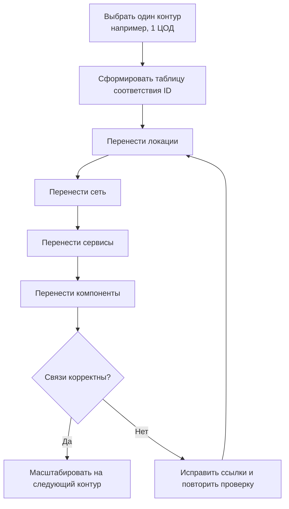

# Как переиспользовать пример `architecture/ta`

Пример `architecture/ta` нужно использовать как шаблон структуры и связей, а не как готовый пакет для прямого копирования.

## 1. Что переносить из примера

| Что берем | Зачем |
|---|---|
| Структуру файлов (`architecture/ta/_root.yaml`) | Сохранить правильный порядок загрузки и читаемость |
| Форму объектов (поля и вложенности) | Избежать пропуска обязательных связей |
| Паттерны связей (`location`, `segment`, `is_part_of`, `network_connection`) | Быстро получить рабочий контур |

## 2. Что НЕ делать

- Не копировать весь пример одним блоком.
- Не смешивать старый (`jupiter.*`) и новый префикс ID.
- Не переносить компоненты до слоя локаций и сети.

## 3. Рекомендуемый процесс переиспользования

## 4. Таблица соответствия ID (шаблон)

| Пример (`jupiter`) | Целевой ID | Комментарий |
|---|---|---|
| `jupiter.dc.moscow_dc01` | `myorg.dc.main01` | Основной ЦОД |
| `jupiter.network_segment.dc.int_net` | `myorg.segment.main.int` | Внутренний сегмент |
| `jupiter.compute_service.app_ac1` | `myorg.compute_service.app01` | Ключевой сервис |
| `jupiter.server_virtual.ad01` | `myorg.server.virtual.app01` | Сервер сервиса |

## 5. Практический чек-лист после миграции каждого блока

- [ ] Объект виден в профильном реестре.
- [ ] Карточка объекта открывается и содержит контекст.
- [ ] Переходы по связям не обрываются.
- [ ] Нет дублей той же сущности под разными ID.

## 6. Признак корректного переиспользования

Можно пройти цепочку без разрывов: `dc -> segment -> network -> compute_service -> server`.
