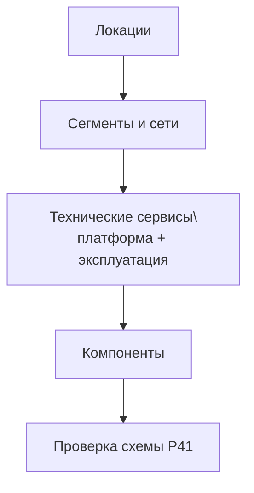

# Что нужно заполнить для получения схемы Р41

Документ описывает, какие данные должны быть в модели TA, чтобы схема Р41 строилась корректно и была полезной.

## 1. Где смотреть результат

- Документ схемы: `seaf.ta.docs.schema_r41`.
- Схема строится из TA-сущностей (`seaf.company.ta.*`) через специализированный датасет R41.
- Включение данных реверса в общую схему управляется флагом `schema_r41_plural.include_reverse` в `../configs.yaml`.

## 2. Минимум для появления рабочей схемы

Чтобы схема была не пустой и показывала связанный контур, заполните минимум:

1. Локации: `dc_region`, `dc_az`, `dc` (или `dc_office`);
2. Сеть: `network_segment`, `network`;
3. Платформа: `compute_service`;
4. Компоненты: `server`.

Минимальная проверяемая цепочка:

`dc -> network_segment -> network -> compute_service -> server`

## 3. Полный набор сущностей для Р41 (SEAF2)

| Сущность для Р41 | Где заполняется | Что обязательно проверить |
|---|---|---|
| `seaf.company.ta.services.dc_regions` | `architecture/ta/dc_region.yaml` | Есть хотя бы 1 регион |
| `seaf.company.ta.services.dc_azs` | `architecture/ta/dc_az.yaml` | `region` заполнен |
| `seaf.company.ta.services.dcs` | `architecture/ta/dc.yaml` | `availabilityzone` заполнен |
| `seaf.company.ta.services.dc_offices` | `architecture/ta/dc_office.yaml` | `region` заполнен |
| `seaf.company.ta.services.network_segments` | `architecture/ta/network_segment.yaml` | `location` заполнен |
| `seaf.company.ta.services.networks` | `architecture/ta/network.yaml` | `segment` и `location` заполнены |
| `seaf.company.ta.services.network_links` | `architecture/ta/network_links.yaml` | `network_connection` заполнен |
| `seaf.company.ta.services.logical_links` | `architecture/ta/logical_link.yaml` | `source` и `target` заполнены |
| `seaf.company.ta.services.kbs` | `architecture/ta/kb.yaml` | `network_connection` заполнен |
| `seaf.company.ta.components.hw_storages` | `architecture/ta/hw_storage.yaml` | `location`/`network_connection` заполнены |
| `seaf.company.ta.components.servers` | `architecture/ta/server.yaml` | `is_part_of`, `subnets`, `location` заполнены |
| `seaf.company.ta.components.user_devices` | `architecture/ta/user_device.yaml` | `location`, `network_connection` заполнены |
| `seaf.company.ta.components.networks` | `architecture/ta/network_component.yaml` | `network_connection`, `location` заполнены |
| `seaf.company.ta.services.cluster_virtualizations` | `architecture/ta/cluster_virtualization.yaml` | `location`/`network_connection` заполнены |
| `seaf.company.ta.services.compute_services` | `architecture/ta/compute_service.yaml` | `network_connection`, `high_availability` заполнены |
| `seaf.company.ta.services.storages` | `architecture/ta/storage.yaml` | `network_connection`, `softwares` заполнены |
| `seaf.company.ta.services.backups` | `architecture/ta/backup.yaml` | `network_connection` заполнен |
| `seaf.company.ta.services.monitorings` | `architecture/ta/monitoring.yaml` | `network_connection` заполнен |
| `seaf.company.ta.services.k8s` | `architecture/ta/k8s.yaml` | `network_connection`, `softwares` заполнены |
| `seaf.company.ta.services.softwares` | `architecture/ta/software.yaml` | ПО, на которое ссылаются `k8s`/`storages`, существует |

## 4. Порядок заполнения для стабильной Р41

Практика: после каждого шага проверяйте связность, а не только наличие объектов.

## 5. Чек-лист перед проверкой схемы

- [ ] У всех сетей заполнены `segment` и `location`.
- [ ] У всех серверов заполнены `is_part_of` и `subnets`.
- [ ] У вычислительных сервисов заполнены `network_connection` и `high_availability`.
- [ ] Ссылки между объектами не ведут на несуществующие ID.
- [ ] Для `k8s` и `storages` существует связанное ПО в `software.yaml`.

## 6. Типовые причины, почему Р41 не строится или выглядит «пустой»

1. Разрывы ссылок (ID в связях не существует).
2. Неполный локационный слой (нет связки `region -> az -> dc`).
3. Пустые `network_connection` / `is_part_of` у ключевых сущностей.
4. Компоненты заведены раньше сети и платформы.

## 7. Минимальная стратегия диагностики

1. Проверить одну цепочку `dc -> network -> compute_service -> server`.
2. Проверить, что все ID в этой цепочке существуют.
3. Проверить, что карточки каждого объекта открываются и содержат связи.
4. Повторить для следующего контура.

Если цепочки замыкаются, схема Р41 обычно отображается корректно.
