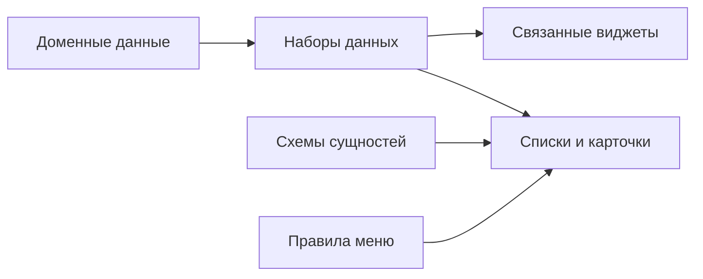

# Карта модуля

## 1. Логика модуля в одном взгляде

## 2. Слои и их назначение

| Слой | Где находится | Задача для пользователя |
|---|---|---|
| Доменные данные | `architecture/ta` | Первичное заполнение объектов |
| Базовые датасеты | `datasets/dataset_parts` | Формирование согласованных наборов данных |
| Модель сущностей | `services`, `components` | Правила полей и связей |
| Представления | `presentations` | Что увидит пользователь в UI |
| Документация | `docs`, `advanced` | Правила работы и развития |

## 3. Карта «вопрос -> где смотреть»

| Пользовательский вопрос | Где искать ответ |
|---|---|
| Почему объект не видно в списке? | `04_datasets_and_lake.md`, затем `07_troubleshooting.md` |
| Почему карточка пустая? | `03_ta_metamodel.md`, `05_ui_layer.md` |
| Как правильно начать новый контур? | `../02_model_filling_start.md` |
| Как проверить связи и oneOf для сущности? | `09_entities_reference.md` |

## 4. Контроль целостности модуля

Минимальный критерий целостности:

1. объект создан в доменных данных;
2. объект попадает в датасет;
3. объект виден в реестре;
4. карточка объекта показывает ключевые связи.

Если любой шаг не выполняется, используйте диагностику из `07_troubleshooting.md`.

## 5. Практическая рекомендация

Не расширяйте одновременно все слои. Работайте вертикальными срезами: один контур -> данные -> проверка отображения -> следующий контур.
