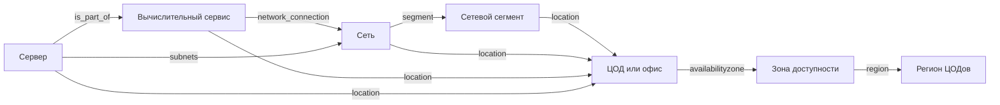

# Мета-модель TA

## 1. Ядро метамодели

Модель состоит из трех типов сущностей:

1. **Контекст** (локации, окружения, стенды);
2. **Сервисы** (платформенные и инфраструктурные);
3. **Компоненты** (физические/виртуальные объекты исполнения).

## 2. Канонические связи

| Откуда | Связь | Куда | Для чего |
|---|---|---|---|
| Сервис | `location` / `availabilityzone` | Локации | География и отказоустойчивость |
| Сервис | `network_connection` | Сети | Сетевой контекст сервиса |
| Компонент | `is_part_of` | Сервис/платформа | Принадлежность ресурса |
| Компонент | `subnets` | Сети | Фактическое сетевое подключение |
| Сеть | `segment` | Сегмент | Уровень сетевой зоны |
| Сегмент | `location` | ЦОД/офис | Где физически существует сегмент |

## 3. Диаграмма связей

## 4. Минимально обязательные поля по ключевым сущностям

| Сущность | Минимум для рабочего отображения |
|---|---|
| `dc_region` | `title` |
| `dc_az` | `title`, `region` |
| `dc` | `title`, `availabilityzone` |
| `network_segment` | `title`, `location`, `zone` |
| `network` | `title`, `type`, `segment`, `location` |
| `compute_service` | `title`, `service_type`, `network_connection`, `high_availability` |
| `server` | `title`, `type`, `location`, `is_part_of`, `subnets` |

## 5. Практические правила моделирования

1. Любая связь должна указывать только на существующий ID.
2. Один объект — один ID (без клонов и «временных» дублей).
3. Локационный контекст должен быть согласован по всей цепочке.
4. Если сервис введен, но к нему не привязан ни один компонент, он считается неполным.
5. Для `network_segment` пара `location + zone` должна быть уникальной: в одном ЦОД/офисе нельзя описывать два сегмента одной и той же зоны безопасности.

## 6. Антипаттерны

| Антипаттерн | Последствие |
|---|---|
| Компонент без `is_part_of` | Карточка сервиса не показывает инфраструктуру |
| Сеть без `segment` | Потеря сетевого контекста в UI |
| Сервис без `network_connection` | Невозможно анализировать сетевую зависимость |
| Несогласованные локации у связанного контура | Ложные или пустые связи |
| Два `network_segment` с одинаковыми `location` и `zone` | Конфликт зон безопасности и неоднозначная перепривязка сетей/сервисов |

## 7. Вывод

Качество модели определяет качество аналитики. Заполняйте не «по файлам», а по связям между сущностями.

## 8. Детализация по каждой сущности

Отдельные главы по всем сущностям (со схемой связей и `oneOf`) вынесены в `09_entities_reference.md`.
