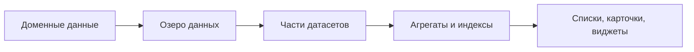

# Данные и датасеты TA

## 1. Поток данных

## 2. Группы датасетов и смысл

| Группа | Назначение | Что пользователь обычно проверяет |
|---|---|---|
| `00_bootstrap` | Базовая инициализация и кэш-слои | Модуль загружается без пустых ключевых реестров |
| `10_location` | Локационный контур | Иерархия локаций корректна |
| `20_network` | Сетевой контур | Сегменты, сети, сетевые связи согласованы |
| `30_platform` | Платформенные сервисы и компоненты | Связь сервисов и компонентов |
| `40_ops_security` | Эксплуатация и безопасность | Контекст мониторинга/backup/kb |
| `50_k8s` | Kubernetes-слой | Связность k8s с платформой и серверами |
| `60_environment` | Окружения и стенды | Корректный эксплуатационный контекст |
| `70_indexes` | Индексы для быстрых связей | Карточки не теряют связанные объекты |
| `80_views` | Агрегированные представления | Итоговые реестры полные и непротиворечивые |

## 3. Практические проверки после обновления данных

| Проверка | Способ | Ожидаемый результат |
|---|---|---|
| Объект попал в реестр | Список соответствующей сущности | Объект находится по ID |
| Ссылки не обрываются | Переходы из карточки по связанным полям | Каждый переход открывает валидный объект |
| Контур согласован | Путь `dc -> network -> service -> server` | Путь замкнут и логичен |
| Нет дублей | Фильтр по похожим именам/ID | Один объект = один ID |

## 4. Индексные и агрегированные слои: зачем это пользователю

- **Индексы** ускоряют и стабилизируют показ связей в карточках.
- **Агрегаты** дают целостные витрины для списков и сравнений.

Если индексный слой неактуален, пользователь первым увидит это как «пустые связанные таблицы».

## 5. Признаки проблем в датасетном слое

1. Объект есть в исходном файле, но отсутствует в списке.
2. Объект виден в списке, но карточка не показывает связи.
3. Один и тот же объект виден несколько раз в одном реестре.

Для реакции используйте `07_troubleshooting.md`.

## 6. Практическая рекомендация

Проверяйте модель по «малому контуру» после каждого слоя и только затем расширяйте наборы данных.
