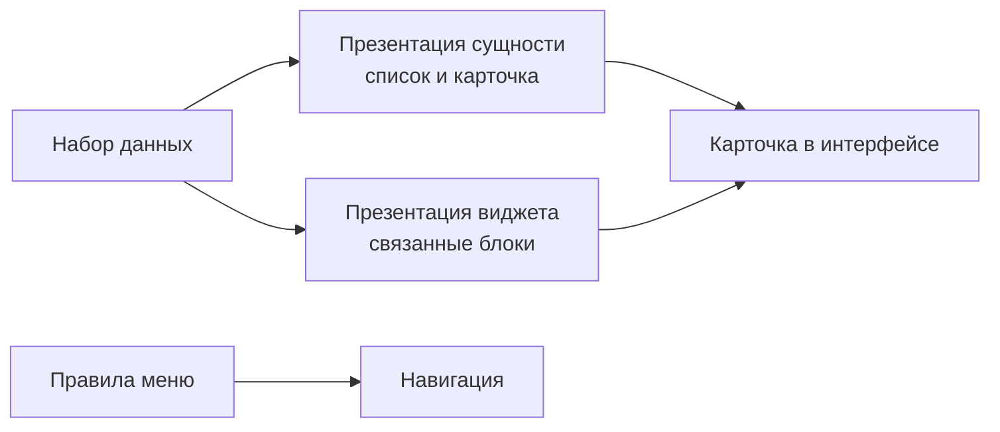

# UI-слой: списки, карточки, виджеты

## 1. Что делает UI-слой

UI-слой не хранит данные, а показывает уже собранную модель через:

- меню (`presentations/menu`),
- списки и карточки (`presentations/entities`),
- дополнительные блоки (`presentations/widgets`).

## 2. Схема формирования карточки

## 3. Практика чтения карточки

| Блок карточки | Что проверить первым |
|---|---|
| Заголовок и тип | Объект действительно тот, что ожидаете |
| Локация | `location`/`availabilityzone` заполнены и согласованы |
| Сетевой контекст | Есть связи на сегмент/сеть |
| Принадлежность/состав | `is_part_of` и обратные связи корректны |
| Связанные таблицы | Нет пустых блоков там, где ожидается связь |

## 4. Типовые симптомы и первичная интерпретация

| Симптом | Вероятная зона |
|---|---|
| Пустая карточка при наличии объекта в списке | Неполные связи в данных |
| Пустой виджет связей | Разрыв ссылок или несогласованность контуров |
| Разные значения в списке и карточке | Несогласованность агрегатов |
| Нет пункта меню | Условие показа меню не выполнено |

## 5. Пользовательский маршрут проверки UI

1. Найти объект в реестре.
2. Открыть карточку.
3. Проверить 3 обязательных контекста: локация, сеть, принадлежность.
4. Пройти по 1-2 связанным ссылкам.
5. Подтвердить, что контур замыкается.

## 6. Практический вывод

UI — это индикатор качества модели. Если контур легко читается и связи не обрываются, модель заполняется правильно.
