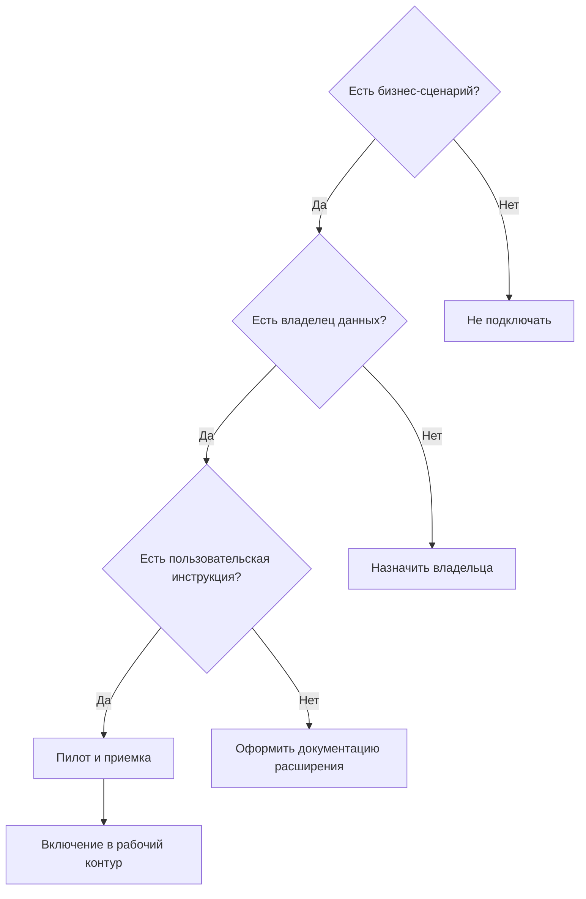

# Дополнительные источники и расширения

## 1. Назначение расширений

Расширения (`_extensions/*`) добавляют специализированные данные и представления, которые не обязательны для базового контура TA.

## 2. Принцип безопасного использования

Каждое расширение включается как отдельный функциональный модуль с собственными:

- целями,
- владельцем,
- документацией,
- критериями приемки.

## 3. Матрица решения о подключении

| Вопрос | Если ответ «да» | Если ответ «нет» |
|---|---|---|
| Есть конкретный пользовательский сценарий? | Можно планировать включение | Не подключать |
| Назначен владелец данных? | Можно запускать пилот | Сначала назначить владельца |
| Есть инструкция в `_extensions/*/docs`? | Можно масштабировать | Сначала оформить документацию |
| Понятны критерии качества? | Можно принимать в продуктивный контур | Сначала зафиксировать quality gate |

## 4. Схема принятия решения

## 5. Риски при неуправляемом подключении

1. Дубли сущностей в реестрах.
2. Конфликтующие трактовки одинаковых полей.
3. Неочевидное поведение карточек и меню.

## 6. Практический вывод

Подключайте расширение только после формального ответа на 4 вопроса: цель, владелец, инструкция, критерии приемки.
