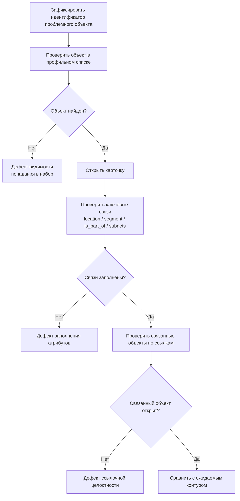

# Диагностика: практический разбор проблем

Документ — это оперативный регламент для ситуаций, когда в интерфейсе уже виден дефект данных/связей.

## 1. Быстрый алгоритм (до 15 минут)

## 2. Таблица «симптом -> причина -> действие»

| Симптом | Вероятная причина | Что проверить сразу | Что исправлять |
|---|---|---|---|
| Объект отсутствует в списке | Не попал в целевой набор данных | Есть ли объект в исходном файле и корректен ли ID | Источник данных и ID |
| Карточка есть, но пустые блоки | Не заполнены опорные связи | `location`, `segment`, `is_part_of`, `network_connection` | Заполнить отсутствующие связи |
| Сервер не отображается у сервиса | Разрыв `is_part_of` | Поле `is_part_of` в карточке сервера | Привязать сервер к сервису |
| Сеть «оторвана» от ЦОДа | Некорректен `location` или `segment` | Карточка сети и сегмента | Исправить локацию/сегмент |
| Дубли объектов в реестре | Два ID для одной сущности | Поиск по title и похожим ID | Нормализовать ID и ссылки |
| В одном ЦОДе конфликтуют сегменты одной зоны | Два `network_segment` с одинаковыми `location` и `zone` | `/core/storage/problems/`, validator `seaf.validation.ta.services.network_segment_location_zone_uniqueness` | Оставить один сегмент и перепривязать зависимые сети/сервисы/компоненты |

## 3. Минимальный пакет для эскалации

Передайте в команду сопровождения:

1. URL карточки/списка;
2. ID объекта;
3. симптом в одной фразе;
4. ожидаемое поведение;
5. приоритет (критично/высоко/средне/низко).

## 4. Приоритизация инцидентов

| Приоритет | Когда ставить | Срок реакции (рекомендуемый) |
|---|---|---|
| Критичный | Нельзя пройти ключевой пользовательский сценарий | В течение рабочего дня |
| Высокий | Есть частичная блокировка анализа | 1-2 рабочих дня |
| Средний | Локальная некорректность без блокировки | До недели |
| Низкий | Косметика/локальное улучшение | По плану улучшений |

## 5. Частые корневые причины повторяемых проблем

1. Заполнение модели не по слоям.
2. Несогласованные правила ID у разных команд.
3. Массовый перенос без промежуточных проверок.
4. Отсутствие регулярного gate-контроля.

## 6. Профилактика

- после каждого слоя проходить базовый цикл проверки: список -> карточка -> связанные объекты;
- не объединять крупные несвязанные изменения в один шаг;
- фиксировать единые правила ID и обязательных связей.

## 7. Критерий «инцидент закрыт»

Инцидент считается закрытым, если:

- симптом не воспроизводится;
- связанный пользовательский сценарий проходит от начала до конца;
- не появилось побочных разрывов в соседних объектах.
