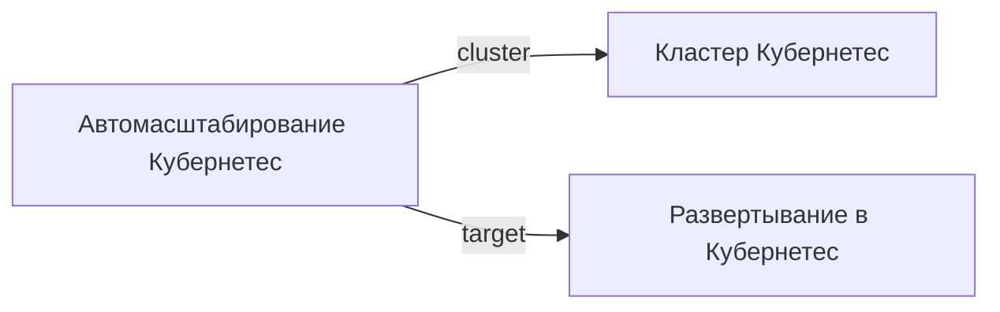

# Kubernetes HPA

- Идентификатор сущности: `seaf.company.ta.components.k8s_hpa`
- Файл схемы: `_metamodel_/seaf-company-ta/components/k8s_hpa.yaml`
- Ключи объектов в YAML: `k8s_hpa`

## Схема связей

## Связи по полям

| Поле | Целевые сущности |
|---|---|
| `cluster` | `seaf.company.ta.services.k8s` (Kubernetes кластер) |
| `target` | `seaf.company.ta.services.k8s_deployments` (Kubernetes deployment) |

## Варианты oneOf

Вариантов `oneOf` нет.
