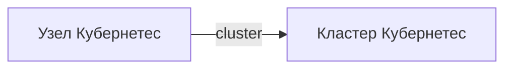

# Kubernetes нода

- Идентификатор сущности: `seaf.company.ta.components.k8s_nodes`
- Файл схемы: `_metamodel_/seaf-company-ta/components/k8s_node.yaml`
- Ключи объектов в YAML: `k8s_node`

## Схема связей

## Связи по полям

| Поле | Целевые сущности |
|---|---|
| `cluster` | `seaf.company.ta.services.k8s` (Kubernetes кластер) |

## Варианты oneOf

Вариантов `oneOf` нет.
