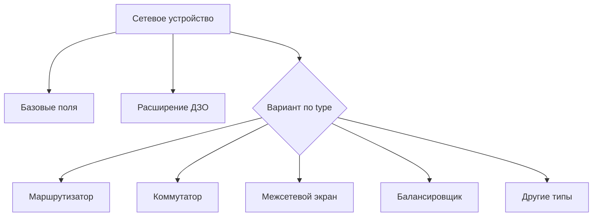
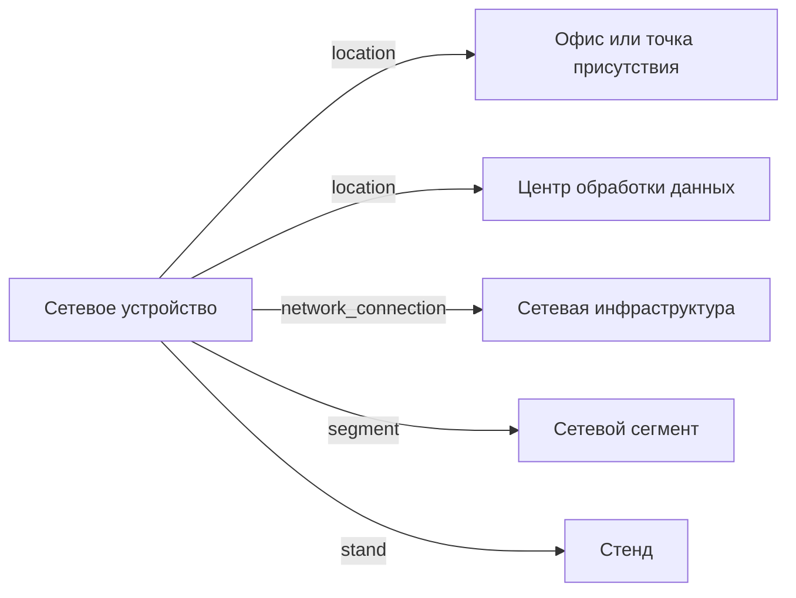

# Сетевое устройство

- Идентификатор сущности: `seaf.company.ta.components.networks`
- Файл схемы: `_metamodel_/seaf-company-ta/components/network.yaml`
- Ключи объектов в YAML: `network_component`

## Схема связей

## Связи по полям

| Поле | Целевые сущности |
|---|---|
| `location` | `seaf.company.ta.services.dc_offices` (Офис или точка присутствия); `seaf.company.ta.services.dcs` (Центр обработки данных) |
| `network_connection` | `seaf.company.ta.services.networks` (Сетевая инфраструктура) |
| `segment` | `seaf.company.ta.services.network_segments` (Сетевой сегмент) |
| `stand` | `seaf.company.ta.services.stands` (Стенд) |

## Варианты oneOf

Вариантов `oneOf` нет. Ветвление задается полем `type` (перечень типов устройств).
