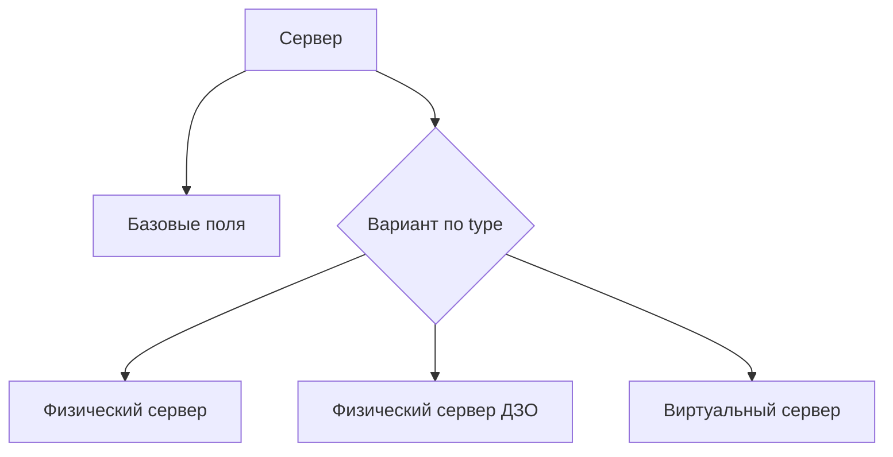
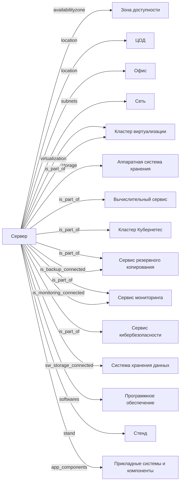

# Сервер (предложение по схеме)

- Идентификатор сущности: `seaf.company.ta.components.servers`
- Файл схемы: `_metamodel_/seaf-company-ta/components/server.yaml`
- Ключи объектов в YAML: `server`

## Схема связей

## Связи по полям

| Поле | Целевые сущности |
|---|---|
| `availabilityzone` | `seaf.company.ta.services.dc_azs` (Зона доступности) |
| `location` | `seaf.company.ta.services.dcs` (ЦОД); `seaf.company.ta.services.dc_offices` (Офис) |
| `subnets` | `seaf.company.ta.services.networks` (Сеть) |
| `virtualization` | `seaf.company.ta.services.cluster_virtualizations` (Кластер виртуализации) |
| `storage` | `seaf.company.ta.components.hw_storages` (Аппаратная система хранения) |
| `is_part_of` | `seaf.company.ta.services.cluster_virtualizations`; `seaf.company.ta.services.compute_services`; `seaf.company.ta.services.k8s`; `seaf.company.ta.services.backups`; `seaf.company.ta.services.monitorings`; `seaf.company.ta.services.kbs` |
| `is_monitoring_connected` | `seaf.company.ta.services.monitorings` (Сервис мониторинга) |
| `is_backup_connected` | `seaf.company.ta.services.backups` (Сервис резервного копирования) |
| `sw_storage_connected` | `seaf.company.ta.services.storages` (Система хранения данных) |
| `softwares` | `seaf.company.ta.services.softwares` (Программное обеспечение) |
| `stand` | `seaf.company.ta.services.stands` (Стенд) |
| `app_components` | `seaf.company.ai.agents`; `seaf.company.app.systems`; `seaf.company.cybersec.systems`; `kadzo.v2023.systems`; `kadzo.v2023.kb_systems`; `kadzo.v2023.tech_services`; `components` |

## Варианты oneOf

| Уровень | Вариант | Маркер варианта | Обязательные поля |
|---|---|---|---|
| Объект | Физический сервер | `type = Физический` | `type`, `vendor`, `model`, `fqdn`, `cpu`, `ram`, `disks`, `nic_qty` |
| Объект | Физический сервер ДЗО | `type = Физический` | `type`, `vendor`, `model`, `fqdn`, `cpu`, `ram`, `disks`, `nic_qty` |
| Объект | Виртуальный сервер | `type = Виртуальный` | `type`, `fqdn`, `virtualization`, `cpu`, `ram`, `disks` |
