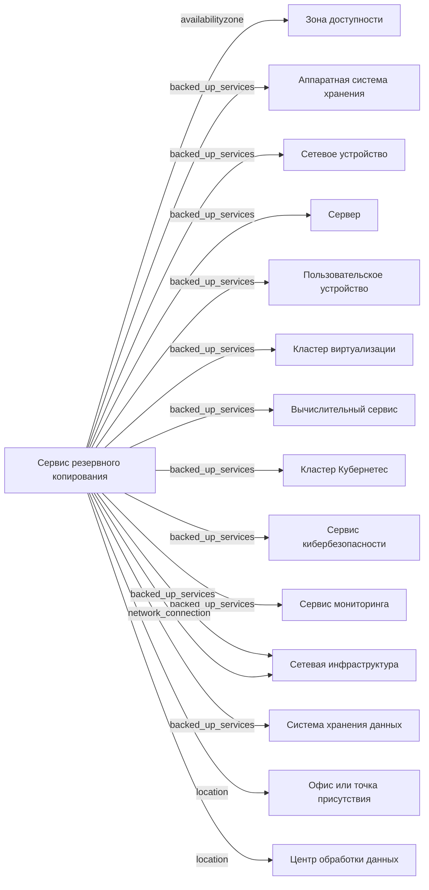

# Сервис резервного копирования

- Идентификатор сущности: `seaf.company.ta.services.backups`
- Файл схемы: `_metamodel_/seaf-company-ta/services/backup.yaml`
- Ключи объектов в YAML: `backup`

## Схема связей

## Связи по полям

| Поле | Целевые сущности |
|---|---|
| `availabilityzone` | `seaf.company.ta.services.dc_azs` (Зона доступности) |
| `backed_up_services` | `seaf.company.ta.components.hw_storages` (Аппаратная система хранения); `seaf.company.ta.components.networks` (Сетевое устройство); `seaf.company.ta.components.servers` (Сервер (предложение по схеме)); `seaf.company.ta.components.user_devices` (Пользовательское устройство); `seaf.company.ta.services.cluster_virtualizations` (Кластер виртуализации); `seaf.company.ta.services.compute_services` (Вычислительный сервис); `seaf.company.ta.services.k8s` (Kubernetes кластер); `seaf.company.ta.services.kbs` (Сервис кибербезопасности); `seaf.company.ta.services.monitorings` (Сервис мониторинга); `seaf.company.ta.services.networks` (Сетевая инфраструктура); `seaf.company.ta.services.storages` (Система хранения данных) |
| `location` | `seaf.company.ta.services.dc_offices` (Офис или точка присутствия); `seaf.company.ta.services.dcs` (Центр обработки данных) |
| `network_connection` | `seaf.company.ta.services.networks` (Сетевая инфраструктура) |

## Варианты oneOf

Вариантов `oneOf` нет.
