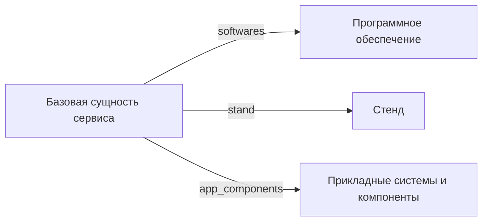

# Базовая сущность технического сервиса

- Идентификатор сущности: `seaf.company.ta.services.entity`
- Файл схемы: `_metamodel_/seaf-company-ta/services/base_entity.yaml`
- Тип: абстрактная база для остальных технических сервисов (не самостоятельный реестр)

## Схема связей

## Связи по полям

| Поле | Целевые сущности |
|---|---|
| `app_components` | `seaf.company.ai.agents`; `seaf.company.app.systems`; `seaf.company.cybersec.systems`; `kadzo.v2023.systems`; `kadzo.v2023.kb_systems`; `kadzo.v2023.tech_services`; `components` |
| `softwares` | `seaf.company.ta.services.softwares` |
| `stand` | `seaf.company.ta.services.stands` |

## Варианты oneOf

Вариантов `oneOf` нет.
