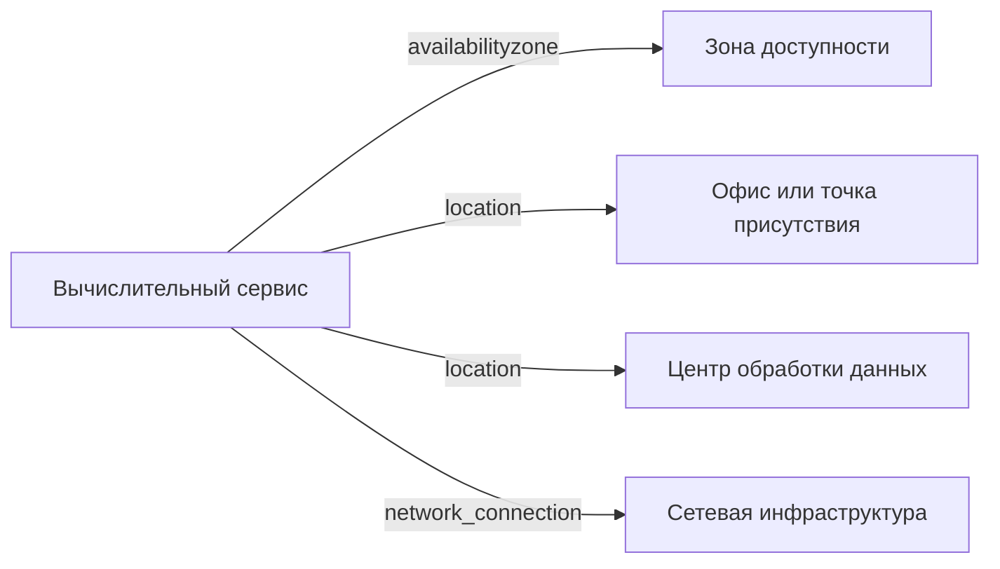

# Вычислительный сервис

- Идентификатор сущности: `seaf.company.ta.services.compute_services`
- Файл схемы: `_metamodel_/seaf-company-ta/services/compute_service.yaml`
- Ключи объектов в YAML: `compute_service`

## Схема связей

## Связи по полям

| Поле | Целевые сущности |
|---|---|
| `availabilityzone` | `seaf.company.ta.services.dc_azs` (Зона доступности) |
| `location` | `seaf.company.ta.services.dc_offices` (Офис или точка присутствия); `seaf.company.ta.services.dcs` (Центр обработки данных) |
| `network_connection` | `seaf.company.ta.services.networks` (Сетевая инфраструктура) |

## Варианты oneOf

Вариантов `oneOf` нет.
