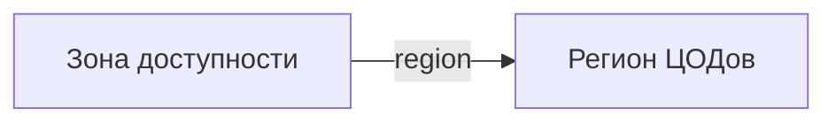

# Зона доступности

- Идентификатор сущности: `seaf.company.ta.services.dc_azs`
- Файл схемы: `_metamodel_/seaf-company-ta/services/dc_az.yaml`
- Ключи объектов в YAML: `dc_az`

## Схема связей

## Связи по полям

| Поле | Целевые сущности |
|---|---|
| `region` | `seaf.company.ta.services.dc_regions` (Регион ЦОДов) |

## Варианты oneOf

Вариантов `oneOf` нет.
