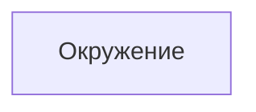

# Окружение

- Идентификатор сущности: `seaf.company.ta.services.environments`
- Файл схемы: `_metamodel_/seaf-company-ta/services/environment.yaml`
- Ключи объектов в YAML: `environment`

## Схема связей

## Связи по полям

Связей на другие сущности нет.

## Варианты oneOf

Вариантов `oneOf` нет.
