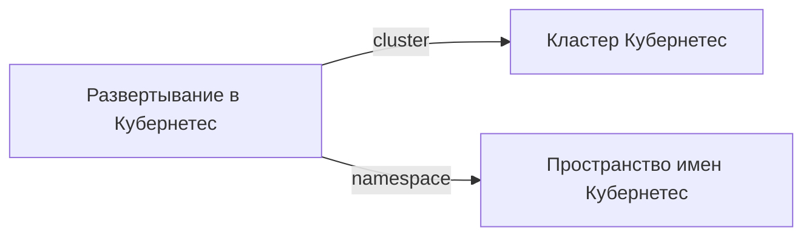

# Kubernetes deployment

- Идентификатор сущности: `seaf.company.ta.services.k8s_deployments`
- Файл схемы: `_metamodel_/seaf-company-ta/services/k8s_deployments.yaml`
- Ключи объектов в YAML: `k8s_deployment`

## Схема связей

## Связи по полям

| Поле | Целевые сущности |
|---|---|
| `cluster` | `seaf.company.ta.services.k8s` (Kubernetes кластер) |
| `namespace` | `seaf.company.ta.components.k8s_namespaces` (Kubernetes namespace) |

## Варианты oneOf

Вариантов `oneOf` нет.
