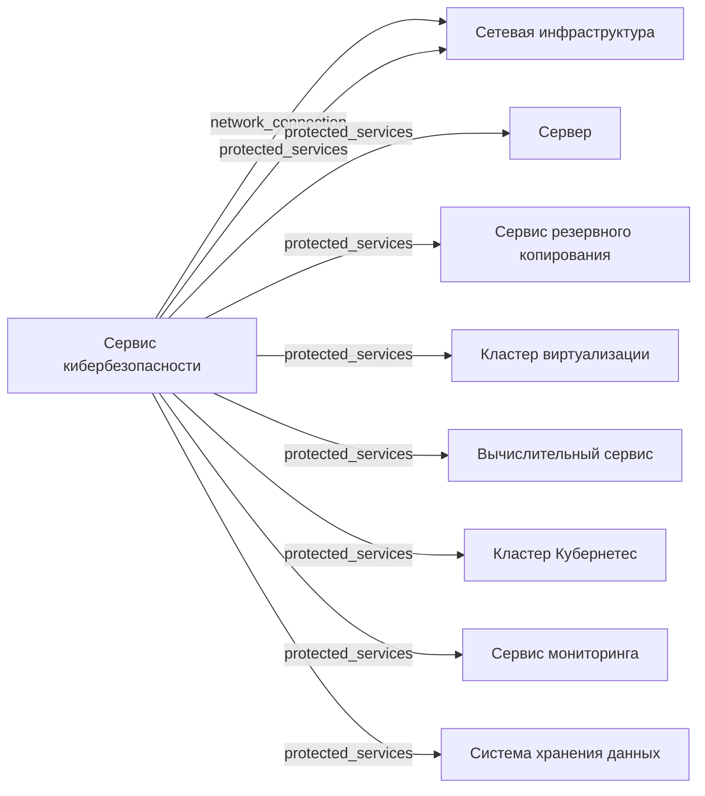

# Сервис кибербезопасности

- Идентификатор сущности: `seaf.company.ta.services.kbs`
- Файл схемы: `_metamodel_/seaf-company-ta/services/kb.yaml`
- Ключи объектов в YAML: `kb`

## Схема связей

## Связи по полям

| Поле | Целевые сущности |
|---|---|
| `network_connection` | `seaf.company.ta.services.networks` (Сетевая инфраструктура) |
| `protected_services` | `seaf.company.ta.components.servers` (Сервер (предложение по схеме)); `seaf.company.ta.services.backups` (Сервис резервного копирования); `seaf.company.ta.services.cluster_virtualizations` (Кластер виртуализации); `seaf.company.ta.services.compute_services` (Вычислительный сервис); `seaf.company.ta.services.k8s` (Kubernetes кластер); `seaf.company.ta.services.monitorings` (Сервис мониторинга); `seaf.company.ta.services.networks` (Сетевая инфраструктура); `seaf.company.ta.services.storages` (Система хранения данных) |

## Варианты oneOf

| Уровень | Вариант | Маркер варианта | Обязательные поля |
|---|---|---|---|
| Объект | ИБ-Антивирусное ПО | - | `technology`, `software_name`, `tag`, `status`, `network_connection` |
| Объект | ИБ-Аудит действий персонала | - | `technology`, `software_name`, `tag`, `status`, `network_connection` |
| Объект | ИБ-Защита от киберугроз | - | `technology`, `software_name`, `tag`, `status`, `network_connection` |
| Объект | ИБ-Управление доступом | - | `technology`, `software_name`, `tag`, `status`, `network_connection` |
| Объект | ИБ-Защита трафика | - | `technology`, `software_name`, `tag`, `status`, `network_connection` |
| Объект | ИБ-Защита от сетевых атак | - | `technology`, `software_name`, `tag`, `status`, `network_connection` |
| Объект | ИБ-Защита от утечек информации | - | `technology`, `software_name`, `tag`, `status`, `network_connection` |
| Объект | ИБ-Управление событиями инф.безопасности | - | `technology`, `software_name`, `tag`, `status`, `network_connection` |
| Объект | ИБ-Управление оборудованием | - | `technology`, `software_name`, `tag`, `status`, `network_connection` |
| Объект | ИБ-Управление сертификатами | - | `technology`, `software_name`, `tag`, `status`, `network_connection` |
| Объект | ИБ-Предотвращение мошенничества | - | `technology`, `software_name`, `tag`, `status`, `network_connection` |
| Объект | ИБ-Идентификация и управление учетными записями | - | `technology`, `software_name`, `tag`, `status`, `network_connection` |
| Объект | ИБ-Привилегированный доступ | - | `technology`, `software_name`, `tag`, `status`, `network_connection` |
| Объект | ИБ-Хранение секретов | - | `technology`, `software_name`, `tag`, `status`, `network_connection` |
| Объект | ИБ-Политики безопасности платформы | - | `technology`, `software_name`, `tag`, `status`, `network_connection` |
| Объект | ИБ-Целевые репозитории ПО | - | `technology`, `software_name`, `tag`, `status`, `network_connection` |
