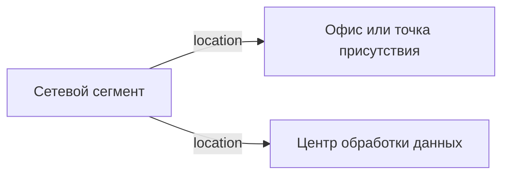

# Сетевой сегмент

- Идентификатор сущности: `seaf.company.ta.services.network_segments`
- Файл схемы: `_metamodel_/seaf-company-ta/services/network_segment.yaml`
- Ключи объектов в YAML: `network_segment`

## Схема связей

## Связи по полям

| Поле | Целевые сущности |
|---|---|
| `location` | `seaf.company.ta.services.dc_offices` (Офис или точка присутствия); `seaf.company.ta.services.dcs` (Центр обработки данных) |

## Правила моделирования

- В пределах одной локации (`location`) должен существовать только один сегмент для каждой зоны `zone`.
- Если в одном ЦОД или офисе появляются два сегмента с одинаковой `zone`, это считается ошибкой моделирования: связанные сети, сервисы и компоненты должны быть перепривязаны к одному корректному сегменту.
- Для автоматического контроля используется validator `seaf.validation.ta.services.network_segment_location_zone_uniqueness`.

## Допустимые значения enum

Поле `zone` в схеме ограничено следующими значениями:

- `DMZ`
- `EXT-WAN-EDGE`
- `INET-EDGE`
- `INT-NET`
- `INT-SECURITY-NET`
- `INT-WAN-EDGE`
- `INTERNET`
- `TRANSPORT-WAN`

## Варианты oneOf

Вариантов `oneOf` нет.
