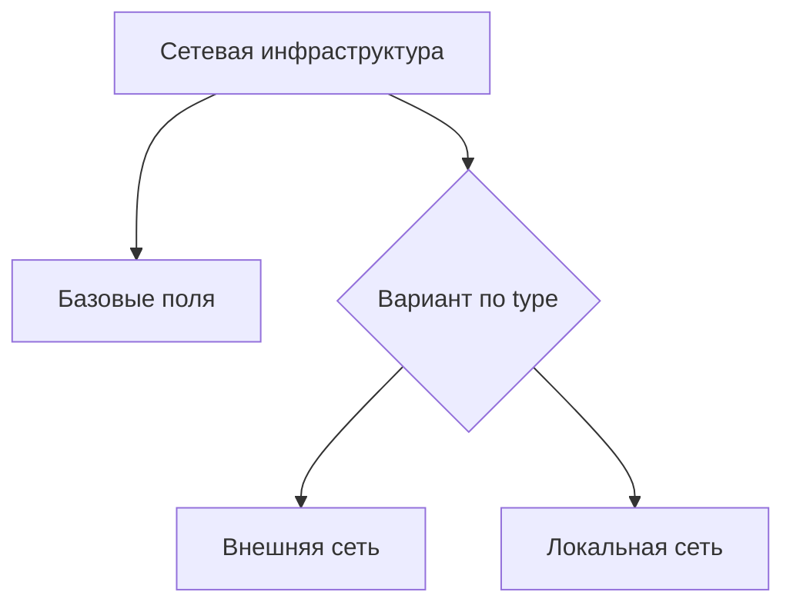
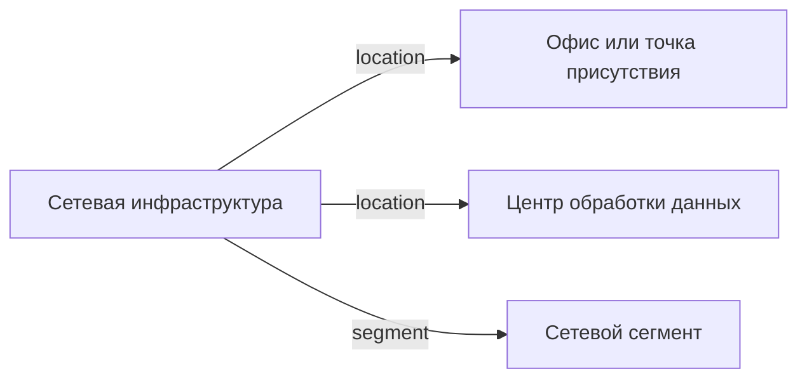

# Сетевая инфраструктура

- Идентификатор сущности: `seaf.company.ta.services.networks`
- Файл схемы: `_metamodel_/seaf-company-ta/services/network.yaml`
- Ключи объектов в YAML: `network`

## Схема связей

## Связи по полям

| Поле | Целевые сущности |
|---|---|
| `location` | `seaf.company.ta.services.dc_offices` (Офис или точка присутствия); `seaf.company.ta.services.dcs` (Центр обработки данных) |
| `segment` | `seaf.company.ta.services.network_segments` (Сетевой сегмент) |

## Варианты oneOf

| Уровень | Вариант | Маркер варианта | Обязательные поля |
|---|---|---|---|
| Объект | Внешняя сеть | `type = WAN` | `type`, `location`, `wan_ip`, `provider` |
| Объект | Локальная сеть | `type = LAN` | `type`, `location`, `lan_type`, `ipnetwork` |
