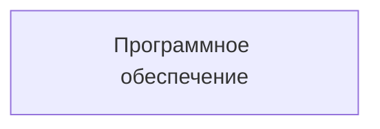

# Программное обеспечение

- Идентификатор сущности: `seaf.company.ta.services.softwares`
- Файл схемы: `_metamodel_/seaf-company-ta/services/software.yaml`
- Ключи объектов в YAML: `software`

## Схема связей

## Связи по полям

Связей на другие сущности нет.

## Варианты oneOf

Вариантов `oneOf` нет.
