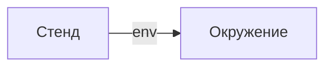

# Стенд

- Идентификатор сущности: `seaf.company.ta.services.stands`
- Файл схемы: `_metamodel_/seaf-company-ta/services/stand.yaml`
- Ключи объектов в YAML: `stand`

## Схема связей

## Связи по полям

| Поле | Целевые сущности |
|---|---|
| `env` | `seaf.company.ta.services.environments` (Окружение) |

## Варианты oneOf

Вариантов `oneOf` нет.
