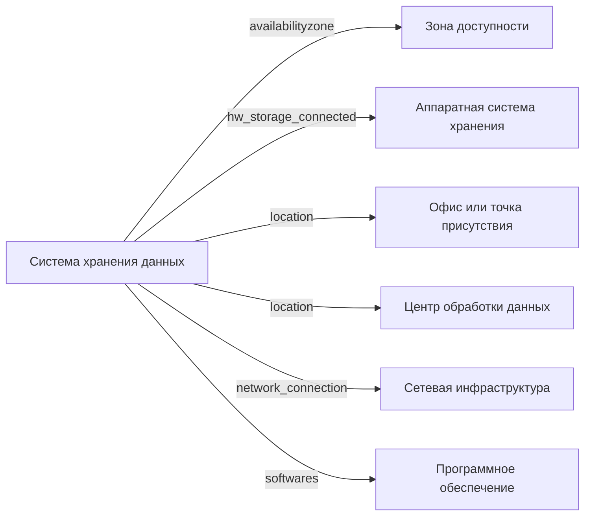

# Система хранения данных

- Идентификатор сущности: `seaf.company.ta.services.storages`
- Файл схемы: `_metamodel_/seaf-company-ta/services/storage.yaml`
- Ключи объектов в YAML: `storage`

## Схема связей

## Связи по полям

| Поле | Целевые сущности |
|---|---|
| `availabilityzone` | `seaf.company.ta.services.dc_azs` (Зона доступности) |
| `hw_storage_connected` | `seaf.company.ta.components.hw_storages` (Аппаратная система хранения) |
| `location` | `seaf.company.ta.services.dc_offices` (Офис или точка присутствия); `seaf.company.ta.services.dcs` (Центр обработки данных) |
| `network_connection` | `seaf.company.ta.services.networks` (Сетевая инфраструктура) |
| `softwares` | `seaf.company.ta.services.softwares` (Программное обеспечение) |

## Варианты oneOf

| Уровень | Вариант | Маркер варианта | Обязательные поля |
|---|---|---|---|
| Объект | Вариант 1 | Software Defined Storage | `type`, `softwares`, `volume`, `network_connection` |
| Объект | Вариант 2 | Simple Storage Service | `type`, `availabilityzone`, `network_connection` |
