# Исследование: дерево датасетов TA (Jupiter)

## 0. Задание
Нужно описать «дерево» (lineage) датасетов, связанных только с технической архитектурой (TA), взяв за основу пример `seaf-company-example-jupiter_seaf1` и начиная с файла:

- `seaf-company-example-jupiter_seaf1/_metamodel_/seaf-company-ta/ta/datasets.yaml`

Требования к описанию:
- фиксировать, от каких датасетов/источников строится каждый датасет (через `origin`)
- если датасеты «наследуют» данные из разных датасетов — явно показывать родителей и рекурсивно раскрывать их источники
- фиксировать пути к директориям/файлам, где определены датасеты

Этот документ сгенерирован в рамках текущей задачи и положен в:
- `seaf-company-example-jupiter/datasets_ta.md`

## 1. Область исследования (что считалось TA)
В исследование включены только датасеты с префиксом `seaf.company.ds.ta.` (включая датасеты-справочники для editable tables и датасеты схемы).

## 2. Просмотренные каталоги и точки входа
- `seaf-company-example-jupiter_seaf1/_metamodel_/seaf-company-ta/ta/datasets.yaml` — основной набор TA-датасетов (SEAF2 namespace `seaf.company.ta.*`)
- `seaf-company-example-jupiter_seaf1/_metamodel_/seaf-company-ta/_extensions/seaf1_datasets/datasets/dataset_parts/` — «SEAF1 counterpart» для тех же `seaf.company.ds.ta.*` (подмешивание legacy namespace `seaf.ta.*`)
- `seaf-company-example-jupiter_seaf1/_metamodel_/seaf-company-ta/_extensions/ta_docs/r41/datasets/root.yaml` — датасеты `schema_r41*`
- `seaf-company-example-jupiter_seaf1/_metamodel_/seaf-company-ta/_extensions/ta_docs/editable_tables/` — датасеты-справочники (options) для редактируемых таблиц TA

## 3. Что считается «родительским датасетом»
В этом описании зависимость/наследование фиксируется по `origin`:
- `origin: seaf.ds.objects_by_entities` или `origin: seaf.ds.objects` — это базовые «озёра» данных (корни графа)
- `origin: <dataset_id>` или `origin: { alias: <dataset_id>, ... }` — это наследование от других датасетов (рёбра графа между датасетами)

Важно: часть «SEAF1 counterpart» датасетов подмешивает `seaf.ta.*` не через `origin`-ссылку на отдельный датасет, а через переменную `data_lake: ($)` (текущий data-lake) и логику merge в `source`. Это отдельно отмечено в разделе SEAF1-совместимости.

## 4. Дерево зависимостей (SEAF2 primary)
SEAF2-реализация — это определения из `.../ta/datasets.yaml`. Здесь почти все датасеты являются прямой «витриной» сущности из `seaf.ds.objects_by_entities`; исключения — композитные витрины (`*_infra_objects`, `kb_links`).

```mermaid
graph TD
  seaf_company_ds_ta_all_objects[seaf.company.ds.ta.all_objects]
  seaf_company_ds_ta_backup[seaf.company.ds.ta.backup]
  seaf_company_ds_ta_cluster_virtualization_infra_objects[seaf.company.ds.ta.cluster_virtualization_infra_objects]
  seaf_company_ds_ta_cluster_virtualizations[seaf.company.ds.ta.cluster_virtualizations]
  seaf_company_ds_ta_clusters[seaf.company.ds.ta.clusters]
  seaf_company_ds_ta_compute_services[seaf.company.ds.ta.compute_services]
  seaf_company_ds_ta_dc_azs[seaf.company.ds.ta.dc_azs]
  seaf_company_ds_ta_dc_offices[seaf.company.ds.ta.dc_offices]
  seaf_company_ds_ta_dc_regions[seaf.company.ds.ta.dc_regions]
  seaf_company_ds_ta_dcs[seaf.company.ds.ta.dcs]
  seaf_company_ds_ta_environments[seaf.company.ds.ta.environments]
  seaf_company_ds_ta_hw_storages[seaf.company.ds.ta.hw_storages]
  seaf_company_ds_ta_k8s[seaf.company.ds.ta.k8s]
  seaf_company_ds_ta_k8s_cluster_objects[seaf.company.ds.ta.k8s_cluster_objects]
  seaf_company_ds_ta_k8s_deployments[seaf.company.ds.ta.k8s_deployments]
  seaf_company_ds_ta_k8s_hpas[seaf.company.ds.ta.k8s_hpas]
  seaf_company_ds_ta_k8s_infra_objects[seaf.company.ds.ta.k8s_infra_objects]
  seaf_company_ds_ta_k8s_namespaces[seaf.company.ds.ta.k8s_namespaces]
  seaf_company_ds_ta_k8s_nodes[seaf.company.ds.ta.k8s_nodes]
  seaf_company_ds_ta_kb[seaf.company.ds.ta.kb]
  seaf_company_ds_ta_kb_links[seaf.company.ds.ta.kb_links]
  seaf_company_ds_ta_logical_links[seaf.company.ds.ta.logical_links]
  seaf_company_ds_ta_monitoring[seaf.company.ds.ta.monitoring]
  seaf_company_ds_ta_network_components[seaf.company.ds.ta.network_components]
  seaf_company_ds_ta_network_links[seaf.company.ds.ta.network_links]
  seaf_company_ds_ta_network_segments[seaf.company.ds.ta.network_segments]
  seaf_company_ds_ta_networks[seaf.company.ds.ta.networks]
  seaf_company_ds_ta_servers[seaf.company.ds.ta.servers]
  seaf_company_ds_ta_software[seaf.company.ds.ta.software]
  seaf_company_ds_ta_stands[seaf.company.ds.ta.stands]
  seaf_company_ds_ta_storages[seaf.company.ds.ta.storages]
  seaf_company_ds_ta_user_devices[seaf.company.ds.ta.user_devices]
  seaf_ds_objects([seaf.ds.objects])
  seaf_ds_objects_by_entities([seaf.ds.objects_by_entities])
  seaf_company_ds_ta_backup --> seaf_company_ds_ta_cluster_virtualization_infra_objects
  seaf_company_ds_ta_backup --> seaf_company_ds_ta_k8s_infra_objects
  seaf_company_ds_ta_backup --> seaf_company_ds_ta_kb_links
  seaf_company_ds_ta_cluster_virtualizations --> seaf_company_ds_ta_cluster_virtualization_infra_objects
  seaf_company_ds_ta_k8s --> seaf_company_ds_ta_k8s_infra_objects
  seaf_company_ds_ta_k8s --> seaf_company_ds_ta_kb_links
  seaf_company_ds_ta_kb --> seaf_company_ds_ta_cluster_virtualization_infra_objects
  seaf_company_ds_ta_kb --> seaf_company_ds_ta_k8s_infra_objects
  seaf_company_ds_ta_kb --> seaf_company_ds_ta_kb_links
  seaf_company_ds_ta_monitoring --> seaf_company_ds_ta_cluster_virtualization_infra_objects
  seaf_company_ds_ta_monitoring --> seaf_company_ds_ta_k8s_infra_objects
  seaf_company_ds_ta_monitoring --> seaf_company_ds_ta_kb_links
  seaf_ds_objects --> seaf_company_ds_ta_cluster_virtualization_infra_objects
  seaf_ds_objects --> seaf_company_ds_ta_k8s_infra_objects
  seaf_ds_objects --> seaf_company_ds_ta_kb_links
  seaf_ds_objects_by_entities --> seaf_company_ds_ta_all_objects
  seaf_ds_objects_by_entities --> seaf_company_ds_ta_backup
  seaf_ds_objects_by_entities --> seaf_company_ds_ta_cluster_virtualizations
  seaf_ds_objects_by_entities --> seaf_company_ds_ta_clusters
  seaf_ds_objects_by_entities --> seaf_company_ds_ta_compute_services
  seaf_ds_objects_by_entities --> seaf_company_ds_ta_dc_azs
  seaf_ds_objects_by_entities --> seaf_company_ds_ta_dc_offices
  seaf_ds_objects_by_entities --> seaf_company_ds_ta_dc_regions
  seaf_ds_objects_by_entities --> seaf_company_ds_ta_dcs
  seaf_ds_objects_by_entities --> seaf_company_ds_ta_environments
  seaf_ds_objects_by_entities --> seaf_company_ds_ta_hw_storages
  seaf_ds_objects_by_entities --> seaf_company_ds_ta_k8s
  seaf_ds_objects_by_entities --> seaf_company_ds_ta_k8s_cluster_objects
  seaf_ds_objects_by_entities --> seaf_company_ds_ta_k8s_deployments
  seaf_ds_objects_by_entities --> seaf_company_ds_ta_k8s_hpas
  seaf_ds_objects_by_entities --> seaf_company_ds_ta_k8s_namespaces
  seaf_ds_objects_by_entities --> seaf_company_ds_ta_k8s_nodes
  seaf_ds_objects_by_entities --> seaf_company_ds_ta_kb
  seaf_ds_objects_by_entities --> seaf_company_ds_ta_logical_links
  seaf_ds_objects_by_entities --> seaf_company_ds_ta_monitoring
  seaf_ds_objects_by_entities --> seaf_company_ds_ta_network_components
  seaf_ds_objects_by_entities --> seaf_company_ds_ta_network_links
  seaf_ds_objects_by_entities --> seaf_company_ds_ta_network_segments
  seaf_ds_objects_by_entities --> seaf_company_ds_ta_networks
  seaf_ds_objects_by_entities --> seaf_company_ds_ta_servers
  seaf_ds_objects_by_entities --> seaf_company_ds_ta_software
  seaf_ds_objects_by_entities --> seaf_company_ds_ta_stands
  seaf_ds_objects_by_entities --> seaf_company_ds_ta_storages
  seaf_ds_objects_by_entities --> seaf_company_ds_ta_user_devices
```

## 5. Дерево зависимостей (SEAF1 compatibility overlay)
SEAF1-совместимость — это набор файлов в `.../ta/seaf1_datasets/`. Они переопределяют те же ID `seaf.company.ds.ta.*`, но внутри `source` делают merge:
- «SEAF2 часть» берётся из `seaf.ds.objects_by_entities` по ключам `seaf.company.ta.*`
- «SEAF1 часть» берётся из data-lake по ключам `seaf.ta.*` и маппится в целевой entity_id `seaf.company.ta.*` (добавляются `__id__`, `__entity_id__` и т.п.)

Ключевая разница: `seaf.company.ds.ta.all_objects` в SEAF1-режиме строится не сканированием ключей `seaf.company.ta.*`, а явным merge списка доменных TA-датасетов (чтобы в итог попали и SEAF2, и подмешанные SEAF1-объекты).

```mermaid
graph TD
  seaf_company_ds_ta_all_objects[seaf.company.ds.ta.all_objects]
  seaf_company_ds_ta_backup[seaf.company.ds.ta.backup]
  seaf_company_ds_ta_cluster_virtualization_infra_objects[seaf.company.ds.ta.cluster_virtualization_infra_objects]
  seaf_company_ds_ta_cluster_virtualizations[seaf.company.ds.ta.cluster_virtualizations]
  seaf_company_ds_ta_clusters[seaf.company.ds.ta.clusters]
  seaf_company_ds_ta_compute_services[seaf.company.ds.ta.compute_services]
  seaf_company_ds_ta_dc_azs[seaf.company.ds.ta.dc_azs]
  seaf_company_ds_ta_dc_offices[seaf.company.ds.ta.dc_offices]
  seaf_company_ds_ta_dc_regions[seaf.company.ds.ta.dc_regions]
  seaf_company_ds_ta_dcs[seaf.company.ds.ta.dcs]
  seaf_company_ds_ta_environments[seaf.company.ds.ta.environments]
  seaf_company_ds_ta_hw_storages[seaf.company.ds.ta.hw_storages]
  seaf_company_ds_ta_k8s[seaf.company.ds.ta.k8s]
  seaf_company_ds_ta_k8s_cluster_objects[seaf.company.ds.ta.k8s_cluster_objects]
  seaf_company_ds_ta_k8s_deployments[seaf.company.ds.ta.k8s_deployments]
  seaf_company_ds_ta_k8s_hpas[seaf.company.ds.ta.k8s_hpas]
  seaf_company_ds_ta_k8s_infra_objects[seaf.company.ds.ta.k8s_infra_objects]
  seaf_company_ds_ta_k8s_namespaces[seaf.company.ds.ta.k8s_namespaces]
  seaf_company_ds_ta_k8s_nodes[seaf.company.ds.ta.k8s_nodes]
  seaf_company_ds_ta_kb[seaf.company.ds.ta.kb]
  seaf_company_ds_ta_kb_links[seaf.company.ds.ta.kb_links]
  seaf_company_ds_ta_logical_links[seaf.company.ds.ta.logical_links]
  seaf_company_ds_ta_monitoring[seaf.company.ds.ta.monitoring]
  seaf_company_ds_ta_network_components[seaf.company.ds.ta.network_components]
  seaf_company_ds_ta_network_links[seaf.company.ds.ta.network_links]
  seaf_company_ds_ta_network_segments[seaf.company.ds.ta.network_segments]
  seaf_company_ds_ta_networks[seaf.company.ds.ta.networks]
  seaf_company_ds_ta_servers[seaf.company.ds.ta.servers]
  seaf_company_ds_ta_software[seaf.company.ds.ta.software]
  seaf_company_ds_ta_stands[seaf.company.ds.ta.stands]
  seaf_company_ds_ta_storages[seaf.company.ds.ta.storages]
  seaf_company_ds_ta_user_devices[seaf.company.ds.ta.user_devices]
  seaf_ds_objects_by_entities([seaf.ds.objects_by_entities])
  seaf_company_ds_ta_all_objects --> seaf_company_ds_ta_cluster_virtualization_infra_objects
  seaf_company_ds_ta_all_objects --> seaf_company_ds_ta_k8s_infra_objects
  seaf_company_ds_ta_all_objects --> seaf_company_ds_ta_kb_links
  seaf_company_ds_ta_backup --> seaf_company_ds_ta_all_objects
  seaf_company_ds_ta_backup --> seaf_company_ds_ta_cluster_virtualization_infra_objects
  seaf_company_ds_ta_backup --> seaf_company_ds_ta_k8s_infra_objects
  seaf_company_ds_ta_backup --> seaf_company_ds_ta_kb_links
  seaf_company_ds_ta_cluster_virtualizations --> seaf_company_ds_ta_all_objects
  seaf_company_ds_ta_cluster_virtualizations --> seaf_company_ds_ta_cluster_virtualization_infra_objects
  seaf_company_ds_ta_clusters --> seaf_company_ds_ta_all_objects
  seaf_company_ds_ta_compute_services --> seaf_company_ds_ta_all_objects
  seaf_company_ds_ta_dc_azs --> seaf_company_ds_ta_all_objects
  seaf_company_ds_ta_dc_offices --> seaf_company_ds_ta_all_objects
  seaf_company_ds_ta_dc_regions --> seaf_company_ds_ta_all_objects
  seaf_company_ds_ta_dcs --> seaf_company_ds_ta_all_objects
  seaf_company_ds_ta_environments --> seaf_company_ds_ta_all_objects
  seaf_company_ds_ta_hw_storages --> seaf_company_ds_ta_all_objects
  seaf_company_ds_ta_k8s --> seaf_company_ds_ta_all_objects
  seaf_company_ds_ta_k8s --> seaf_company_ds_ta_k8s_infra_objects
  seaf_company_ds_ta_k8s --> seaf_company_ds_ta_kb_links
  seaf_company_ds_ta_k8s_deployments --> seaf_company_ds_ta_all_objects
  seaf_company_ds_ta_k8s_deployments --> seaf_company_ds_ta_k8s_cluster_objects
  seaf_company_ds_ta_k8s_hpas --> seaf_company_ds_ta_all_objects
  seaf_company_ds_ta_k8s_hpas --> seaf_company_ds_ta_k8s_cluster_objects
  seaf_company_ds_ta_k8s_namespaces --> seaf_company_ds_ta_all_objects
  seaf_company_ds_ta_k8s_namespaces --> seaf_company_ds_ta_k8s_cluster_objects
  seaf_company_ds_ta_k8s_nodes --> seaf_company_ds_ta_all_objects
  seaf_company_ds_ta_k8s_nodes --> seaf_company_ds_ta_k8s_cluster_objects
  seaf_company_ds_ta_kb --> seaf_company_ds_ta_all_objects
  seaf_company_ds_ta_kb --> seaf_company_ds_ta_cluster_virtualization_infra_objects
  seaf_company_ds_ta_kb --> seaf_company_ds_ta_k8s_infra_objects
  seaf_company_ds_ta_kb --> seaf_company_ds_ta_kb_links
  seaf_company_ds_ta_logical_links --> seaf_company_ds_ta_all_objects
  seaf_company_ds_ta_monitoring --> seaf_company_ds_ta_all_objects
  seaf_company_ds_ta_monitoring --> seaf_company_ds_ta_cluster_virtualization_infra_objects
  seaf_company_ds_ta_monitoring --> seaf_company_ds_ta_k8s_infra_objects
  seaf_company_ds_ta_monitoring --> seaf_company_ds_ta_kb_links
  seaf_company_ds_ta_network_components --> seaf_company_ds_ta_all_objects
  seaf_company_ds_ta_network_links --> seaf_company_ds_ta_all_objects
  seaf_company_ds_ta_network_segments --> seaf_company_ds_ta_all_objects
  seaf_company_ds_ta_networks --> seaf_company_ds_ta_all_objects
  seaf_company_ds_ta_servers --> seaf_company_ds_ta_all_objects
  seaf_company_ds_ta_software --> seaf_company_ds_ta_all_objects
  seaf_company_ds_ta_stands --> seaf_company_ds_ta_all_objects
  seaf_company_ds_ta_storages --> seaf_company_ds_ta_all_objects
  seaf_company_ds_ta_user_devices --> seaf_company_ds_ta_all_objects
  seaf_ds_objects_by_entities --> seaf_company_ds_ta_backup
  seaf_ds_objects_by_entities --> seaf_company_ds_ta_cluster_virtualizations
  seaf_ds_objects_by_entities --> seaf_company_ds_ta_clusters
  seaf_ds_objects_by_entities --> seaf_company_ds_ta_compute_services
  seaf_ds_objects_by_entities --> seaf_company_ds_ta_dc_azs
  seaf_ds_objects_by_entities --> seaf_company_ds_ta_dc_offices
  seaf_ds_objects_by_entities --> seaf_company_ds_ta_dc_regions
  seaf_ds_objects_by_entities --> seaf_company_ds_ta_dcs
  seaf_ds_objects_by_entities --> seaf_company_ds_ta_environments
  seaf_ds_objects_by_entities --> seaf_company_ds_ta_hw_storages
  seaf_ds_objects_by_entities --> seaf_company_ds_ta_k8s
  seaf_ds_objects_by_entities --> seaf_company_ds_ta_k8s_deployments
  seaf_ds_objects_by_entities --> seaf_company_ds_ta_k8s_hpas
  seaf_ds_objects_by_entities --> seaf_company_ds_ta_k8s_namespaces
  seaf_ds_objects_by_entities --> seaf_company_ds_ta_k8s_nodes
  seaf_ds_objects_by_entities --> seaf_company_ds_ta_kb
  seaf_ds_objects_by_entities --> seaf_company_ds_ta_logical_links
  seaf_ds_objects_by_entities --> seaf_company_ds_ta_monitoring
  seaf_ds_objects_by_entities --> seaf_company_ds_ta_network_components
  seaf_ds_objects_by_entities --> seaf_company_ds_ta_network_links
  seaf_ds_objects_by_entities --> seaf_company_ds_ta_network_segments
  seaf_ds_objects_by_entities --> seaf_company_ds_ta_networks
  seaf_ds_objects_by_entities --> seaf_company_ds_ta_servers
  seaf_ds_objects_by_entities --> seaf_company_ds_ta_software
  seaf_ds_objects_by_entities --> seaf_company_ds_ta_stands
  seaf_ds_objects_by_entities --> seaf_company_ds_ta_storages
  seaf_ds_objects_by_entities --> seaf_company_ds_ta_user_devices
```

## 6. Каталог датасетов (по каждому ID)
Формат описания ниже:
- **Определения:** где определён датасет (SEAF2 / SEAF1 / other)
- **Родители (origin deps):** какие датасеты указаны в `origin`
- **База (seaf.ds.*):** какие data-lake источники указаны в `origin`
- **Используется в:** файлы, где встречается ID датасета (кроме его собственных определений)

### seaf.company.ds.ta.all_objects
- **Определения:**
  - SEAF2 primary: `seaf-company-example-jupiter_seaf1/_metamodel_/seaf-company-ta/ta/datasets.yaml` — Все объекты технической архитектуры (для визуализаций/схем)
  - SEAF1 compatibility: `seaf-company-example-jupiter_seaf1/_metamodel_/seaf-company-ta/_extensions/seaf1_datasets/datasets/dataset_parts/all_objects.yaml` — Все объекты технической архитектуры (для визуализаций/схем)
- **Родители (origin deps):** `seaf.company.ds.ta.backup`, `seaf.company.ds.ta.cluster_virtualizations`, `seaf.company.ds.ta.clusters`, `seaf.company.ds.ta.compute_services`, `seaf.company.ds.ta.dc_azs`, `seaf.company.ds.ta.dc_offices`, `seaf.company.ds.ta.dc_regions`, `seaf.company.ds.ta.dcs`, `seaf.company.ds.ta.environments`, `seaf.company.ds.ta.hw_storages`, `seaf.company.ds.ta.k8s`, `seaf.company.ds.ta.k8s_deployments`, `seaf.company.ds.ta.k8s_hpas`, `seaf.company.ds.ta.k8s_namespaces`, `seaf.company.ds.ta.k8s_nodes`, `seaf.company.ds.ta.kb`, `seaf.company.ds.ta.logical_links`, `seaf.company.ds.ta.monitoring`, `seaf.company.ds.ta.network_components`, `seaf.company.ds.ta.network_links`, `seaf.company.ds.ta.network_segments`, `seaf.company.ds.ta.networks`, `seaf.company.ds.ta.servers`, `seaf.company.ds.ta.software`, `seaf.company.ds.ta.stands`, `seaf.company.ds.ta.storages`, `seaf.company.ds.ta.user_devices`
- **База (seaf.ds.*):** `seaf.ds.objects_by_entities`
- **Используется в (первые 12):** `seaf-company-example-jupiter_seaf1/_metamodel_/seaf-company-ta/_extensions/app/systems/datasets/root.yaml`, `seaf-company-example-jupiter_seaf1/_metamodel_/seaf-company-ta/_extensions/ta_docs/r41/datasets/root.yaml`, `seaf-company-example-jupiter_seaf1/_metamodel_/seaf-company-ta/_extensions/ta_docs/editable_tables/cyber_logical_edit_tables.yaml`, `seaf-company-example-jupiter_seaf1/_metamodel_/seaf-company-ta/_extensions/ta_docs/editable_tables/infrastructure_edit_tables.yaml`, `seaf-company-example-jupiter_seaf1/_metamodel_/seaf-company-ta/_extensions/ta_docs/editable_tables/kbs_edit_options.yaml`, `seaf-company-example-jupiter_seaf1/_metamodel_/seaf-company-ta/_extensions/ta_docs/editable_tables/logical_links_edit_options.yaml`, `seaf-company-example-jupiter_seaf1/_metamodel_/seaf-company-ta/presentations/backup.yaml`, `seaf-company-example-jupiter_seaf1/_metamodel_/seaf-company-ta/presentations/cluster.yaml`, `seaf-company-example-jupiter_seaf1/_metamodel_/seaf-company-ta/presentations/cluster_virtualization.yaml`, `seaf-company-example-jupiter_seaf1/_metamodel_/seaf-company-ta/presentations/compute_service.yaml`, `seaf-company-example-jupiter_seaf1/_metamodel_/seaf-company-ta/presentations/dc.yaml`, `seaf-company-example-jupiter_seaf1/_metamodel_/seaf-company-ta/presentations/dc_az.yaml` … (+14 файлов)

### seaf.company.ds.ta.backup
- **Определения:**
  - SEAF2 primary: `seaf-company-example-jupiter_seaf1/_metamodel_/seaf-company-ta/ta/datasets.yaml` — Сервисы резервного копирования
  - SEAF1 compatibility: `seaf-company-example-jupiter_seaf1/_metamodel_/seaf-company-ta/_extensions/seaf1_datasets/datasets/dataset_parts/backup.yaml` — Сервисы резервного копирования
- **Родители (origin deps):** нет
- **База (seaf.ds.*):** `seaf.ds.objects_by_entities`
- **Прочие origin-значения:** `($)`
- **Используется в:** `seaf-company-example-jupiter_seaf1/_metamodel_/seaf-company-ta/auto_tests/plan.md`, `seaf-company-example-jupiter_seaf1/_metamodel_/seaf-company-ta/_extensions/ta_docs/editable_tables/infrastructure_edit_tables.yaml`, `seaf-company-example-jupiter_seaf1/_metamodel_/seaf-company-ta/presentations/backup.yaml`, `seaf-company-example-jupiter_seaf1/_metamodel_/seaf-company-ta/presentations/cluster.yaml`, `seaf-company-example-jupiter_seaf1/_metamodel_/seaf-company-ta/widgets/backup.yaml`, `seaf-company-example-jupiter_seaf1/_metamodel_/seaf-company-ta/widgets/network.yaml`, `seaf-company-example-jupiter_seaf1/_metamodel_/seaf-company-ta/widgets/platform.yaml`

### seaf.company.ds.ta.cluster_virtualization_infra_objects
- **Определения:**
  - SEAF2 primary: `seaf-company-example-jupiter_seaf1/_metamodel_/seaf-company-ta/ta/datasets.yaml` — Инфраструктура кластеров виртуализации (Storage/Backup/Monitoring/Security)
  - SEAF1 compatibility: `seaf-company-example-jupiter_seaf1/_metamodel_/seaf-company-ta/_extensions/seaf1_datasets/datasets/dataset_parts/cluster_virtualization_infra_objects.yaml` — Инфраструктура кластеров виртуализации (Storage/Backup/Monitoring/Security)
- **Родители (origin deps):** `seaf.company.ds.ta.all_objects`, `seaf.company.ds.ta.backup`, `seaf.company.ds.ta.cluster_virtualizations`, `seaf.company.ds.ta.kb`, `seaf.company.ds.ta.monitoring`
- **База (seaf.ds.*):** `seaf.ds.objects`
- **Используется в:** `seaf-company-example-jupiter_seaf1/_metamodel_/seaf-company-ta/presentations/cluster_virtualization.yaml`

### seaf.company.ds.ta.cluster_virtualizations
- **Определения:**
  - SEAF2 primary: `seaf-company-example-jupiter_seaf1/_metamodel_/seaf-company-ta/ta/datasets.yaml` — Коллекция кластеров виртуализации
  - SEAF1 compatibility: `seaf-company-example-jupiter_seaf1/_metamodel_/seaf-company-ta/_extensions/seaf1_datasets/datasets/dataset_parts/cluster_virtualizations.yaml` — Коллекция кластеров виртуализации
- **Родители (origin deps):** нет
- **База (seaf.ds.*):** `seaf.ds.objects_by_entities`
- **Прочие origin-значения:** `($)`
- **Используется в:** `seaf-company-example-jupiter_seaf1/_metamodel_/seaf-company-ta/_extensions/ta_docs/editable_tables/cluster_virtualization_edit_table.yaml`, `seaf-company-example-jupiter_seaf1/_metamodel_/seaf-company-ta/presentations/cluster_virtualization.yaml`, `seaf-company-example-jupiter_seaf1/_metamodel_/seaf-company-ta/presentations/server.yaml`, `seaf-company-example-jupiter_seaf1/_metamodel_/seaf-company-ta/widgets/network.yaml`, `seaf-company-example-jupiter_seaf1/_metamodel_/seaf-company-ta/widgets/platform.yaml`, `seaf-company-example-jupiter_seaf1/_metamodel_/seaf-company-ta/widgets/server.yaml`

### seaf.company.ds.ta.clusters
- **Определения:**
  - SEAF2 primary: `seaf-company-example-jupiter_seaf1/_metamodel_/seaf-company-ta/ta/datasets.yaml` — Коллекция вычислительных кластеров
  - SEAF1 compatibility: `seaf-company-example-jupiter_seaf1/_metamodel_/seaf-company-ta/_extensions/seaf1_datasets/datasets/dataset_parts/clusters.yaml` — Коллекция вычислительных кластеров
- **Родители (origin deps):** нет
- **База (seaf.ds.*):** `seaf.ds.objects_by_entities`
- **Прочие origin-значения:** `($)`
- **Используется в:** `seaf-company-example-jupiter_seaf1/_metamodel_/seaf-company-ta/_extensions/ta_docs/editable_tables/clusters_edit_table.yaml`, `seaf-company-example-jupiter_seaf1/_metamodel_/seaf-company-ta/presentations/cluster.yaml`, `seaf-company-example-jupiter_seaf1/_metamodel_/seaf-company-ta/presentations/server.yaml`, `seaf-company-example-jupiter_seaf1/_metamodel_/seaf-company-ta/widgets/network.yaml`, `seaf-company-example-jupiter_seaf1/_metamodel_/seaf-company-ta/widgets/platform.yaml`, `seaf-company-example-jupiter_seaf1/_metamodel_/seaf-company-ta/widgets/server.yaml`

### seaf.company.ds.ta.compute_services
- **Определения:**
  - SEAF2 primary: `seaf-company-example-jupiter_seaf1/_metamodel_/seaf-company-ta/ta/datasets.yaml` — Коллекция вычислительных сервисов
  - SEAF1 compatibility: `seaf-company-example-jupiter_seaf1/_metamodel_/seaf-company-ta/_extensions/seaf1_datasets/datasets/dataset_parts/compute_services.yaml` — Список вычислительных сервисов
- **Родители (origin deps):** нет
- **База (seaf.ds.*):** `seaf.ds.objects_by_entities`
- **Прочие origin-значения:** `($)`
- **Используется в:** `seaf-company-example-jupiter_seaf1/_metamodel_/seaf-company-ta/_extensions/ta_docs/editable_tables/compute_services_edit_table.yaml`, `seaf-company-example-jupiter_seaf1/_metamodel_/seaf-company-ta/presentations/compute_service.yaml`, `seaf-company-example-jupiter_seaf1/_metamodel_/seaf-company-ta/widgets/compute_service.yaml`, `seaf-company-example-jupiter_seaf1/_metamodel_/seaf-company-ta/widgets/network.yaml`, `seaf-company-example-jupiter_seaf1/_metamodel_/seaf-company-ta/widgets/platform.yaml`, `seaf-company-example-jupiter_seaf1/_metamodel_/seaf-company-ta/widgets/server.yaml`

### seaf.company.ds.ta.dc_azs
- **Определения:**
  - SEAF2 primary: `seaf-company-example-jupiter_seaf1/_metamodel_/seaf-company-ta/ta/datasets.yaml` — Коллекция зон доступности компании
  - SEAF1 compatibility: `seaf-company-example-jupiter_seaf1/_metamodel_/seaf-company-ta/_extensions/seaf1_datasets/datasets/dataset_parts/dc_azs.yaml` — Коллекция зон доступности компании
- **Родители (origin deps):** нет
- **База (seaf.ds.*):** `seaf.ds.objects_by_entities`
- **Прочие origin-значения:** `($)`
- **Используется в (первые 12):** `seaf-company-example-jupiter_seaf1/_metamodel_/seaf-company-ta/_extensions/ta_docs/editable_tables/cluster_virtualization_edit_table.yaml`, `seaf-company-example-jupiter_seaf1/_metamodel_/seaf-company-ta/_extensions/ta_docs/editable_tables/clusters_edit_table.yaml`, `seaf-company-example-jupiter_seaf1/_metamodel_/seaf-company-ta/_extensions/ta_docs/editable_tables/compute_services_edit_table.yaml`, `seaf-company-example-jupiter_seaf1/_metamodel_/seaf-company-ta/_extensions/ta_docs/editable_tables/dc_az_edit_table.yaml`, `seaf-company-example-jupiter_seaf1/_metamodel_/seaf-company-ta/_extensions/ta_docs/editable_tables/dc_edit_table.yaml`, `seaf-company-example-jupiter_seaf1/_metamodel_/seaf-company-ta/_extensions/ta_docs/editable_tables/infrastructure_edit_tables.yaml`, `seaf-company-example-jupiter_seaf1/_metamodel_/seaf-company-ta/_extensions/ta_docs/editable_tables/k8s_edit_table.yaml`, `seaf-company-example-jupiter_seaf1/_metamodel_/seaf-company-ta/presentations/backup.yaml`, `seaf-company-example-jupiter_seaf1/_metamodel_/seaf-company-ta/presentations/cluster.yaml`, `seaf-company-example-jupiter_seaf1/_metamodel_/seaf-company-ta/presentations/cluster_virtualization.yaml`, `seaf-company-example-jupiter_seaf1/_metamodel_/seaf-company-ta/presentations/compute_service.yaml`, `seaf-company-example-jupiter_seaf1/_metamodel_/seaf-company-ta/presentations/dc.yaml` … (+13 файлов)

### seaf.company.ds.ta.dc_offices
- **Определения:**
  - SEAF2 primary: `seaf-company-example-jupiter_seaf1/_metamodel_/seaf-company-ta/ta/datasets.yaml` — Коллекция офисов и точек присутствия компании
  - SEAF1 compatibility: `seaf-company-example-jupiter_seaf1/_metamodel_/seaf-company-ta/_extensions/seaf1_datasets/datasets/dataset_parts/dc_offices.yaml` — Коллекция офисов и точек присутствия компании
- **Родители (origin deps):** нет
- **База (seaf.ds.*):** `seaf.ds.objects_by_entities`
- **Прочие origin-значения:** `($)`
- **Используется в (первые 12):** `seaf-company-example-jupiter_seaf1/_metamodel_/seaf-company-ta/_extensions/ta_docs/editable_tables/dc_office_edit_table.yaml`, `seaf-company-example-jupiter_seaf1/_metamodel_/seaf-company-ta/_extensions/ta_docs/editable_tables/network_options_locations.yaml`, `seaf-company-example-jupiter_seaf1/_metamodel_/seaf-company-ta/presentations/backup.yaml`, `seaf-company-example-jupiter_seaf1/_metamodel_/seaf-company-ta/presentations/cluster.yaml`, `seaf-company-example-jupiter_seaf1/_metamodel_/seaf-company-ta/presentations/cluster_virtualization.yaml`, `seaf-company-example-jupiter_seaf1/_metamodel_/seaf-company-ta/presentations/compute_service.yaml`, `seaf-company-example-jupiter_seaf1/_metamodel_/seaf-company-ta/presentations/dc_office.yaml`, `seaf-company-example-jupiter_seaf1/_metamodel_/seaf-company-ta/presentations/hw_storage.yaml`, `seaf-company-example-jupiter_seaf1/_metamodel_/seaf-company-ta/presentations/k8s.yaml`, `seaf-company-example-jupiter_seaf1/_metamodel_/seaf-company-ta/presentations/kb.yaml`, `seaf-company-example-jupiter_seaf1/_metamodel_/seaf-company-ta/presentations/monitoring.yaml`, `seaf-company-example-jupiter_seaf1/_metamodel_/seaf-company-ta/presentations/network.yaml` … (+16 файлов)

### seaf.company.ds.ta.dc_regions
- **Определения:**
  - SEAF2 primary: `seaf-company-example-jupiter_seaf1/_metamodel_/seaf-company-ta/ta/datasets.yaml` — Коллекция регионов ЦОДов компании
  - SEAF1 compatibility: `seaf-company-example-jupiter_seaf1/_metamodel_/seaf-company-ta/_extensions/seaf1_datasets/datasets/dataset_parts/dc_regions.yaml` — Коллекция регионов ЦОДов компании
- **Родители (origin deps):** нет
- **База (seaf.ds.*):** `seaf.ds.objects_by_entities`
- **Прочие origin-значения:** `($)`
- **Используется в:** `seaf-company-example-jupiter_seaf1/_metamodel_/seaf-company-ta/_extensions/ta_docs/editable_tables/dc_region_edit_table.yaml`, `seaf-company-example-jupiter_seaf1/_metamodel_/seaf-company-ta/presentations/dc.yaml`, `seaf-company-example-jupiter_seaf1/_metamodel_/seaf-company-ta/presentations/dc_az.yaml`, `seaf-company-example-jupiter_seaf1/_metamodel_/seaf-company-ta/presentations/dc_office.yaml`, `seaf-company-example-jupiter_seaf1/_metamodel_/seaf-company-ta/presentations/dc_region.yaml`, `seaf-company-example-jupiter_seaf1/_metamodel_/seaf-company-ta/widgets/dc.yaml`, `seaf-company-example-jupiter_seaf1/_metamodel_/seaf-company-ta/widgets/dc_az.yaml`, `seaf-company-example-jupiter_seaf1/_metamodel_/seaf-company-ta/widgets/dc_office.yaml`, `seaf-company-example-jupiter_seaf1/_metamodel_/seaf-company-ta/widgets/hw_storage.yaml`, `seaf-company-example-jupiter_seaf1/_metamodel_/seaf-company-ta/widgets/network_component.yaml`, `seaf-company-example-jupiter_seaf1/_metamodel_/seaf-company-ta/widgets/server.yaml`, `seaf-company-example-jupiter_seaf1/_metamodel_/seaf-company-ta/widgets/user_device.yaml`

### seaf.company.ds.ta.dcs
- **Определения:**
  - SEAF2 primary: `seaf-company-example-jupiter_seaf1/_metamodel_/seaf-company-ta/ta/datasets.yaml` — Коллекция ЦОДов (Datacenter) компании
  - SEAF1 compatibility: `seaf-company-example-jupiter_seaf1/_metamodel_/seaf-company-ta/_extensions/seaf1_datasets/datasets/dataset_parts/dcs.yaml` — Коллекция ЦОДов (Datacenter) компании
- **Родители (origin deps):** нет
- **База (seaf.ds.*):** `seaf.ds.objects_by_entities`
- **Прочие origin-значения:** `($)`
- **Используется в (первые 12):** `seaf-company-example-jupiter_seaf1/_metamodel_/seaf-company-ta/_extensions/ta_docs/editable_tables/cluster_virtualization_edit_table.yaml`, `seaf-company-example-jupiter_seaf1/_metamodel_/seaf-company-ta/_extensions/ta_docs/editable_tables/clusters_edit_table.yaml`, `seaf-company-example-jupiter_seaf1/_metamodel_/seaf-company-ta/_extensions/ta_docs/editable_tables/dc_edit_table.yaml`, `seaf-company-example-jupiter_seaf1/_metamodel_/seaf-company-ta/_extensions/ta_docs/editable_tables/infrastructure_edit_tables.yaml`, `seaf-company-example-jupiter_seaf1/_metamodel_/seaf-company-ta/_extensions/ta_docs/editable_tables/k8s_edit_table.yaml`, `seaf-company-example-jupiter_seaf1/_metamodel_/seaf-company-ta/_extensions/ta_docs/editable_tables/network_options_locations.yaml`, `seaf-company-example-jupiter_seaf1/_metamodel_/seaf-company-ta/presentations/backup.yaml`, `seaf-company-example-jupiter_seaf1/_metamodel_/seaf-company-ta/presentations/cluster.yaml`, `seaf-company-example-jupiter_seaf1/_metamodel_/seaf-company-ta/presentations/cluster_virtualization.yaml`, `seaf-company-example-jupiter_seaf1/_metamodel_/seaf-company-ta/presentations/compute_service.yaml`, `seaf-company-example-jupiter_seaf1/_metamodel_/seaf-company-ta/presentations/dc.yaml`, `seaf-company-example-jupiter_seaf1/_metamodel_/seaf-company-ta/presentations/hw_storage.yaml` … (+21 файлов)

### seaf.company.ds.ta.environments
- **Определения:**
  - SEAF2 primary: `seaf-company-example-jupiter_seaf1/_metamodel_/seaf-company-ta/ta/datasets.yaml` — Окружения (prod/dev/test)
  - SEAF1 compatibility: `seaf-company-example-jupiter_seaf1/_metamodel_/seaf-company-ta/_extensions/seaf1_datasets/datasets/dataset_parts/environments.yaml` — Окружения (prod/dev/test)
- **Родители (origin deps):** нет
- **База (seaf.ds.*):** `seaf.ds.objects_by_entities`
- **Прочие origin-значения:** `($)`
- **Используется в:** `seaf-company-example-jupiter_seaf1/_metamodel_/seaf-company-ta/_extensions/ta_docs/editable_tables/environments_stands_edit_tables.yaml`, `seaf-company-example-jupiter_seaf1/_metamodel_/seaf-company-ta/presentations/environment.yaml`, `seaf-company-example-jupiter_seaf1/_metamodel_/seaf-company-ta/presentations/stand.yaml`

### seaf.company.ds.ta.hw_storages
- **Определения:**
  - SEAF2 primary: `seaf-company-example-jupiter_seaf1/_metamodel_/seaf-company-ta/ta/datasets.yaml` — Коллекция аппаратных СХД
  - SEAF1 compatibility: `seaf-company-example-jupiter_seaf1/_metamodel_/seaf-company-ta/_extensions/seaf1_datasets/datasets/dataset_parts/hw_storages.yaml` — Коллекция аппаратных СХД
- **Родители (origin deps):** нет
- **База (seaf.ds.*):** `seaf.ds.objects_by_entities`
- **Прочие origin-значения:** `($)`
- **Используется в:** `seaf-company-example-jupiter_seaf1/_metamodel_/seaf-company-ta/presentations/cluster.yaml`, `seaf-company-example-jupiter_seaf1/_metamodel_/seaf-company-ta/presentations/hw_storage.yaml`, `seaf-company-example-jupiter_seaf1/_metamodel_/seaf-company-ta/presentations/storage.yaml`, `seaf-company-example-jupiter_seaf1/_metamodel_/seaf-company-ta/widgets/hw_storage.yaml`, `seaf-company-example-jupiter_seaf1/_metamodel_/seaf-company-ta/widgets/network.yaml`, `seaf-company-example-jupiter_seaf1/_metamodel_/seaf-company-ta/widgets/platform.yaml`, `seaf-company-example-jupiter_seaf1/_metamodel_/seaf-company-ta/widgets/storage.yaml`

### seaf.company.ds.ta.k8s
- **Определения:**
  - SEAF2 primary: `seaf-company-example-jupiter_seaf1/_metamodel_/seaf-company-ta/ta/datasets.yaml` — Кластеры Kubernetes
  - SEAF1 compatibility: `seaf-company-example-jupiter_seaf1/_metamodel_/seaf-company-ta/_extensions/seaf1_datasets/datasets/dataset_parts/k8s.yaml` — Кластеры Kubernetes
- **Родители (origin deps):** нет
- **База (seaf.ds.*):** `seaf.ds.objects_by_entities`
- **Прочие origin-значения:** `($)`
- **Используется в:** `seaf-company-example-jupiter_seaf1/_metamodel_/seaf-company-ta/_extensions/ta_docs/editable_tables/k8s_edit_table.yaml`, `seaf-company-example-jupiter_seaf1/_metamodel_/seaf-company-ta/presentations/k8s.yaml`, `seaf-company-example-jupiter_seaf1/_metamodel_/seaf-company-ta/presentations/k8s_deployment.yaml`, `seaf-company-example-jupiter_seaf1/_metamodel_/seaf-company-ta/presentations/k8s_hpa.yaml`, `seaf-company-example-jupiter_seaf1/_metamodel_/seaf-company-ta/presentations/k8s_namespace.yaml`, `seaf-company-example-jupiter_seaf1/_metamodel_/seaf-company-ta/presentations/k8s_node.yaml`, `seaf-company-example-jupiter_seaf1/_metamodel_/seaf-company-ta/widgets/network.yaml`, `seaf-company-example-jupiter_seaf1/_metamodel_/seaf-company-ta/widgets/platform.yaml`

### seaf.company.ds.ta.k8s_cluster_objects
- **Определения:**
  - SEAF2 primary: `seaf-company-example-jupiter_seaf1/_metamodel_/seaf-company-ta/ta/datasets.yaml` — Kubernetes объекты (ноды/неймспейсы/деплойменты/HPA) с привязкой к кластеру
  - SEAF1 compatibility: `seaf-company-example-jupiter_seaf1/_metamodel_/seaf-company-ta/_extensions/seaf1_datasets/datasets/dataset_parts/k8s_cluster_objects.yaml` — Kubernetes объекты (ноды/неймспейсы/деплойменты/HPA) с привязкой к кластеру
- **Родители (origin deps):** `seaf.company.ds.ta.k8s_deployments`, `seaf.company.ds.ta.k8s_hpas`, `seaf.company.ds.ta.k8s_namespaces`, `seaf.company.ds.ta.k8s_nodes`
- **База (seaf.ds.*):** `seaf.ds.objects_by_entities`
- **Используется в:** `seaf-company-example-jupiter_seaf1/_metamodel_/seaf-company-ta/presentations/k8s.yaml`, `seaf-company-example-jupiter_seaf1/_metamodel_/seaf-company-ta/widgets/platform.yaml`

### seaf.company.ds.ta.k8s_deployments
- **Определения:**
  - SEAF2 primary: `seaf-company-example-jupiter_seaf1/_metamodel_/seaf-company-ta/ta/datasets.yaml` — Kubernetes deployments
  - SEAF1 compatibility: `seaf-company-example-jupiter_seaf1/_metamodel_/seaf-company-ta/_extensions/seaf1_datasets/datasets/dataset_parts/k8s_deployments.yaml` — Kubernetes deployments
- **Родители (origin deps):** нет
- **База (seaf.ds.*):** `seaf.ds.objects_by_entities`
- **Прочие origin-значения:** `($)`
- **Используется в:** `seaf-company-example-jupiter_seaf1/_metamodel_/seaf-company-ta/presentations/k8s_deployment.yaml`, `seaf-company-example-jupiter_seaf1/_metamodel_/seaf-company-ta/presentations/k8s_hpa.yaml`, `seaf-company-example-jupiter/_metamodel_/seaf-company-ta/presentations/k8s_deployments.yaml`

### seaf.company.ds.ta.k8s_hpas
- **Определения:**
  - SEAF2 primary: `seaf-company-example-jupiter_seaf1/_metamodel_/seaf-company-ta/ta/datasets.yaml` — Правила HPA
  - SEAF1 compatibility: `seaf-company-example-jupiter_seaf1/_metamodel_/seaf-company-ta/_extensions/seaf1_datasets/datasets/dataset_parts/k8s_hpas.yaml` — Правила HPA
- **Родители (origin deps):** нет
- **База (seaf.ds.*):** `seaf.ds.objects_by_entities`
- **Прочие origin-значения:** `($)`
- **Используется в:** `seaf-company-example-jupiter_seaf1/_metamodel_/seaf-company-ta/presentations/k8s_hpa.yaml`

### seaf.company.ds.ta.k8s_infra_objects
- **Определения:**
  - SEAF2 primary: `seaf-company-example-jupiter_seaf1/_metamodel_/seaf-company-ta/ta/datasets.yaml` — Инфраструктура кластера Kubernetes (Storage/Backup/Monitoring/Security)
  - SEAF1 compatibility: `seaf-company-example-jupiter_seaf1/_metamodel_/seaf-company-ta/_extensions/seaf1_datasets/datasets/dataset_parts/k8s_infra_objects.yaml` — Инфраструктура кластера Kubernetes (Storage/Backup/Monitoring/Security)
- **Родители (origin deps):** `seaf.company.ds.ta.all_objects`, `seaf.company.ds.ta.backup`, `seaf.company.ds.ta.k8s`, `seaf.company.ds.ta.kb`, `seaf.company.ds.ta.monitoring`
- **База (seaf.ds.*):** `seaf.ds.objects`
- **Используется в:** `seaf-company-example-jupiter_seaf1/_metamodel_/seaf-company-ta/presentations/k8s.yaml`, `seaf-company-example-jupiter_seaf1/_metamodel_/seaf-company-ta/widgets/platform.yaml`

### seaf.company.ds.ta.k8s_namespaces
- **Определения:**
  - SEAF2 primary: `seaf-company-example-jupiter_seaf1/_metamodel_/seaf-company-ta/ta/datasets.yaml` — Namespace'ы Kubernetes
  - SEAF1 compatibility: `seaf-company-example-jupiter_seaf1/_metamodel_/seaf-company-ta/_extensions/seaf1_datasets/datasets/dataset_parts/k8s_namespaces.yaml` — Namespace'ы Kubernetes
- **Родители (origin deps):** нет
- **База (seaf.ds.*):** `seaf.ds.objects_by_entities`
- **Прочие origin-значения:** `($)`
- **Используется в:** `seaf-company-example-jupiter_seaf1/_metamodel_/seaf-company-ta/presentations/k8s_deployment.yaml`, `seaf-company-example-jupiter_seaf1/_metamodel_/seaf-company-ta/presentations/k8s_namespace.yaml`, `seaf-company-example-jupiter/_metamodel_/seaf-company-ta/presentations/k8s_deployments.yaml`

### seaf.company.ds.ta.k8s_nodes
- **Определения:**
  - SEAF2 primary: `seaf-company-example-jupiter_seaf1/_metamodel_/seaf-company-ta/ta/datasets.yaml` — Kubernetes ноды
  - SEAF1 compatibility: `seaf-company-example-jupiter_seaf1/_metamodel_/seaf-company-ta/_extensions/seaf1_datasets/datasets/dataset_parts/k8s_nodes.yaml` — Kubernetes ноды
- **Родители (origin deps):** нет
- **База (seaf.ds.*):** `seaf.ds.objects_by_entities`
- **Прочие origin-значения:** `($)`
- **Используется в:** `seaf-company-example-jupiter_seaf1/_metamodel_/seaf-company-ta/presentations/k8s_node.yaml`

### seaf.company.ds.ta.kb
- **Определения:**
  - SEAF2 primary: `seaf-company-example-jupiter_seaf1/_metamodel_/seaf-company-ta/ta/datasets.yaml` — Сервисы кибербезопасности
  - SEAF1 compatibility: `seaf-company-example-jupiter_seaf1/_metamodel_/seaf-company-ta/_extensions/seaf1_datasets/datasets/dataset_parts/kb.yaml` — Сервисы кибербезопасности
- **Родители (origin deps):** нет
- **База (seaf.ds.*):** `seaf.ds.objects_by_entities`
- **Прочие origin-значения:** `($)`
- **Используется в:** `seaf-company-example-jupiter_seaf1/_metamodel_/seaf-company-ta/_extensions/ta_docs/editable_tables/cyber_logical_edit_tables.yaml`, `seaf-company-example-jupiter_seaf1/_metamodel_/seaf-company-ta/_extensions/ta_docs/editable_tables/k8s_edit_table.yaml`, `seaf-company-example-jupiter_seaf1/_metamodel_/seaf-company-ta/_extensions/ta_docs/editable_tables/kbs_edit_options.yaml`, `seaf-company-example-jupiter_seaf1/_metamodel_/seaf-company-ta/presentations/cluster.yaml`, `seaf-company-example-jupiter_seaf1/_metamodel_/seaf-company-ta/presentations/kb.yaml`, `seaf-company-example-jupiter_seaf1/_metamodel_/seaf-company-ta/widgets/network.yaml`, `seaf-company-example-jupiter_seaf1/_metamodel_/seaf-company-ta/widgets/platform.yaml`

### seaf.company.ds.ta.kb_links
- **Определения:**
  - SEAF2 primary: `seaf-company-example-jupiter_seaf1/_metamodel_/seaf-company-ta/ta/datasets.yaml` — Связи сервисов кибербезопасности (защищаемые объекты, потребители, мониторинг, бэкап)
  - SEAF1 compatibility: `seaf-company-example-jupiter_seaf1/_metamodel_/seaf-company-ta/_extensions/seaf1_datasets/datasets/dataset_parts/kb_links.yaml` — Связи сервисов кибербезопасности (защищаемые объекты, потребители, мониторинг, бэкап)
- **Родители (origin deps):** `seaf.company.ds.ta.all_objects`, `seaf.company.ds.ta.backup`, `seaf.company.ds.ta.k8s`, `seaf.company.ds.ta.kb`, `seaf.company.ds.ta.monitoring`
- **База (seaf.ds.*):** `seaf.ds.objects`
- **Используется в:** `seaf-company-example-jupiter_seaf1/_metamodel_/seaf-company-ta/presentations/kb.yaml`

### seaf.company.ds.ta.kbs_options.networks
- **Определения:**
  - Other: `seaf-company-example-jupiter_seaf1/_metamodel_/seaf-company-ta/_extensions/ta_docs/editable_tables/kbs_edit_options.yaml` — Опции для выбора сетей в таблице редактирования КБ
- **Родители (origin deps):** `seaf.company.ds.ta.networks`
- **База (seaf.ds.*):** не указана напрямую
- **Используется в:** `seaf-company-example-jupiter_seaf1/_metamodel_/seaf-company-ta/_extensions/ta_docs/editable_tables/kbs_edit_options.yaml`

### seaf.company.ds.ta.kbs_options.services
- **Определения:**
  - Other: `seaf-company-example-jupiter_seaf1/_metamodel_/seaf-company-ta/_extensions/ta_docs/editable_tables/kbs_edit_options.yaml` — Опции для выбора защищаемых сервисов в таблице редактирования КБ
- **Родители (origin deps):** `seaf.company.ds.ta.all_objects`
- **База (seaf.ds.*):** не указана напрямую
- **Используется в:** `seaf-company-example-jupiter_seaf1/_metamodel_/seaf-company-ta/_extensions/ta_docs/editable_tables/kbs_edit_options.yaml`

### seaf.company.ds.ta.logical_link_options.objects
- **Определения:**
  - Other: `seaf-company-example-jupiter_seaf1/_metamodel_/seaf-company-ta/_extensions/ta_docs/editable_tables/logical_links_edit_options.yaml` — Опции для выбора объектов в таблице редактирования логических связей
- **Родители (origin deps):** `seaf.company.ds.ta.all_objects`
- **База (seaf.ds.*):** не указана напрямую
- **Используется в:** `seaf-company-example-jupiter_seaf1/_metamodel_/seaf-company-ta/_extensions/ta_docs/editable_tables/logical_links_edit_options.yaml`

### seaf.company.ds.ta.logical_link_options.stands
- **Определения:**
  - Other: `seaf-company-example-jupiter_seaf1/_metamodel_/seaf-company-ta/_extensions/ta_docs/editable_tables/logical_links_edit_options.yaml` — Опции для выбора стендов в таблице редактирования логических связей
- **Родители (origin deps):** `seaf.company.ds.ta.stand_options`
- **База (seaf.ds.*):** не указана напрямую
- **Используется в:** `seaf-company-example-jupiter_seaf1/_metamodel_/seaf-company-ta/_extensions/ta_docs/editable_tables/logical_links_edit_options.yaml`

### seaf.company.ds.ta.logical_links
- **Определения:**
  - SEAF2 primary: `seaf-company-example-jupiter_seaf1/_metamodel_/seaf-company-ta/ta/datasets.yaml` — Логические связи между объектами
  - SEAF1 compatibility: `seaf-company-example-jupiter_seaf1/_metamodel_/seaf-company-ta/_extensions/seaf1_datasets/datasets/dataset_parts/logical_links.yaml` — Логические связи между объектами
- **Родители (origin deps):** нет
- **База (seaf.ds.*):** `seaf.ds.objects_by_entities`
- **Прочие origin-значения:** `($)`
- **Используется в:** `seaf-company-example-jupiter_seaf1/_metamodel_/seaf-company-ta/_extensions/ta_docs/editable_tables/cyber_logical_edit_tables.yaml`, `seaf-company-example-jupiter_seaf1/_metamodel_/seaf-company-ta/presentations/logical_link.yaml`, `seaf-company-example-jupiter_seaf1/_metamodel_/seaf-company-ta/widgets/logical_link.yaml`

### seaf.company.ds.ta.monitoring
- **Определения:**
  - SEAF2 primary: `seaf-company-example-jupiter_seaf1/_metamodel_/seaf-company-ta/ta/datasets.yaml` — Сервисы мониторинга
  - SEAF1 compatibility: `seaf-company-example-jupiter_seaf1/_metamodel_/seaf-company-ta/_extensions/seaf1_datasets/datasets/dataset_parts/monitoring.yaml` — Сервисы мониторинга
- **Родители (origin deps):** нет
- **База (seaf.ds.*):** `seaf.ds.objects_by_entities`
- **Прочие origin-значения:** `($)`
- **Используется в:** `seaf-company-example-jupiter_seaf1/_metamodel_/seaf-company-ta/_extensions/ta_docs/editable_tables/infrastructure_edit_tables.yaml`, `seaf-company-example-jupiter_seaf1/_metamodel_/seaf-company-ta/_extensions/ta_docs/editable_tables/k8s_edit_table.yaml`, `seaf-company-example-jupiter_seaf1/_metamodel_/seaf-company-ta/_extensions/ta_docs/editable_tables/monitoring_role_options.yaml`, `seaf-company-example-jupiter_seaf1/_metamodel_/seaf-company-ta/presentations/cluster.yaml`, `seaf-company-example-jupiter_seaf1/_metamodel_/seaf-company-ta/presentations/monitoring.yaml`, `seaf-company-example-jupiter_seaf1/_metamodel_/seaf-company-ta/widgets/monitoring.yaml`, `seaf-company-example-jupiter_seaf1/_metamodel_/seaf-company-ta/widgets/network.yaml`, `seaf-company-example-jupiter_seaf1/_metamodel_/seaf-company-ta/widgets/platform.yaml`

### seaf.company.ds.ta.monitoring_roles
- **Определения:**
  - Other: `seaf-company-example-jupiter_seaf1/_metamodel_/seaf-company-ta/_extensions/ta_docs/editable_tables/monitoring_role_options.yaml` — Опции для поля "Роли" в мониторинге
- **Родители (origin deps):** `seaf.company.ds.ta.monitoring`
- **База (seaf.ds.*):** не указана напрямую
- **Используется в:** `seaf-company-example-jupiter_seaf1/_metamodel_/seaf-company-ta/_extensions/ta_docs/editable_tables/infrastructure_edit_tables.yaml`, `seaf-company-example-jupiter_seaf1/_metamodel_/seaf-company-ta/_extensions/ta_docs/editable_tables/monitoring_role_options.yaml`

### seaf.company.ds.ta.network_components
- **Определения:**
  - SEAF2 primary: `seaf-company-example-jupiter_seaf1/_metamodel_/seaf-company-ta/ta/datasets.yaml` — Сетевые устройства
  - SEAF1 compatibility: `seaf-company-example-jupiter_seaf1/_metamodel_/seaf-company-ta/_extensions/seaf1_datasets/datasets/dataset_parts/network_components.yaml` — Сетевые устройства
- **Родители (origin deps):** нет
- **База (seaf.ds.*):** `seaf.ds.objects_by_entities`
- **Прочие origin-значения:** `($)`
- **Используется в:** `seaf-company-example-jupiter_seaf1/_metamodel_/seaf-company-ta/presentations/network_component.yaml`, `seaf-company-example-jupiter_seaf1/_metamodel_/seaf-company-ta/widgets/network.yaml`, `seaf-company-example-jupiter_seaf1/_metamodel_/seaf-company-ta/widgets/network_component.yaml`

### seaf.company.ds.ta.network_links
- **Определения:**
  - SEAF2 primary: `seaf-company-example-jupiter_seaf1/_metamodel_/seaf-company-ta/ta/datasets.yaml` — Сетевые связанности
  - SEAF1 compatibility: `seaf-company-example-jupiter_seaf1/_metamodel_/seaf-company-ta/_extensions/seaf1_datasets/datasets/dataset_parts/network_links.yaml` — Сетевые связанности
- **Родители (origin deps):** нет
- **База (seaf.ds.*):** `seaf.ds.objects_by_entities`
- **Прочие origin-значения:** `($)`
- **Используется в:** `seaf-company-example-jupiter_seaf1/_metamodel_/seaf-company-ta/_extensions/ta_docs/editable_tables/network_link_edit_table.yaml`, `seaf-company-example-jupiter_seaf1/_metamodel_/seaf-company-ta/presentations/network_link.yaml`, `seaf-company-example-jupiter_seaf1/_metamodel_/seaf-company-ta/widgets/network_link.yaml`, `seaf-company-example-jupiter_seaf1/_metamodel_/seaf-company-ta/widgets/user_device.yaml`

### seaf.company.ds.ta.network_options.locations
- **Определения:**
  - Other: `seaf-company-example-jupiter_seaf1/_metamodel_/seaf-company-ta/_extensions/ta_docs/editable_tables/network_options_locations.yaml` — Локации (ЦОДы и офисы) для редактируемых таблиц сетей
- **Родители (origin deps):** `seaf.company.ds.ta.dc_offices`, `seaf.company.ds.ta.dcs`
- **База (seaf.ds.*):** не указана напрямую
- **Используется в:** `seaf-company-example-jupiter_seaf1/_metamodel_/seaf-company-ta/_extensions/ta_docs/editable_tables/network_edit_table.yaml`, `seaf-company-example-jupiter_seaf1/_metamodel_/seaf-company-ta/_extensions/ta_docs/editable_tables/network_options_locations.yaml`

### seaf.company.ds.ta.network_options.segments
- **Определения:**
  - Other: `seaf-company-example-jupiter_seaf1/_metamodel_/seaf-company-ta/_extensions/ta_docs/editable_tables/network_options_segments.yaml` — Список сетевых сегментов для редактируемых таблиц
- **Родители (origin deps):** `seaf.company.ds.ta.network_segments`
- **База (seaf.ds.*):** не указана напрямую
- **Используется в:** `seaf-company-example-jupiter_seaf1/_metamodel_/seaf-company-ta/_extensions/ta_docs/editable_tables/network_edit_table.yaml`, `seaf-company-example-jupiter_seaf1/_metamodel_/seaf-company-ta/_extensions/ta_docs/editable_tables/network_options_segments.yaml`

### seaf.company.ds.ta.network_options.zones
- **Определения:**
  - Other: `seaf-company-example-jupiter_seaf1/_metamodel_/seaf-company-ta/_extensions/ta_docs/editable_tables/network_options_zones.yaml` — Значения зоны для редактируемых таблиц сетевых сегментов
- **Родители (origin deps):** `seaf.company.ds.ta.network_segments`
- **База (seaf.ds.*):** не указана напрямую
- **Используется в:** `seaf-company-example-jupiter_seaf1/_metamodel_/seaf-company-ta/_extensions/ta_docs/editable_tables/network_options_zones.yaml`

### seaf.company.ds.ta.network_segments
- **Определения:**
  - SEAF2 primary: `seaf-company-example-jupiter_seaf1/_metamodel_/seaf-company-ta/ta/datasets.yaml` — Коллекция сетевых сегментов
  - SEAF1 compatibility: `seaf-company-example-jupiter_seaf1/_metamodel_/seaf-company-ta/_extensions/seaf1_datasets/datasets/dataset_parts/network_segments.yaml` — Коллекция сетевых сегментов
- **Родители (origin deps):** нет
- **База (seaf.ds.*):** `seaf.ds.objects_by_entities`
- **Прочие origin-значения:** `($)`
- **Используется в (первые 12):** `seaf-company-example-jupiter_seaf1/_metamodel_/seaf-company-ta/_extensions/ta_docs/editable_tables/network_options_segments.yaml`, `seaf-company-example-jupiter_seaf1/_metamodel_/seaf-company-ta/_extensions/ta_docs/editable_tables/network_options_zones.yaml`, `seaf-company-example-jupiter_seaf1/_metamodel_/seaf-company-ta/_extensions/ta_docs/editable_tables/network_segment_edit_table.yaml`, `seaf-company-example-jupiter_seaf1/_metamodel_/seaf-company-ta/presentations/cluster.yaml`, `seaf-company-example-jupiter_seaf1/_metamodel_/seaf-company-ta/presentations/cluster_virtualization.yaml`, `seaf-company-example-jupiter_seaf1/_metamodel_/seaf-company-ta/presentations/k8s.yaml`, `seaf-company-example-jupiter_seaf1/_metamodel_/seaf-company-ta/presentations/kb.yaml`, `seaf-company-example-jupiter_seaf1/_metamodel_/seaf-company-ta/presentations/network.yaml`, `seaf-company-example-jupiter_seaf1/_metamodel_/seaf-company-ta/presentations/network_component.yaml`, `seaf-company-example-jupiter_seaf1/_metamodel_/seaf-company-ta/presentations/network_segment.yaml`, `seaf-company-example-jupiter_seaf1/_metamodel_/seaf-company-ta/widgets/backup.yaml`, `seaf-company-example-jupiter_seaf1/_metamodel_/seaf-company-ta/widgets/hw_storage.yaml` … (+9 файлов)

### seaf.company.ds.ta.networks
- **Определения:**
  - SEAF2 primary: `seaf-company-example-jupiter_seaf1/_metamodel_/seaf-company-ta/ta/datasets.yaml` — Коллекция LAN и WAN сетей
  - SEAF1 compatibility: `seaf-company-example-jupiter_seaf1/_metamodel_/seaf-company-ta/_extensions/seaf1_datasets/datasets/dataset_parts/networks.yaml` — Коллекция LAN и WAN сетей
- **Родители (origin deps):** нет
- **База (seaf.ds.*):** `seaf.ds.objects_by_entities`
- **Прочие origin-значения:** `($)`
- **Используется в (первые 12):** `seaf-company-example-jupiter_seaf1/_metamodel_/seaf-company-ta/_extensions/ta_docs/editable_tables/cluster_virtualization_edit_table.yaml`, `seaf-company-example-jupiter_seaf1/_metamodel_/seaf-company-ta/_extensions/ta_docs/editable_tables/clusters_edit_table.yaml`, `seaf-company-example-jupiter_seaf1/_metamodel_/seaf-company-ta/_extensions/ta_docs/editable_tables/compute_services_edit_table.yaml`, `seaf-company-example-jupiter_seaf1/_metamodel_/seaf-company-ta/_extensions/ta_docs/editable_tables/cyber_logical_edit_tables.yaml`, `seaf-company-example-jupiter_seaf1/_metamodel_/seaf-company-ta/_extensions/ta_docs/editable_tables/infrastructure_edit_tables.yaml`, `seaf-company-example-jupiter_seaf1/_metamodel_/seaf-company-ta/_extensions/ta_docs/editable_tables/k8s_edit_table.yaml`, `seaf-company-example-jupiter_seaf1/_metamodel_/seaf-company-ta/_extensions/ta_docs/editable_tables/kbs_edit_options.yaml`, `seaf-company-example-jupiter_seaf1/_metamodel_/seaf-company-ta/_extensions/ta_docs/editable_tables/network_edit_table.yaml`, `seaf-company-example-jupiter_seaf1/_metamodel_/seaf-company-ta/_extensions/ta_docs/editable_tables/network_link_edit_table.yaml`, `seaf-company-example-jupiter_seaf1/_metamodel_/seaf-company-ta/presentations/backup.yaml`, `seaf-company-example-jupiter_seaf1/_metamodel_/seaf-company-ta/presentations/cluster.yaml`, `seaf-company-example-jupiter_seaf1/_metamodel_/seaf-company-ta/presentations/cluster_virtualization.yaml` … (+21 файлов)

### seaf.company.ds.ta.schema_r41
- **Определения:**
  - Other: `seaf-company-example-jupiter_seaf1/_metamodel_/seaf-company-ta/_extensions/ta_docs/r41/datasets/root.yaml` — ?????? ????? ???????? ??????????? ??????????? (?????? seaf.company.ta.*) ??? ?????????? ???? ? ???????????? (???????????? schema_r41).
- **Родители (origin deps):** нет
- **База (seaf.ds.*):** `seaf.ds.objects_by_entities`
- **Используется в:** `seaf-company-example-jupiter_seaf1/_metamodel_/seaf-company-ta/_extensions/ta_docs/r41/datasets/root.yaml`, `seaf-company-example-jupiter_seaf1/_metamodel_/seaf-company-ta/_extensions/ta_docs/r41/docs/schema_r41.yaml`

### seaf.company.ds.ta.schema_r41_plural
- **Определения:**
  - Other: `seaf-company-example-jupiter_seaf1/_metamodel_/seaf-company-ta/_extensions/ta_docs/r41/datasets/root.yaml` — ?????? ????? ???????? ??????????? ???????????, ????????? ???????? ?? ????? (?????? seaf.company.ta.*) - ?????? ????????? schema_r41, ?? ???????? ?? ?????.
- **Родители (origin deps):** `seaf.company.ds.ta.all_objects`
- **База (seaf.ds.*):** `seaf.ds.objects_by_entities`
- **Прочие origin-значения:** `($)`
- **Используется в:** `seaf-company-example-jupiter_seaf1/_metamodel_/seaf-company-ta/_extensions/ta_docs/r41/datasets/root.yaml`, `seaf-company-example-jupiter_seaf1/_metamodel_/seaf-company-ta/_extensions/ta_docs/r41/docs/schema_r41.yaml`

### seaf.company.ds.ta.servers
- **Определения:**
  - SEAF2 primary: `seaf-company-example-jupiter_seaf1/_metamodel_/seaf-company-ta/ta/datasets.yaml` — Коллекция физических и виртуальных серверов
  - SEAF1 compatibility: `seaf-company-example-jupiter_seaf1/_metamodel_/seaf-company-ta/_extensions/seaf1_datasets/datasets/dataset_parts/servers.yaml` — Коллекция физических и виртуальных серверов
- **Родители (origin deps):** нет
- **База (seaf.ds.*):** `seaf.ds.objects_by_entities`
- **Прочие origin-значения:** `($)`
- **Используется в:** `seaf-company-example-jupiter_seaf1/_metamodel_/seaf-company-ta/auto_tests/plan.md`, `seaf-company-example-jupiter_seaf1/_metamodel_/seaf-company-ta/presentations/cluster.yaml`, `seaf-company-example-jupiter_seaf1/_metamodel_/seaf-company-ta/presentations/server.yaml`, `seaf-company-example-jupiter_seaf1/_metamodel_/seaf-company-ta/widgets/platform.yaml`, `seaf-company-example-jupiter_seaf1/_metamodel_/seaf-company-ta/widgets/server.yaml`

### seaf.company.ds.ta.software
- **Определения:**
  - SEAF2 primary: `seaf-company-example-jupiter_seaf1/_metamodel_/seaf-company-ta/ta/datasets.yaml` — Коллекция программного обеспечения
  - SEAF1 compatibility: `seaf-company-example-jupiter_seaf1/_metamodel_/seaf-company-ta/_extensions/seaf1_datasets/datasets/dataset_parts/software.yaml` — Коллекция программного обеспечения
- **Родители (origin deps):** нет
- **База (seaf.ds.*):** `seaf.ds.objects_by_entities`
- **Прочие origin-значения:** `($)`
- **Используется в:** `seaf-company-example-jupiter_seaf1/_metamodel_/seaf-company-ta/_extensions/ta_docs/editable_tables/infrastructure_edit_tables.yaml`, `seaf-company-example-jupiter_seaf1/_metamodel_/seaf-company-ta/presentations/software.yaml`, `seaf-company-example-jupiter_seaf1/_metamodel_/seaf-company-ta/widgets/software.yaml`

### seaf.company.ds.ta.stand_options
- **Определения:**
  - Other: `seaf-company-example-jupiter_seaf1/_metamodel_/seaf-company-ta/_extensions/ta_docs/editable_tables/stand_options.yaml` — Список стендов для редактируемых таблиц
- **Родители (origin deps):** `seaf.company.ds.ta.stands`
- **База (seaf.ds.*):** не указана напрямую
- **Используется в:** `seaf-company-example-jupiter_seaf1/_metamodel_/seaf-company-ta/_extensions/ta_docs/editable_tables/clusters_edit_table.yaml`, `seaf-company-example-jupiter_seaf1/_metamodel_/seaf-company-ta/_extensions/ta_docs/editable_tables/compute_services_edit_table.yaml`, `seaf-company-example-jupiter_seaf1/_metamodel_/seaf-company-ta/_extensions/ta_docs/editable_tables/cyber_logical_edit_tables.yaml`, `seaf-company-example-jupiter_seaf1/_metamodel_/seaf-company-ta/_extensions/ta_docs/editable_tables/infrastructure_edit_tables.yaml`, `seaf-company-example-jupiter_seaf1/_metamodel_/seaf-company-ta/_extensions/ta_docs/editable_tables/k8s_edit_table.yaml`, `seaf-company-example-jupiter_seaf1/_metamodel_/seaf-company-ta/_extensions/ta_docs/editable_tables/logical_links_edit_options.yaml`, `seaf-company-example-jupiter_seaf1/_metamodel_/seaf-company-ta/_extensions/ta_docs/editable_tables/stand_options.yaml`

### seaf.company.ds.ta.stands
- **Определения:**
  - SEAF2 primary: `seaf-company-example-jupiter_seaf1/_metamodel_/seaf-company-ta/ta/datasets.yaml` — Стенды окружений
  - SEAF1 compatibility: `seaf-company-example-jupiter_seaf1/_metamodel_/seaf-company-ta/_extensions/seaf1_datasets/datasets/dataset_parts/stands.yaml` — Стенды окружений
- **Родители (origin deps):** нет
- **База (seaf.ds.*):** `seaf.ds.objects_by_entities`
- **Прочие origin-значения:** `($)`
- **Используется в:** `seaf-company-example-jupiter_seaf1/_metamodel_/seaf-company-ta/_extensions/ta_docs/editable_tables/clusters_edit_table.yaml`, `seaf-company-example-jupiter_seaf1/_metamodel_/seaf-company-ta/_extensions/ta_docs/editable_tables/compute_services_edit_table.yaml`, `seaf-company-example-jupiter_seaf1/_metamodel_/seaf-company-ta/_extensions/ta_docs/editable_tables/cyber_logical_edit_tables.yaml`, `seaf-company-example-jupiter_seaf1/_metamodel_/seaf-company-ta/_extensions/ta_docs/editable_tables/environments_stands_edit_tables.yaml`, `seaf-company-example-jupiter_seaf1/_metamodel_/seaf-company-ta/_extensions/ta_docs/editable_tables/infrastructure_edit_tables.yaml`, `seaf-company-example-jupiter_seaf1/_metamodel_/seaf-company-ta/_extensions/ta_docs/editable_tables/k8s_edit_table.yaml`, `seaf-company-example-jupiter_seaf1/_metamodel_/seaf-company-ta/_extensions/ta_docs/editable_tables/stand_options.yaml`, `seaf-company-example-jupiter_seaf1/_metamodel_/seaf-company-ta/presentations/stand.yaml`, `seaf-company-example-jupiter_seaf1/_metamodel_/seaf-company-ta/widgets/compute_service.yaml`

### seaf.company.ds.ta.storages
- **Определения:**
  - SEAF2 primary: `seaf-company-example-jupiter_seaf1/_metamodel_/seaf-company-ta/ta/datasets.yaml` — Коллекция сервисов хранения данных
  - SEAF1 compatibility: `seaf-company-example-jupiter_seaf1/_metamodel_/seaf-company-ta/_extensions/seaf1_datasets/datasets/dataset_parts/storages.yaml` — Коллекция сервисов хранения данных
- **Родители (origin deps):** нет
- **База (seaf.ds.*):** `seaf.ds.objects_by_entities`
- **Прочие origin-значения:** `($)`
- **Используется в:** `seaf-company-example-jupiter_seaf1/_metamodel_/seaf-company-ta/_extensions/ta_docs/editable_tables/infrastructure_edit_tables.yaml`, `seaf-company-example-jupiter_seaf1/_metamodel_/seaf-company-ta/presentations/cluster.yaml`, `seaf-company-example-jupiter_seaf1/_metamodel_/seaf-company-ta/presentations/storage.yaml`, `seaf-company-example-jupiter_seaf1/_metamodel_/seaf-company-ta/widgets/network.yaml`, `seaf-company-example-jupiter_seaf1/_metamodel_/seaf-company-ta/widgets/platform.yaml`, `seaf-company-example-jupiter_seaf1/_metamodel_/seaf-company-ta/widgets/storage.yaml`

### seaf.company.ds.ta.user_devices
- **Определения:**
  - SEAF2 primary: `seaf-company-example-jupiter_seaf1/_metamodel_/seaf-company-ta/ta/datasets.yaml` — Пользовательские устройства
  - SEAF1 compatibility: `seaf-company-example-jupiter_seaf1/_metamodel_/seaf-company-ta/_extensions/seaf1_datasets/datasets/dataset_parts/user_devices.yaml` — Пользовательские устройства
- **Родители (origin deps):** нет
- **База (seaf.ds.*):** `seaf.ds.objects_by_entities`
- **Прочие origin-значения:** `($)`
- **Используется в:** `seaf-company-example-jupiter_seaf1/_metamodel_/seaf-company-ta/presentations/user_device.yaml`, `seaf-company-example-jupiter_seaf1/_metamodel_/seaf-company-ta/widgets/network.yaml`, `seaf-company-example-jupiter_seaf1/_metamodel_/seaf-company-ta/widgets/user_device.yaml`

## 7. Сходимость TA datasets с reverse2seaf2

### 7.1 Где находится логика
- Основные TA-датасеты: `seaf-company-example-jupiter/_metamodel_/seaf-company-ta/ta/datasets.yaml`
- Реверс-датасеты (генерация объектов): `reverse2seaf2/ta/dataset_parts/` (входной imports: `reverse2seaf2/ta/dataset_parts/root.yaml`)

### 7.2 Механизм сходимости (как данные «срастаются»)
Для части витрин `seaf.company.ds.ta.*` добавлен второй источник в `origin` вида `reverse2seaf2.ds.ta.reverse.*`, а в `source` выполняется merge базовой витрины SEAF2 и реверс-результата:

- `base := objects."seaf.company.ta.<entity>"` (из `seaf.ds.objects_by_entities`)
- `reverse := <reverse_dataset_output>`
- результат: `[$base, $reverse] ~> $merge()` (или `[$base, $a, $b] ~> $merge()` для кластеров)

Практический эффект:
- SEAF2-объекты (например `jupiter.*`) остаются как есть
- Реверс-объекты добавляются в ту же витрину, но с отдельными ID (обычно `reverse.*`), поэтому чаще всего это «union», а не перезапись

### 7.3 Карта соответствий: какие витрины дополняются реверсом

| Итоговая витрина `seaf.company.ds.ta.*` | Подмешиваемый реверс-датасет | Где определён реверс |
| --- | --- | --- |
| `seaf.company.ds.ta.backup` | `reverse2seaf2.ds.ta.reverse.backups` | `reverse2seaf2/ta/dataset_parts/storage.yaml` |
| `seaf.company.ds.ta.cluster_virtualizations` | `reverse2seaf2.ds.ta.reverse.cluster_virtualizations` | `reverse2seaf2/ta/dataset_parts/virtualization.yaml` |
| `seaf.company.ds.ta.clusters` | `reverse2seaf2.ds.ta.reverse.dmss_clusters` | `reverse2seaf2/ta/dataset_parts/clusters.yaml` |
| `seaf.company.ds.ta.clusters` | `reverse2seaf2.ds.ta.reverse.rdss_clusters` | `reverse2seaf2/ta/dataset_parts/clusters.yaml` |
| `seaf.company.ds.ta.compute_services` | `reverse2seaf2.ds.ta.reverse.elbs` | `reverse2seaf2/ta/dataset_parts/elbs.yaml` |
| `seaf.company.ds.ta.dc_azs` | `reverse2seaf2.ds.ta.reverse.dc_az` | `reverse2seaf2/ta/dataset_parts/dc_az.yaml` |
| `seaf.company.ds.ta.dc_regions` | `reverse2seaf2.ds.ta.reverse.dc_regions` | `reverse2seaf2/ta/dataset_parts/dc_regions.yaml` |
| `seaf.company.ds.ta.dcs` | `reverse2seaf2.ds.ta.reverse.dcs` | `reverse2seaf2/ta/dataset_parts/dcs.yaml` |
| `seaf.company.ds.ta.k8s` | `reverse2seaf2.ds.ta.reverse.k8s` | `reverse2seaf2/ta/dataset_parts/k8s.yaml` |
| `seaf.company.ds.ta.logical_links` | `reverse2seaf2.ds.ta.reverse.logical_links` | `reverse2seaf2/ta/dataset_parts/logical_links.yaml` |
| `seaf.company.ds.ta.network_components` | `reverse2seaf2.ds.ta.reverse.elb_network_components` | `reverse2seaf2/ta/dataset_parts/elb_network_components.yaml` |
| `seaf.company.ds.ta.network_components` | `reverse2seaf2.ds.ta.reverse.nat_gateways` | `reverse2seaf2/ta/dataset_parts/nat_gateways.yaml` |
| `seaf.company.ds.ta.network_components` | `reverse2seaf2.ds.ta.reverse.network_components` | `reverse2seaf2/ta/dataset_parts/network_components.yaml` |
| `seaf.company.ds.ta.network_components` | `reverse2seaf2.ds.ta.reverse.vpn_gateways` | `reverse2seaf2/ta/dataset_parts/vpn_gateways.yaml` |
| `seaf.company.ds.ta.network_segments` | `reverse2seaf2.ds.ta.reverse.network_segments` | `reverse2seaf2/ta/dataset_parts/network_segments.yaml` |
| `seaf.company.ds.ta.networks` | `reverse2seaf2.ds.ta.reverse.networks` | `reverse2seaf2/ta/dataset_parts/networks.yaml` |
| `seaf.company.ds.ta.servers` | `reverse2seaf2.ds.ta.reverse.servers` | `reverse2seaf2/ta/dataset_parts/servers.yaml` |
| `seaf.company.ds.ta.storages` | `reverse2seaf2.ds.ta.reverse.storages` | `reverse2seaf2/ta/dataset_parts/storage.yaml` |

### 7.4 Совместимость по entity_id
Реверс-датасеты генерируют объекты уже в SEAF2-namespace: в их `source` проставляется `"__entity_id__": "seaf.company.ta...."` (то есть они формально «того же типа», что и базовые TA-сущности).
Ниже — какие `__entity_id__` встречаются в dataset_parts:

- `reverse2seaf2.ds.ta.reverse.backups` (`reverse2seaf2/ta/dataset_parts/storage.yaml`) → `seaf.company.ta.services.backups`, `seaf.company.ta.services.storages`
- `reverse2seaf2.ds.ta.reverse.cluster_virtualizations` (`reverse2seaf2/ta/dataset_parts/virtualization.yaml`) → `seaf.company.ta.services.cluster_virtualizations`
- `reverse2seaf2.ds.ta.reverse.dc_az` (`reverse2seaf2/ta/dataset_parts/dc_az.yaml`) → `seaf.company.ta.services.dc_azs`
- `reverse2seaf2.ds.ta.reverse.dc_regions` (`reverse2seaf2/ta/dataset_parts/dc_regions.yaml`) → `seaf.company.ta.services.dc_regions`
- `reverse2seaf2.ds.ta.reverse.dcs` (`reverse2seaf2/ta/dataset_parts/dcs.yaml`) → `seaf.company.ta.services.dcs`
- `reverse2seaf2.ds.ta.reverse.dmss_clusters` (`reverse2seaf2/ta/dataset_parts/clusters.yaml`) → `seaf.company.ta.services.clusters`
- `reverse2seaf2.ds.ta.reverse.elb_network_components` (`reverse2seaf2/ta/dataset_parts/elb_network_components.yaml`) → `seaf.company.ta.components.networks`
- `reverse2seaf2.ds.ta.reverse.elbs` (`reverse2seaf2/ta/dataset_parts/elbs.yaml`) → `seaf.company.ta.services.compute_services`
- `reverse2seaf2.ds.ta.reverse.k8s` (`reverse2seaf2/ta/dataset_parts/k8s.yaml`) → `seaf.company.ta.services.k8s`
- `reverse2seaf2.ds.ta.reverse.logical_links` (`reverse2seaf2/ta/dataset_parts/logical_links.yaml`) → `seaf.company.ta.services.logical_links`
- `reverse2seaf2.ds.ta.reverse.nat_gateways` (`reverse2seaf2/ta/dataset_parts/nat_gateways.yaml`) → `seaf.company.ta.components.networks`
- `reverse2seaf2.ds.ta.reverse.network_components` (`reverse2seaf2/ta/dataset_parts/network_components.yaml`) → `seaf.company.ta.components.networks`
- `reverse2seaf2.ds.ta.reverse.network_segments` (`reverse2seaf2/ta/dataset_parts/network_segments.yaml`) → `seaf.company.ta.services.network_segments`
- `reverse2seaf2.ds.ta.reverse.networks` (`reverse2seaf2/ta/dataset_parts/networks.yaml`) → `seaf.company.ta.services.networks`
- `reverse2seaf2.ds.ta.reverse.rdss_clusters` (`reverse2seaf2/ta/dataset_parts/clusters.yaml`) → `seaf.company.ta.services.clusters`
- `reverse2seaf2.ds.ta.reverse.servers` (`reverse2seaf2/ta/dataset_parts/servers.yaml`) → `seaf.company.ta.components.servers`
- `reverse2seaf2.ds.ta.reverse.storages` (`reverse2seaf2/ta/dataset_parts/storage.yaml`) → `seaf.company.ta.services.backups`, `seaf.company.ta.services.storages`
- `reverse2seaf2.ds.ta.reverse.vpn_gateways` (`reverse2seaf2/ta/dataset_parts/vpn_gateways.yaml`) → `seaf.company.ta.components.networks`

### 7.5 Отличия от подхода SEAF1-compat из `example-jupiter_seaf1`
- В `example-jupiter_seaf1/_metamodel_/seaf-company-ta/_extensions/seaf1_datasets/datasets/dataset_parts/*` SEAF1-данные маппились из `seaf.ta.*` в `seaf.company.ta.*` и могли ПЕРЕЗАТИРАТЬ объекты с тем же ключом (merge `[$seaf2, $seaf1]`).
- В `reverse2seaf2` объекты создаются с новыми ID (`reverse.*`), поэтому merge в `seaf-company-example-jupiter` почти всегда является ДОБАВЛЕНИЕМ без конфликтов по ключам.

### 7.6 Потенциальные расхождения/точки контроля
- `seaf.company.ds.ta.all_objects` в `seaf-company-example-jupiter` собирается по ключам entity `seaf.company.ta*`, поэтому автоматически «видит» реверс-объекты, если они попали в соответствующие витрины.
- Витрины без reverse-подмешивания (например `dc_offices`, `monitoring`, `kb`, `environments`, `stands`, а также k8s-компоненты `k8s_*`) остаются только на данных SEAF2.
- В `seaf-company-example-jupiter/_metamodel_/seaf-company-ta/ta/datasets.yaml` есть минимум один description с битой кодировкой (у `seaf.company.ds.ta.cluster_virtualizations` и `seaf.company.ds.ta.k8s`), это не влияет на расчёт, но мешает читабельности.

## 8. Виджеты/презентации TA: таблицы и PlantUML (по коду)

Область: только `_metamodel_/seaf-company-ta` в двух репозиториях:
- `seaf-company-example-jupiter_seaf1/_metamodel_/seaf-company-ta/`
- `seaf-company-example-jupiter/_metamodel_/seaf-company-ta/`

Матрица ниже построена по YAML-коду в `presentations/` и `widgets/`:
- `kind=card` — карточка (обычно `type: mkr-grid`)
- `kind=table` — таблица (`type: table`)
- `kind=plantuml` — presentation, где по коду есть зависимость от `.puml` (шаблон/генерация)

Важно про namespace: в пакете присутствуют и сущности `seaf.company.ta.*`, и legacy-сущности `seaf.ta.*` (они всё равно питаются от витрин `seaf.company.ds.ta.*`).

Legacy сущности (`seaf.ta.*`), найденные в пакете: `seaf.ta.services.cluster_virtualizations`, `seaf.ta.services.clusters`, `seaf.ta.services.compute_services`, `seaf.ta.services.k8s`

### 8.1 Матрица источников (card/table/PlantUML)
| Entity::presentation | kind | SEAF1 origin | Current origin | puml (первые 2) | Файл (SEAF1) | Файл (Current) |
| --- | --- | --- | --- | --- | --- | --- |
| `seaf.company.ta.components.hw_storages::card` | `card` | `seaf.company.ds.ta.all_objects` | `seaf.ds.objects` | (нет) | `seaf-company-example-jupiter_seaf1/_metamodel_/seaf-company-ta/presentations/hw_storage.yaml` | `seaf-company-example-jupiter/_metamodel_/seaf-company-ta/presentations/hw_storage.yaml` |
| `seaf.company.ta.components.hw_storages::hw_storage_details` | `table` | `seaf.company.ds.ta.dc_offices`, `seaf.company.ds.ta.dcs`, `seaf.company.ds.ta.hw_storages`, `seaf.company.ds.ta.networks` | `seaf.company.ds.ta.dc_offices`, `seaf.company.ds.ta.dcs`, `seaf.company.ds.ta.hw_storages`, `seaf.company.ds.ta.networks` | `templates/server_location.puml` | `seaf-company-example-jupiter_seaf1/_metamodel_/seaf-company-ta/widgets/hw_storage.yaml` | `seaf-company-example-jupiter/_metamodel_/seaf-company-ta/widgets/hw_storage.yaml` |
| `seaf.company.ta.components.hw_storages::list` | `table` | `seaf.company.ds.ta.dc_offices`, `seaf.company.ds.ta.dcs`, `seaf.company.ds.ta.hw_storages` | `seaf.company.ds.ta.dc_offices`, `seaf.company.ds.ta.dcs`, `seaf.company.ds.ta.hw_storages` | (нет) | `seaf-company-example-jupiter_seaf1/_metamodel_/seaf-company-ta/presentations/hw_storage.yaml` | `seaf-company-example-jupiter/_metamodel_/seaf-company-ta/presentations/hw_storage.yaml` |
| `seaf.company.ta.components.hw_storages::hw_storage_location_topology` | `plantuml` | `seaf.company.ds.ta.dc_azs`, `seaf.company.ds.ta.dc_offices`, `seaf.company.ds.ta.dc_regions`, `seaf.company.ds.ta.dcs`, `seaf.company.ds.ta.hw_storages` | `seaf.company.ds.ta.dc_azs`, `seaf.company.ds.ta.dc_offices`, `seaf.company.ds.ta.dc_regions`, `seaf.company.ds.ta.dcs`, `seaf.company.ds.ta.hw_storages` | `templates/server_location.puml` | `seaf-company-example-jupiter_seaf1/_metamodel_/seaf-company-ta/widgets/hw_storage.yaml` | `seaf-company-example-jupiter/_metamodel_/seaf-company-ta/widgets/hw_storage.yaml` |
| `seaf.company.ta.components.hw_storages::hw_storage_location_tree` | `plantuml` | `seaf.company.ds.ta.dc_offices`, `seaf.company.ds.ta.dcs`, `seaf.company.ds.ta.hw_storages`, `seaf.company.ds.ta.network_segments`, `seaf.company.ds.ta.networks` | `seaf.company.ds.ta.dc_offices`, `seaf.company.ds.ta.dcs`, `seaf.company.ds.ta.hw_storages`, `seaf.company.ds.ta.network_segments`, `seaf.company.ds.ta.networks` | `templates/server_location.puml` | `seaf-company-example-jupiter_seaf1/_metamodel_/seaf-company-ta/widgets/hw_storage.yaml` | `seaf-company-example-jupiter/_metamodel_/seaf-company-ta/widgets/hw_storage.yaml` |
| `seaf.company.ta.services.k8s_deployments::card` | `card` | `seaf.company.ds.ta.k8s`, `seaf.company.ds.ta.k8s_deployments`, `seaf.company.ds.ta.k8s_namespaces` | `seaf.company.ds.ta.k8s`, `seaf.company.ds.ta.k8s_deployments`, `seaf.company.ds.ta.k8s_namespaces` | (нет) | `seaf-company-example-jupiter_seaf1/_metamodel_/seaf-company-ta/presentations/k8s_deployment.yaml` | `seaf-company-example-jupiter/_metamodel_/seaf-company-ta/presentations/k8s_deployments.yaml` |
| `seaf.company.ta.services.k8s_deployments::list` | `table` | `seaf.company.ds.ta.k8s`, `seaf.company.ds.ta.k8s_deployments`, `seaf.company.ds.ta.k8s_namespaces` | `seaf.company.ds.ta.k8s`, `seaf.company.ds.ta.k8s_deployments`, `seaf.company.ds.ta.k8s_namespaces` | (нет) | `seaf-company-example-jupiter_seaf1/_metamodel_/seaf-company-ta/presentations/k8s_deployment.yaml` | `seaf-company-example-jupiter/_metamodel_/seaf-company-ta/presentations/k8s_deployments.yaml` |
| `seaf.company.ta.components.k8s_hpa::card` | `card` | `seaf.company.ds.ta.k8s`, `seaf.company.ds.ta.k8s_deployments`, `seaf.company.ds.ta.k8s_hpas` | `seaf.company.ds.ta.k8s`, `seaf.company.ds.ta.k8s_deployments`, `seaf.company.ds.ta.k8s_hpas` | (нет) | `seaf-company-example-jupiter_seaf1/_metamodel_/seaf-company-ta/presentations/k8s_hpa.yaml` | `seaf-company-example-jupiter/_metamodel_/seaf-company-ta/presentations/k8s_hpa.yaml` |
| `seaf.company.ta.components.k8s_hpa::list` | `table` | `seaf.company.ds.ta.k8s`, `seaf.company.ds.ta.k8s_deployments`, `seaf.company.ds.ta.k8s_hpas` | `seaf.company.ds.ta.k8s`, `seaf.company.ds.ta.k8s_deployments`, `seaf.company.ds.ta.k8s_hpas` | (нет) | `seaf-company-example-jupiter_seaf1/_metamodel_/seaf-company-ta/presentations/k8s_hpa.yaml` | `seaf-company-example-jupiter/_metamodel_/seaf-company-ta/presentations/k8s_hpa.yaml` |
| `seaf.company.ta.components.k8s_namespaces::card` | `card` | `seaf.company.ds.ta.k8s`, `seaf.company.ds.ta.k8s_namespaces` | `seaf.company.ds.ta.k8s`, `seaf.company.ds.ta.k8s_namespaces` | (нет) | `seaf-company-example-jupiter_seaf1/_metamodel_/seaf-company-ta/presentations/k8s_namespace.yaml` | `seaf-company-example-jupiter/_metamodel_/seaf-company-ta/presentations/k8s_namespace.yaml` |
| `seaf.company.ta.components.k8s_namespaces::list` | `table` | `seaf.company.ds.ta.k8s`, `seaf.company.ds.ta.k8s_namespaces` | `seaf.company.ds.ta.k8s`, `seaf.company.ds.ta.k8s_namespaces` | (нет) | `seaf-company-example-jupiter_seaf1/_metamodel_/seaf-company-ta/presentations/k8s_namespace.yaml` | `seaf-company-example-jupiter/_metamodel_/seaf-company-ta/presentations/k8s_namespace.yaml` |
| `seaf.company.ta.components.k8s_nodes::card` | `card` | `seaf.company.ds.ta.k8s`, `seaf.company.ds.ta.k8s_nodes` | `seaf.company.ds.ta.k8s`, `seaf.company.ds.ta.k8s_nodes` | (нет) | `seaf-company-example-jupiter_seaf1/_metamodel_/seaf-company-ta/presentations/k8s_node.yaml` | `seaf-company-example-jupiter/_metamodel_/seaf-company-ta/presentations/k8s_node.yaml` |
| `seaf.company.ta.components.k8s_nodes::list` | `table` | `seaf.company.ds.ta.k8s`, `seaf.company.ds.ta.k8s_nodes` | `seaf.company.ds.ta.k8s`, `seaf.company.ds.ta.k8s_nodes` | (нет) | `seaf-company-example-jupiter_seaf1/_metamodel_/seaf-company-ta/presentations/k8s_node.yaml` | `seaf-company-example-jupiter/_metamodel_/seaf-company-ta/presentations/k8s_node.yaml` |
| `seaf.company.ta.components.networks::card` | `card` | `seaf.company.ds.ta.all_objects` | `seaf.ds.objects` | (нет) | `seaf-company-example-jupiter_seaf1/_metamodel_/seaf-company-ta/presentations/network_component.yaml` | `seaf-company-example-jupiter/_metamodel_/seaf-company-ta/presentations/network_component.yaml` |
| `seaf.company.ta.components.networks::list` | `table` | `seaf.company.ds.ta.dc_offices`, `seaf.company.ds.ta.dcs`, `seaf.company.ds.ta.network_components`, `seaf.company.ds.ta.network_segments` | `seaf.company.ds.ta.dc_offices`, `seaf.company.ds.ta.dcs`, `seaf.company.ds.ta.network_components`, `seaf.company.ds.ta.network_segments` | (нет) | `seaf-company-example-jupiter_seaf1/_metamodel_/seaf-company-ta/presentations/network_component.yaml` | `seaf-company-example-jupiter/_metamodel_/seaf-company-ta/presentations/network_component.yaml` |
| `seaf.company.ta.components.networks::network_component_details` | `table` | `seaf.company.ds.ta.dc_offices`, `seaf.company.ds.ta.dcs`, `seaf.company.ds.ta.network_components`, `seaf.company.ds.ta.network_segments`, `seaf.company.ds.ta.networks` | `seaf.company.ds.ta.dc_azs`, `seaf.company.ds.ta.dc_offices`, `seaf.company.ds.ta.dcs`, `seaf.company.ds.ta.network_components`, `seaf.company.ds.ta.network_segments`, `seaf.company.ds.ta.networks` | `templates/server_location.puml` | `seaf-company-example-jupiter_seaf1/_metamodel_/seaf-company-ta/widgets/network_component.yaml` | `seaf-company-example-jupiter/_metamodel_/seaf-company-ta/widgets/network_component.yaml` |
| `seaf.company.ta.components.networks::network_component_connections` | `plantuml` | `seaf.company.ds.ta.network_components`, `seaf.company.ds.ta.network_segments`, `seaf.company.ds.ta.networks` | `seaf.company.ds.ta.network_components`, `seaf.company.ds.ta.network_segments`, `seaf.company.ds.ta.networks` | `templates/server_location.puml` | `seaf-company-example-jupiter_seaf1/_metamodel_/seaf-company-ta/widgets/network_component.yaml` | `seaf-company-example-jupiter/_metamodel_/seaf-company-ta/widgets/network_component.yaml` |
| `seaf.company.ta.components.networks::network_component_location_topology` | `plantuml` | `seaf.company.ds.ta.dc_azs`, `seaf.company.ds.ta.dc_offices`, `seaf.company.ds.ta.dc_regions`, `seaf.company.ds.ta.dcs`, `seaf.company.ds.ta.network_components` | `seaf.company.ds.ta.dc_azs`, `seaf.company.ds.ta.dc_offices`, `seaf.company.ds.ta.dc_regions`, `seaf.company.ds.ta.dcs`, `seaf.company.ds.ta.network_components` | `templates/server_location.puml` | `seaf-company-example-jupiter_seaf1/_metamodel_/seaf-company-ta/widgets/network_component.yaml` | `seaf-company-example-jupiter/_metamodel_/seaf-company-ta/widgets/network_component.yaml` |
| `seaf.company.ta.components.servers::card` | `card` | `seaf.company.ds.ta.all_objects` | `seaf.ds.objects` | (нет) | `seaf-company-example-jupiter_seaf1/_metamodel_/seaf-company-ta/presentations/server.yaml` | `seaf-company-example-jupiter/_metamodel_/seaf-company-ta/presentations/server.yaml` |
| `seaf.company.ta.components.servers::list` | `table` | `seaf.company.ds.ta.cluster_virtualizations`, `seaf.company.ds.ta.clusters`, `seaf.company.ds.ta.dc_offices`, `seaf.company.ds.ta.dcs`, `seaf.company.ds.ta.networks`, `seaf.company.ds.ta.servers` | `seaf.company.ds.ta.cluster_virtualizations`, `seaf.company.ds.ta.clusters`, `seaf.company.ds.ta.dc_offices`, `seaf.company.ds.ta.dcs`, `seaf.company.ds.ta.networks`, `seaf.company.ds.ta.servers` | (нет) | `seaf-company-example-jupiter_seaf1/_metamodel_/seaf-company-ta/presentations/server.yaml` | `seaf-company-example-jupiter/_metamodel_/seaf-company-ta/presentations/server.yaml` |
| `seaf.company.ta.components.servers::server_card_details` | `table` | `seaf.company.ds.ta.cluster_virtualizations`, `seaf.company.ds.ta.clusters`, `seaf.company.ds.ta.compute_services`, `seaf.company.ds.ta.dc_offices`, `seaf.company.ds.ta.dcs`, `seaf.company.ds.ta.networks`, `seaf.company.ds.ta.servers` | `seaf.company.ds.ta.cluster_virtualizations`, `seaf.company.ds.ta.clusters`, `seaf.company.ds.ta.compute_services`, `seaf.company.ds.ta.dc_offices`, `seaf.company.ds.ta.dcs`, `seaf.company.ds.ta.networks`, `seaf.company.ds.ta.servers` | `templates/server_location.puml` | `seaf-company-example-jupiter_seaf1/_metamodel_/seaf-company-ta/widgets/server.yaml` | `seaf-company-example-jupiter/_metamodel_/seaf-company-ta/widgets/server.yaml` |
| `seaf.company.ta.components.servers::server_location_topology` | `plantuml` | `seaf.company.ds.ta.dc_azs`, `seaf.company.ds.ta.dc_offices`, `seaf.company.ds.ta.dc_regions`, `seaf.company.ds.ta.dcs`, `seaf.company.ds.ta.servers` | `seaf.company.ds.ta.dc_azs`, `seaf.company.ds.ta.dc_offices`, `seaf.company.ds.ta.dc_regions`, `seaf.company.ds.ta.dcs`, `seaf.company.ds.ta.servers` | `templates/server_location.puml` | `seaf-company-example-jupiter_seaf1/_metamodel_/seaf-company-ta/widgets/server.yaml` | `seaf-company-example-jupiter/_metamodel_/seaf-company-ta/widgets/server.yaml` |
| `seaf.company.ta.components.servers::server_network_topology` | `plantuml` | `seaf.company.ds.ta.dc_offices`, `seaf.company.ds.ta.dcs`, `seaf.company.ds.ta.network_segments`, `seaf.company.ds.ta.networks`, `seaf.company.ds.ta.servers` | `seaf.company.ds.ta.dc_offices`, `seaf.company.ds.ta.dcs`, `seaf.company.ds.ta.network_segments`, `seaf.company.ds.ta.networks`, `seaf.company.ds.ta.servers` | `templates/server_location.puml` | `seaf-company-example-jupiter_seaf1/_metamodel_/seaf-company-ta/widgets/server.yaml` | `seaf-company-example-jupiter/_metamodel_/seaf-company-ta/widgets/server.yaml` |
| `seaf.company.ta.components.user_devices::card` | `card` | `seaf.company.ds.ta.all_objects` | `seaf.ds.objects` | (нет) | `seaf-company-example-jupiter_seaf1/_metamodel_/seaf-company-ta/presentations/user_device.yaml` | `seaf-company-example-jupiter/_metamodel_/seaf-company-ta/presentations/user_device.yaml` |
| `seaf.company.ta.components.user_devices::list` | `table` | `seaf.company.ds.ta.dc_offices`, `seaf.company.ds.ta.dcs`, `seaf.company.ds.ta.networks`, `seaf.company.ds.ta.user_devices` | `seaf.company.ds.ta.dc_offices`, `seaf.company.ds.ta.dcs`, `seaf.company.ds.ta.networks`, `seaf.company.ds.ta.user_devices` | (нет) | `seaf-company-example-jupiter_seaf1/_metamodel_/seaf-company-ta/presentations/user_device.yaml` | `seaf-company-example-jupiter/_metamodel_/seaf-company-ta/presentations/user_device.yaml` |
| `seaf.company.ta.components.user_devices::user_device_details` | `table` | `seaf.company.ds.ta.dc_offices`, `seaf.company.ds.ta.dcs`, `seaf.company.ds.ta.network_links`, `seaf.company.ds.ta.networks`, `seaf.company.ds.ta.user_devices` | `seaf.company.ds.ta.dc_offices`, `seaf.company.ds.ta.dcs`, `seaf.company.ds.ta.network_links`, `seaf.company.ds.ta.networks`, `seaf.company.ds.ta.user_devices` | `templates/server_location.puml` | `seaf-company-example-jupiter_seaf1/_metamodel_/seaf-company-ta/widgets/user_device.yaml` | `seaf-company-example-jupiter/_metamodel_/seaf-company-ta/widgets/user_device.yaml` |
| `seaf.company.ta.components.user_devices::user_device_location_topology` | `plantuml` | `seaf.company.ds.ta.dc_azs`, `seaf.company.ds.ta.dc_offices`, `seaf.company.ds.ta.dc_regions`, `seaf.company.ds.ta.dcs`, `seaf.company.ds.ta.user_devices` | `seaf.company.ds.ta.dc_azs`, `seaf.company.ds.ta.dc_offices`, `seaf.company.ds.ta.dc_regions`, `seaf.company.ds.ta.dcs`, `seaf.company.ds.ta.user_devices` | `templates/server_location.puml` | `seaf-company-example-jupiter_seaf1/_metamodel_/seaf-company-ta/widgets/user_device.yaml` | `seaf-company-example-jupiter/_metamodel_/seaf-company-ta/widgets/user_device.yaml` |
| `seaf.company.ta.components.user_devices::user_device_network_connections` | `plantuml` | `seaf.company.ds.ta.network_segments`, `seaf.company.ds.ta.networks`, `seaf.company.ds.ta.user_devices` | `seaf.company.ds.ta.network_segments`, `seaf.company.ds.ta.networks`, `seaf.company.ds.ta.user_devices` | `templates/server_location.puml` | `seaf-company-example-jupiter_seaf1/_metamodel_/seaf-company-ta/widgets/user_device.yaml` | `seaf-company-example-jupiter/_metamodel_/seaf-company-ta/widgets/user_device.yaml` |
| `seaf.company.ta.services.backups::card` | `card` | `seaf.company.ds.ta.all_objects` | `seaf.ds.objects` | (нет) | `seaf-company-example-jupiter_seaf1/_metamodel_/seaf-company-ta/presentations/backup.yaml` | `seaf-company-example-jupiter/_metamodel_/seaf-company-ta/presentations/backup.yaml` |
| `seaf.company.ta.services.backups::backup_apps` | `table` | `seaf.company.ds.ta.backup`, `seaf.ds.objects` | `seaf.company.ds.ta.backup`, `seaf.ds.objects` | `templates/server_location.puml` | `seaf-company-example-jupiter_seaf1/_metamodel_/seaf-company-ta/widgets/backup.yaml` | `seaf-company-example-jupiter/_metamodel_/seaf-company-ta/widgets/backup.yaml` |
| `seaf.company.ta.services.backups::backup_details` | `table` | `seaf.company.ds.ta.backup`, `seaf.company.ds.ta.dc_azs`, `seaf.company.ds.ta.dc_offices`, `seaf.company.ds.ta.dcs`, `seaf.company.ds.ta.networks` | `seaf.company.ds.ta.backup`, `seaf.company.ds.ta.dc_azs`, `seaf.company.ds.ta.dc_offices`, `seaf.company.ds.ta.dcs`, `seaf.company.ds.ta.networks` | `templates/server_location.puml` | `seaf-company-example-jupiter_seaf1/_metamodel_/seaf-company-ta/widgets/backup.yaml` | `seaf-company-example-jupiter/_metamodel_/seaf-company-ta/widgets/backup.yaml` |
| `seaf.company.ta.services.backups::details` | `table` | `seaf.company.ds.ta.all_objects`, `seaf.company.ds.ta.dc_azs`, `seaf.company.ds.ta.networks` | `seaf.company.ds.ta.dc_azs`, `seaf.company.ds.ta.networks`, `seaf.ds.objects` | (нет) | `seaf-company-example-jupiter_seaf1/_metamodel_/seaf-company-ta/presentations/backup.yaml` | `seaf-company-example-jupiter/_metamodel_/seaf-company-ta/presentations/backup.yaml` |
| `seaf.company.ta.services.backups::list` | `table` | `seaf.company.ds.ta.backup`, `seaf.company.ds.ta.dc_azs`, `seaf.company.ds.ta.dc_offices`, `seaf.company.ds.ta.dcs` | `seaf.company.ds.ta.backup`, `seaf.company.ds.ta.dc_azs`, `seaf.company.ds.ta.dc_offices`, `seaf.company.ds.ta.dcs` | (нет) | `seaf-company-example-jupiter_seaf1/_metamodel_/seaf-company-ta/presentations/backup.yaml` | `seaf-company-example-jupiter/_metamodel_/seaf-company-ta/presentations/backup.yaml` |
| `seaf.company.ta.services.backups::backup_location_tree` | `plantuml` | `seaf.company.ds.ta.backup`, `seaf.company.ds.ta.dc_offices`, `seaf.company.ds.ta.dcs`, `seaf.company.ds.ta.network_segments`, `seaf.company.ds.ta.networks` | `seaf.company.ds.ta.backup`, `seaf.company.ds.ta.dc_offices`, `seaf.company.ds.ta.dcs`, `seaf.company.ds.ta.network_segments`, `seaf.company.ds.ta.networks` | `templates/server_location.puml` | `seaf-company-example-jupiter_seaf1/_metamodel_/seaf-company-ta/widgets/backup.yaml` | `seaf-company-example-jupiter/_metamodel_/seaf-company-ta/widgets/backup.yaml` |
| `seaf.company.ta.services.cluster_virtualizations::card` | `card` | `seaf.company.ds.ta.all_objects` | `seaf.ds.objects` | (нет) | `seaf-company-example-jupiter_seaf1/_metamodel_/seaf-company-ta/presentations/cluster_virtualization.yaml` | `seaf-company-example-jupiter/_metamodel_/seaf-company-ta/presentations/cluster_virtualization.yaml` |
| `seaf.company.ta.services.cluster_virtualizations::cluster_virtualization_cluster_servers` | `table` | `seaf.ds.objects_by_entities` | `seaf.ds.objects_by_entities` | (нет) | `seaf-company-example-jupiter_seaf1/_metamodel_/seaf-company-ta/presentations/cluster_virtualization.yaml` | `seaf-company-example-jupiter/_metamodel_/seaf-company-ta/presentations/cluster_virtualization.yaml` |
| `seaf.company.ta.services.cluster_virtualizations::cluster_virtualization_details` | `table` | `seaf.company.ds.ta.cluster_virtualizations`, `seaf.company.ds.ta.dc_azs`, `seaf.company.ds.ta.dc_offices`, `seaf.company.ds.ta.dcs` | `seaf.company.ds.ta.cluster_virtualizations`, `seaf.company.ds.ta.dc_azs`, `seaf.company.ds.ta.dc_offices`, `seaf.company.ds.ta.dcs` | (нет) | `seaf-company-example-jupiter_seaf1/_metamodel_/seaf-company-ta/presentations/cluster_virtualization.yaml` | `seaf-company-example-jupiter/_metamodel_/seaf-company-ta/presentations/cluster_virtualization.yaml` |
| `seaf.company.ta.services.cluster_virtualizations::cluster_virtualization_guest_servers` | `table` | `seaf.ds.objects_by_entities` | `seaf.ds.objects_by_entities` | (нет) | `seaf-company-example-jupiter_seaf1/_metamodel_/seaf-company-ta/presentations/cluster_virtualization.yaml` | `seaf-company-example-jupiter/_metamodel_/seaf-company-ta/presentations/cluster_virtualization.yaml` |
| `seaf.company.ta.services.cluster_virtualizations::cluster_virtualization_infra` | `table` | `seaf.company.ds.ta.cluster_virtualization_infra_objects` | `seaf.company.ds.ta.cluster_virtualization_infra_objects` | (нет) | `seaf-company-example-jupiter_seaf1/_metamodel_/seaf-company-ta/presentations/cluster_virtualization.yaml` | `seaf-company-example-jupiter/_metamodel_/seaf-company-ta/presentations/cluster_virtualization.yaml` |
| `seaf.company.ta.services.cluster_virtualizations::cluster_virtualization_networks` | `table` | `seaf.company.ds.ta.cluster_virtualizations`, `seaf.company.ds.ta.network_segments`, `seaf.company.ds.ta.networks` | `seaf.company.ds.ta.cluster_virtualizations`, `seaf.company.ds.ta.network_segments`, `seaf.company.ds.ta.networks` | (нет) | `seaf-company-example-jupiter_seaf1/_metamodel_/seaf-company-ta/presentations/cluster_virtualization.yaml` | `seaf-company-example-jupiter/_metamodel_/seaf-company-ta/presentations/cluster_virtualization.yaml` |
| `seaf.company.ta.services.cluster_virtualizations::list` | `table` | `seaf.company.ds.ta.cluster_virtualizations`, `seaf.company.ds.ta.dc_offices`, `seaf.company.ds.ta.dcs` | `seaf.company.ds.ta.cluster_virtualizations`, `seaf.company.ds.ta.dc_offices`, `seaf.company.ds.ta.dcs` | (нет) | `seaf-company-example-jupiter_seaf1/_metamodel_/seaf-company-ta/presentations/cluster_virtualization.yaml` | `seaf-company-example-jupiter/_metamodel_/seaf-company-ta/presentations/cluster_virtualization.yaml` |
| `seaf.company.ta.services.clusters::card` | `card` | `seaf.company.ds.ta.all_objects` | `seaf.ds.objects` | `../widgets/templates/server_location.puml` | `seaf-company-example-jupiter_seaf1/_metamodel_/seaf-company-ta/presentations/cluster.yaml` | `seaf-company-example-jupiter/_metamodel_/seaf-company-ta/presentations/cluster.yaml` |
| `seaf.company.ta.services.clusters::cluster_apps` | `table` | `seaf.company.ds.ta.all_objects`, `seaf.company.ds.ta.clusters` | `seaf.company.ds.ta.clusters`, `seaf.ds.objects` | `../widgets/templates/server_location.puml` | `seaf-company-example-jupiter_seaf1/_metamodel_/seaf-company-ta/presentations/cluster.yaml` | `seaf-company-example-jupiter/_metamodel_/seaf-company-ta/presentations/cluster.yaml` |
| `seaf.company.ta.services.clusters::cluster_details` | `table` | `seaf.company.ds.ta.clusters`, `seaf.company.ds.ta.dc_azs`, `seaf.company.ds.ta.dc_offices`, `seaf.company.ds.ta.dcs` | `seaf.company.ds.ta.clusters`, `seaf.company.ds.ta.dc_azs`, `seaf.company.ds.ta.dc_offices`, `seaf.company.ds.ta.dcs` | `../widgets/templates/server_location.puml` | `seaf-company-example-jupiter_seaf1/_metamodel_/seaf-company-ta/presentations/cluster.yaml` | `seaf-company-example-jupiter/_metamodel_/seaf-company-ta/presentations/cluster.yaml` |
| `seaf.company.ta.services.clusters::cluster_infra` | `table` | `seaf.company.ds.ta.backup`, `seaf.company.ds.ta.clusters`, `seaf.company.ds.ta.hw_storages`, `seaf.company.ds.ta.kb`, `seaf.company.ds.ta.monitoring`, `seaf.company.ds.ta.storages` | `seaf.company.ds.ta.backup`, `seaf.company.ds.ta.clusters`, `seaf.company.ds.ta.hw_storages`, `seaf.company.ds.ta.kb`, `seaf.company.ds.ta.monitoring`, `seaf.company.ds.ta.storages` | `../widgets/templates/server_location.puml` | `seaf-company-example-jupiter_seaf1/_metamodel_/seaf-company-ta/presentations/cluster.yaml` | `seaf-company-example-jupiter/_metamodel_/seaf-company-ta/presentations/cluster.yaml` |
| `seaf.company.ta.services.clusters::cluster_networks` | `table` | `seaf.company.ds.ta.clusters`, `seaf.company.ds.ta.network_segments`, `seaf.company.ds.ta.networks` | `seaf.company.ds.ta.clusters`, `seaf.company.ds.ta.network_segments`, `seaf.company.ds.ta.networks` | `../widgets/templates/server_location.puml` | `seaf-company-example-jupiter_seaf1/_metamodel_/seaf-company-ta/presentations/cluster.yaml` | `seaf-company-example-jupiter/_metamodel_/seaf-company-ta/presentations/cluster.yaml` |
| `seaf.company.ta.services.clusters::cluster_servers` | `table` | `seaf.company.ds.ta.servers` | `seaf.company.ds.ta.servers` | `../widgets/templates/server_location.puml` | `seaf-company-example-jupiter_seaf1/_metamodel_/seaf-company-ta/presentations/cluster.yaml` | `seaf-company-example-jupiter/_metamodel_/seaf-company-ta/presentations/cluster.yaml` |
| `seaf.company.ta.services.clusters::list` | `table` | `seaf.company.ds.ta.clusters`, `seaf.company.ds.ta.dc_azs`, `seaf.company.ds.ta.dc_offices`, `seaf.company.ds.ta.dcs`, `seaf.company.ds.ta.networks` | `seaf.company.ds.ta.clusters`, `seaf.company.ds.ta.dc_azs`, `seaf.company.ds.ta.dc_offices`, `seaf.company.ds.ta.dcs`, `seaf.company.ds.ta.networks` | `../widgets/templates/server_location.puml` | `seaf-company-example-jupiter_seaf1/_metamodel_/seaf-company-ta/presentations/cluster.yaml` | `seaf-company-example-jupiter/_metamodel_/seaf-company-ta/presentations/cluster.yaml` |
| `seaf.company.ta.services.clusters::cluster_location_tree` | `plantuml` | `seaf.company.ds.ta.clusters`, `seaf.company.ds.ta.dc_offices`, `seaf.company.ds.ta.dcs`, `seaf.company.ds.ta.network_segments`, `seaf.company.ds.ta.networks` | `seaf.company.ds.ta.clusters`, `seaf.company.ds.ta.dc_offices`, `seaf.company.ds.ta.dcs`, `seaf.company.ds.ta.network_segments`, `seaf.company.ds.ta.networks` | `../widgets/templates/server_location.puml` | `seaf-company-example-jupiter_seaf1/_metamodel_/seaf-company-ta/presentations/cluster.yaml` | `seaf-company-example-jupiter/_metamodel_/seaf-company-ta/presentations/cluster.yaml` |
| `seaf.company.ta.services.compute_services::card` | `card` | `seaf.company.ds.ta.all_objects` | `seaf.ds.objects` | (нет) | `seaf-company-example-jupiter_seaf1/_metamodel_/seaf-company-ta/presentations/compute_service.yaml` | `seaf-company-example-jupiter/_metamodel_/seaf-company-ta/presentations/compute_service.yaml` |
| `seaf.company.ta.services.compute_services::compute_service_details` | `table` | `seaf.company.ds.ta.compute_services`, `seaf.company.ds.ta.dc_azs`, `seaf.company.ds.ta.dc_offices`, `seaf.company.ds.ta.dcs`, `seaf.company.ds.ta.networks`, `seaf.company.ds.ta.stands` | (нет) | (нет) | `seaf-company-example-jupiter_seaf1/_metamodel_/seaf-company-ta/widgets/compute_service.yaml` | - |
| `seaf.company.ta.services.compute_services::list` | `table` | `seaf.company.ds.ta.compute_services`, `seaf.company.ds.ta.dc_azs`, `seaf.company.ds.ta.dc_offices`, `seaf.company.ds.ta.dcs`, `seaf.company.ds.ta.networks` | `seaf.company.ds.ta.compute_services`, `seaf.company.ds.ta.dc_azs`, `seaf.company.ds.ta.dc_offices`, `seaf.company.ds.ta.dcs`, `seaf.company.ds.ta.networks` | (нет) | `seaf-company-example-jupiter_seaf1/_metamodel_/seaf-company-ta/presentations/compute_service.yaml` | `seaf-company-example-jupiter/_metamodel_/seaf-company-ta/presentations/compute_service.yaml` |
| `seaf.company.ta.services.dc_azs::card` | `card` | `seaf.company.ds.ta.all_objects` | `seaf.ds.objects` | (нет) | `seaf-company-example-jupiter_seaf1/_metamodel_/seaf-company-ta/presentations/dc_az.yaml` | `seaf-company-example-jupiter/_metamodel_/seaf-company-ta/presentations/dc_az.yaml` |
| `seaf.company.ta.services.dc_azs::dc_az_card_details` | `table` | `seaf.company.ds.ta.dc_azs`, `seaf.company.ds.ta.dc_regions` | `seaf.company.ds.ta.dc_azs`, `seaf.company.ds.ta.dc_regions` | `templates/server_location.puml` | `seaf-company-example-jupiter_seaf1/_metamodel_/seaf-company-ta/widgets/dc_az.yaml` | `seaf-company-example-jupiter/_metamodel_/seaf-company-ta/widgets/dc_az.yaml` |
| `seaf.company.ta.services.dc_azs::list` | `table` | `seaf.company.ds.ta.dc_azs`, `seaf.company.ds.ta.dc_regions` | `seaf.company.ds.ta.dc_azs`, `seaf.company.ds.ta.dc_regions` | (нет) | `seaf-company-example-jupiter_seaf1/_metamodel_/seaf-company-ta/presentations/dc_az.yaml` | `seaf-company-example-jupiter/_metamodel_/seaf-company-ta/presentations/dc_az.yaml` |
| `seaf.company.ta.services.dc_azs::dc_az_topology` | `plantuml` | `seaf.company.ds.ta.dc_azs`, `seaf.company.ds.ta.dc_regions`, `seaf.company.ds.ta.dcs` | `seaf.company.ds.ta.dc_azs`, `seaf.company.ds.ta.dc_regions`, `seaf.company.ds.ta.dcs` | `templates/server_location.puml` | `seaf-company-example-jupiter_seaf1/_metamodel_/seaf-company-ta/widgets/dc_az.yaml` | `seaf-company-example-jupiter/_metamodel_/seaf-company-ta/widgets/dc_az.yaml` |
| `seaf.company.ta.services.dc_offices::card` | `card` | `seaf.company.ds.ta.all_objects` | `seaf.ds.objects` | (нет) | `seaf-company-example-jupiter_seaf1/_metamodel_/seaf-company-ta/presentations/dc_office.yaml` | `seaf-company-example-jupiter/_metamodel_/seaf-company-ta/presentations/dc_office.yaml` |
| `seaf.company.ta.services.dc_offices::dc_office_card_details` | `table` | `seaf.company.ds.ta.dc_offices`, `seaf.company.ds.ta.dc_regions` | `seaf.company.ds.ta.dc_offices`, `seaf.company.ds.ta.dc_regions` | `templates/server_location.puml` | `seaf-company-example-jupiter_seaf1/_metamodel_/seaf-company-ta/widgets/dc_office.yaml` | `seaf-company-example-jupiter/_metamodel_/seaf-company-ta/widgets/dc_office.yaml` |
| `seaf.company.ta.services.dc_offices::list` | `table` | `seaf.company.ds.ta.dc_offices`, `seaf.company.ds.ta.dc_regions` | `seaf.company.ds.ta.dc_offices`, `seaf.company.ds.ta.dc_regions` | (нет) | `seaf-company-example-jupiter_seaf1/_metamodel_/seaf-company-ta/presentations/dc_office.yaml` | `seaf-company-example-jupiter/_metamodel_/seaf-company-ta/presentations/dc_office.yaml` |
| `seaf.company.ta.services.dc_offices::dc_office_topology` | `plantuml` | `seaf.company.ds.ta.dc_offices`, `seaf.company.ds.ta.dc_regions` | `seaf.company.ds.ta.dc_offices`, `seaf.company.ds.ta.dc_regions` | `templates/server_location.puml` | `seaf-company-example-jupiter_seaf1/_metamodel_/seaf-company-ta/widgets/dc_office.yaml` | `seaf-company-example-jupiter/_metamodel_/seaf-company-ta/widgets/dc_office.yaml` |
| `seaf.company.ta.services.dc_regions::card` | `card` | `seaf.company.ds.ta.dc_regions` | `seaf.company.ds.ta.dc_regions` | (нет) | `seaf-company-example-jupiter_seaf1/_metamodel_/seaf-company-ta/presentations/dc_region.yaml` | `seaf-company-example-jupiter/_metamodel_/seaf-company-ta/presentations/dc_region.yaml` |
| `seaf.company.ta.services.dc_regions::list` | `table` | `seaf.company.ds.ta.dc_regions` | `seaf.company.ds.ta.dc_regions` | (нет) | `seaf-company-example-jupiter_seaf1/_metamodel_/seaf-company-ta/presentations/dc_region.yaml` | `seaf-company-example-jupiter/_metamodel_/seaf-company-ta/presentations/dc_region.yaml` |
| `seaf.company.ta.services.dcs::card` | `card` | `seaf.company.ds.ta.all_objects` | `seaf.ds.objects` | (нет) | `seaf-company-example-jupiter_seaf1/_metamodel_/seaf-company-ta/presentations/dc.yaml` | `seaf-company-example-jupiter/_metamodel_/seaf-company-ta/presentations/dc.yaml` |
| `seaf.company.ta.services.dcs::dc_card_details` | `table` | `seaf.company.ds.ta.dc_azs`, `seaf.company.ds.ta.dc_regions`, `seaf.company.ds.ta.dcs` | `seaf.company.ds.ta.dc_azs`, `seaf.company.ds.ta.dc_regions`, `seaf.company.ds.ta.dcs` | `templates/server_location.puml` | `seaf-company-example-jupiter_seaf1/_metamodel_/seaf-company-ta/widgets/dc.yaml` | `seaf-company-example-jupiter/_metamodel_/seaf-company-ta/widgets/dc.yaml` |
| `seaf.company.ta.services.dcs::list` | `table` | `seaf.company.ds.ta.dc_azs`, `seaf.company.ds.ta.dc_regions`, `seaf.company.ds.ta.dcs` | `seaf.company.ds.ta.dc_azs`, `seaf.company.ds.ta.dc_regions`, `seaf.company.ds.ta.dcs` | (нет) | `seaf-company-example-jupiter_seaf1/_metamodel_/seaf-company-ta/presentations/dc.yaml` | `seaf-company-example-jupiter/_metamodel_/seaf-company-ta/presentations/dc.yaml` |
| `seaf.company.ta.services.dcs::dc_topology` | `plantuml` | `seaf.company.ds.ta.dc_azs`, `seaf.company.ds.ta.dc_regions`, `seaf.company.ds.ta.dcs` | `seaf.company.ds.ta.dc_azs`, `seaf.company.ds.ta.dc_regions`, `seaf.company.ds.ta.dcs` | `templates/server_location.puml` | `seaf-company-example-jupiter_seaf1/_metamodel_/seaf-company-ta/widgets/dc.yaml` | `seaf-company-example-jupiter/_metamodel_/seaf-company-ta/widgets/dc.yaml` |
| `seaf.company.ta.services.environments::card` | `card` | `seaf.company.ds.ta.environments` | `seaf.company.ds.ta.environments` | (нет) | `seaf-company-example-jupiter_seaf1/_metamodel_/seaf-company-ta/presentations/environment.yaml` | `seaf-company-example-jupiter/_metamodel_/seaf-company-ta/presentations/environment.yaml` |
| `seaf.company.ta.services.environments::list` | `table` | `seaf.company.ds.ta.environments` | `seaf.company.ds.ta.environments` | (нет) | `seaf-company-example-jupiter_seaf1/_metamodel_/seaf-company-ta/presentations/environment.yaml` | `seaf-company-example-jupiter/_metamodel_/seaf-company-ta/presentations/environment.yaml` |
| `seaf.company.ta.services.k8s::card` | `card` | `seaf.company.ds.ta.all_objects` | `seaf.ds.objects` | `../widgets/templates/server_location.puml` | `seaf-company-example-jupiter_seaf1/_metamodel_/seaf-company-ta/presentations/k8s.yaml` | `seaf-company-example-jupiter/_metamodel_/seaf-company-ta/presentations/k8s.yaml` |
| `seaf.company.ta.services.k8s::k8s_apps` | `table` | `seaf.company.ds.ta.all_objects`, `seaf.company.ds.ta.k8s` | `seaf.company.ds.ta.k8s`, `seaf.ds.objects` | `../widgets/templates/server_location.puml` | `seaf-company-example-jupiter_seaf1/_metamodel_/seaf-company-ta/presentations/k8s.yaml` | `seaf-company-example-jupiter/_metamodel_/seaf-company-ta/presentations/k8s.yaml` |
| `seaf.company.ta.services.k8s::k8s_details` | `table` | `seaf.company.ds.ta.dc_azs`, `seaf.company.ds.ta.dc_offices`, `seaf.company.ds.ta.dcs`, `seaf.company.ds.ta.k8s` | `seaf.company.ds.ta.dc_azs`, `seaf.company.ds.ta.dc_offices`, `seaf.company.ds.ta.dcs`, `seaf.company.ds.ta.k8s` | `../widgets/templates/server_location.puml` | `seaf-company-example-jupiter_seaf1/_metamodel_/seaf-company-ta/presentations/k8s.yaml` | `seaf-company-example-jupiter/_metamodel_/seaf-company-ta/presentations/k8s.yaml` |
| `seaf.company.ta.services.k8s::k8s_infra` | `table` | `seaf.company.ds.ta.k8s_infra_objects` | `seaf.company.ds.ta.k8s_infra_objects` | `../widgets/templates/server_location.puml` | `seaf-company-example-jupiter_seaf1/_metamodel_/seaf-company-ta/presentations/k8s.yaml` | `seaf-company-example-jupiter/_metamodel_/seaf-company-ta/presentations/k8s.yaml` |
| `seaf.company.ta.services.k8s::k8s_networks` | `table` | `seaf.company.ds.ta.k8s`, `seaf.company.ds.ta.network_segments`, `seaf.company.ds.ta.networks` | `seaf.company.ds.ta.k8s`, `seaf.company.ds.ta.network_segments`, `seaf.company.ds.ta.networks` | `../widgets/templates/server_location.puml` | `seaf-company-example-jupiter_seaf1/_metamodel_/seaf-company-ta/presentations/k8s.yaml` | `seaf-company-example-jupiter/_metamodel_/seaf-company-ta/presentations/k8s.yaml` |
| `seaf.company.ta.services.k8s::k8s_nodes` | `table` | `seaf.company.ds.ta.k8s_cluster_objects` | `seaf.company.ds.ta.k8s_cluster_objects` | `../widgets/templates/server_location.puml` | `seaf-company-example-jupiter_seaf1/_metamodel_/seaf-company-ta/presentations/k8s.yaml` | `seaf-company-example-jupiter/_metamodel_/seaf-company-ta/presentations/k8s.yaml` |
| `seaf.company.ta.services.k8s::list` | `table` | `seaf.company.ds.ta.dc_azs`, `seaf.company.ds.ta.dc_offices`, `seaf.company.ds.ta.dcs`, `seaf.company.ds.ta.k8s`, `seaf.company.ds.ta.networks` | `seaf.company.ds.ta.dc_azs`, `seaf.company.ds.ta.dc_offices`, `seaf.company.ds.ta.dcs`, `seaf.company.ds.ta.k8s`, `seaf.company.ds.ta.networks` | `../widgets/templates/server_location.puml` | `seaf-company-example-jupiter_seaf1/_metamodel_/seaf-company-ta/presentations/k8s.yaml` | `seaf-company-example-jupiter/_metamodel_/seaf-company-ta/presentations/k8s.yaml` |
| `seaf.company.ta.services.k8s::k8s_location_tree` | `plantuml` | `seaf.company.ds.ta.dc_offices`, `seaf.company.ds.ta.dcs`, `seaf.company.ds.ta.k8s`, `seaf.company.ds.ta.network_segments`, `seaf.company.ds.ta.networks` | `seaf.company.ds.ta.dc_offices`, `seaf.company.ds.ta.dcs`, `seaf.company.ds.ta.k8s`, `seaf.company.ds.ta.network_segments`, `seaf.company.ds.ta.networks` | `../widgets/templates/server_location.puml` | `seaf-company-example-jupiter_seaf1/_metamodel_/seaf-company-ta/presentations/k8s.yaml` | `seaf-company-example-jupiter/_metamodel_/seaf-company-ta/presentations/k8s.yaml` |
| `seaf.company.ta.services.kbs::card` | `card` | `seaf.company.ds.ta.all_objects` | `seaf.ds.objects` | `../widgets/templates/server_location.puml` | `seaf-company-example-jupiter_seaf1/_metamodel_/seaf-company-ta/presentations/kb.yaml` | `seaf-company-example-jupiter/_metamodel_/seaf-company-ta/presentations/kb.yaml` |
| `seaf.company.ta.services.kbs::kb_details` | `table` | `seaf.company.ds.ta.kb`, `seaf.company.ds.ta.networks` | `seaf.company.ds.ta.kb`, `seaf.company.ds.ta.networks` | `../widgets/templates/server_location.puml` | `seaf-company-example-jupiter_seaf1/_metamodel_/seaf-company-ta/presentations/kb.yaml` | `seaf-company-example-jupiter/_metamodel_/seaf-company-ta/presentations/kb.yaml` |
| `seaf.company.ta.services.kbs::kb_links` | `table` | `seaf.company.ds.ta.kb_links` | `seaf.company.ds.ta.kb_links` | `../widgets/templates/server_location.puml` | `seaf-company-example-jupiter_seaf1/_metamodel_/seaf-company-ta/presentations/kb.yaml` | `seaf-company-example-jupiter/_metamodel_/seaf-company-ta/presentations/kb.yaml` |
| `seaf.company.ta.services.kbs::list` | `table` | `seaf.company.ds.ta.kb`, `seaf.company.ds.ta.networks` | `seaf.company.ds.ta.kb`, `seaf.company.ds.ta.networks` | `../widgets/templates/server_location.puml` | `seaf-company-example-jupiter_seaf1/_metamodel_/seaf-company-ta/presentations/kb.yaml` | `seaf-company-example-jupiter/_metamodel_/seaf-company-ta/presentations/kb.yaml` |
| `seaf.company.ta.services.kbs::kb_network_location_tree` | `plantuml` | `seaf.company.ds.ta.dc_offices`, `seaf.company.ds.ta.dcs`, `seaf.company.ds.ta.kb`, `seaf.company.ds.ta.network_segments`, `seaf.company.ds.ta.networks` | `seaf.company.ds.ta.dc_offices`, `seaf.company.ds.ta.dcs`, `seaf.company.ds.ta.kb`, `seaf.company.ds.ta.network_segments`, `seaf.company.ds.ta.networks` | `../widgets/templates/server_location.puml` | `seaf-company-example-jupiter_seaf1/_metamodel_/seaf-company-ta/presentations/kb.yaml` | `seaf-company-example-jupiter/_metamodel_/seaf-company-ta/presentations/kb.yaml` |
| `seaf.company.ta.services.logical_links::card` | `card` | `seaf.company.ds.ta.all_objects` | `seaf.ds.objects` | (нет) | `seaf-company-example-jupiter_seaf1/_metamodel_/seaf-company-ta/presentations/logical_link.yaml` | `seaf-company-example-jupiter/_metamodel_/seaf-company-ta/presentations/logical_link.yaml` |
| `seaf.company.ta.services.logical_links::list` | `table` | `seaf.company.ds.ta.all_objects`, `seaf.company.ds.ta.logical_links` | `seaf.company.ds.ta.logical_links`, `seaf.ds.objects` | (нет) | `seaf-company-example-jupiter_seaf1/_metamodel_/seaf-company-ta/presentations/logical_link.yaml` | `seaf-company-example-jupiter/_metamodel_/seaf-company-ta/presentations/logical_link.yaml` |
| `seaf.company.ta.services.logical_links::logical_link_details` | `table` | `seaf.company.ds.ta.logical_links`, `seaf.ds.objects` | `seaf.company.ds.ta.logical_links`, `seaf.ds.objects` | `templates/server_location.puml` | `seaf-company-example-jupiter_seaf1/_metamodel_/seaf-company-ta/widgets/logical_link.yaml` | `seaf-company-example-jupiter/_metamodel_/seaf-company-ta/widgets/logical_link.yaml` |
| `seaf.company.ta.services.logical_links::logical_link_topology` | `plantuml` | `seaf.company.ds.ta.logical_links`, `seaf.ds.objects` | `seaf.company.ds.ta.logical_links`, `seaf.ds.objects` | `templates/server_location.puml` | `seaf-company-example-jupiter_seaf1/_metamodel_/seaf-company-ta/widgets/logical_link.yaml` | `seaf-company-example-jupiter/_metamodel_/seaf-company-ta/widgets/logical_link.yaml` |
| `seaf.company.ta.services.monitorings::card` | `card` | `seaf.company.ds.ta.all_objects` | `seaf.ds.objects` | (нет) | `seaf-company-example-jupiter_seaf1/_metamodel_/seaf-company-ta/presentations/monitoring.yaml` | `seaf-company-example-jupiter/_metamodel_/seaf-company-ta/presentations/monitoring.yaml` |
| `seaf.company.ta.services.monitorings::details` | `table` | `seaf.company.ds.ta.all_objects`, `seaf.company.ds.ta.dc_azs`, `seaf.company.ds.ta.networks` | `seaf.company.ds.ta.dc_azs`, `seaf.company.ds.ta.networks`, `seaf.ds.objects` | (нет) | `seaf-company-example-jupiter_seaf1/_metamodel_/seaf-company-ta/presentations/monitoring.yaml` | `seaf-company-example-jupiter/_metamodel_/seaf-company-ta/presentations/monitoring.yaml` |
| `seaf.company.ta.services.monitorings::list` | `table` | `seaf.company.ds.ta.dc_azs`, `seaf.company.ds.ta.dc_offices`, `seaf.company.ds.ta.dcs`, `seaf.company.ds.ta.monitoring` | `seaf.company.ds.ta.dc_azs`, `seaf.company.ds.ta.dc_offices`, `seaf.company.ds.ta.dcs`, `seaf.company.ds.ta.monitoring` | (нет) | `seaf-company-example-jupiter_seaf1/_metamodel_/seaf-company-ta/presentations/monitoring.yaml` | `seaf-company-example-jupiter/_metamodel_/seaf-company-ta/presentations/monitoring.yaml` |
| `seaf.company.ta.services.monitorings::monitoring_apps` | `table` | `seaf.company.ds.ta.monitoring`, `seaf.ds.objects` | `seaf.company.ds.ta.monitoring`, `seaf.ds.objects` | `templates/server_location.puml` | `seaf-company-example-jupiter_seaf1/_metamodel_/seaf-company-ta/widgets/monitoring.yaml` | `seaf-company-example-jupiter/_metamodel_/seaf-company-ta/widgets/monitoring.yaml` |
| `seaf.company.ta.services.monitorings::monitoring_details` | `table` | `seaf.company.ds.ta.dc_azs`, `seaf.company.ds.ta.dc_offices`, `seaf.company.ds.ta.dcs`, `seaf.company.ds.ta.monitoring`, `seaf.company.ds.ta.networks` | `seaf.company.ds.ta.dc_azs`, `seaf.company.ds.ta.dc_offices`, `seaf.company.ds.ta.dcs`, `seaf.company.ds.ta.monitoring`, `seaf.company.ds.ta.networks` | `templates/server_location.puml` | `seaf-company-example-jupiter_seaf1/_metamodel_/seaf-company-ta/widgets/monitoring.yaml` | `seaf-company-example-jupiter/_metamodel_/seaf-company-ta/widgets/monitoring.yaml` |
| `seaf.company.ta.services.monitorings::monitoring_location_tree` | `plantuml` | `seaf.company.ds.ta.dc_offices`, `seaf.company.ds.ta.dcs`, `seaf.company.ds.ta.monitoring`, `seaf.company.ds.ta.network_segments`, `seaf.company.ds.ta.networks` | `seaf.company.ds.ta.dc_offices`, `seaf.company.ds.ta.dcs`, `seaf.company.ds.ta.monitoring`, `seaf.company.ds.ta.network_segments`, `seaf.company.ds.ta.networks` | `templates/server_location.puml` | `seaf-company-example-jupiter_seaf1/_metamodel_/seaf-company-ta/widgets/monitoring.yaml` | `seaf-company-example-jupiter/_metamodel_/seaf-company-ta/widgets/monitoring.yaml` |
| `seaf.company.ta.services.network_links::card` | `card` | `seaf.company.ds.ta.all_objects` | `seaf.ds.objects` | (нет) | `seaf-company-example-jupiter_seaf1/_metamodel_/seaf-company-ta/presentations/network_link.yaml` | `seaf-company-example-jupiter/_metamodel_/seaf-company-ta/presentations/network_link.yaml` |
| `seaf.company.ta.services.network_links::list` | `table` | `seaf.company.ds.ta.network_links`, `seaf.company.ds.ta.networks` | `seaf.company.ds.ta.network_links`, `seaf.company.ds.ta.networks` | (нет) | `seaf-company-example-jupiter_seaf1/_metamodel_/seaf-company-ta/presentations/network_link.yaml` | `seaf-company-example-jupiter/_metamodel_/seaf-company-ta/presentations/network_link.yaml` |
| `seaf.company.ta.services.network_links::network_link_card_details` | `table` | `seaf.company.ds.ta.network_links`, `seaf.company.ds.ta.networks` | `seaf.company.ds.ta.network_links`, `seaf.company.ds.ta.networks` | `templates/server_location.puml` | `seaf-company-example-jupiter_seaf1/_metamodel_/seaf-company-ta/widgets/network_link.yaml` | `seaf-company-example-jupiter/_metamodel_/seaf-company-ta/widgets/network_link.yaml` |
| `seaf.company.ta.services.network_links::network_link_topology` | `plantuml` | `seaf.company.ds.ta.network_links`, `seaf.company.ds.ta.network_segments`, `seaf.company.ds.ta.networks` | `seaf.company.ds.ta.network_links`, `seaf.company.ds.ta.network_segments`, `seaf.company.ds.ta.networks` | `templates/server_location.puml` | `seaf-company-example-jupiter_seaf1/_metamodel_/seaf-company-ta/widgets/network_link.yaml` | `seaf-company-example-jupiter/_metamodel_/seaf-company-ta/widgets/network_link.yaml` |
| `seaf.company.ta.services.network_segments::card` | `card` | `seaf.company.ds.ta.all_objects` | `seaf.ds.objects` | (нет) | `seaf-company-example-jupiter_seaf1/_metamodel_/seaf-company-ta/presentations/network_segment.yaml` | `seaf-company-example-jupiter/_metamodel_/seaf-company-ta/presentations/network_segment.yaml` |
| `seaf.company.ta.services.network_segments::list` | `table` | `seaf.company.ds.ta.dc_offices`, `seaf.company.ds.ta.dcs`, `seaf.company.ds.ta.network_segments` | `seaf.company.ds.ta.dc_offices`, `seaf.company.ds.ta.dcs`, `seaf.company.ds.ta.network_segments` | (нет) | `seaf-company-example-jupiter_seaf1/_metamodel_/seaf-company-ta/presentations/network_segment.yaml` | `seaf-company-example-jupiter/_metamodel_/seaf-company-ta/presentations/network_segment.yaml` |
| `seaf.company.ta.services.network_segments::network_segment_card_details` | `table` | `seaf.company.ds.ta.dc_offices`, `seaf.company.ds.ta.dcs`, `seaf.company.ds.ta.network_segments` | `seaf.company.ds.ta.dc_offices`, `seaf.company.ds.ta.dcs`, `seaf.company.ds.ta.network_segments` | `templates/server_location.puml` | `seaf-company-example-jupiter_seaf1/_metamodel_/seaf-company-ta/widgets/network_segment.yaml` | `seaf-company-example-jupiter/_metamodel_/seaf-company-ta/widgets/network_segment.yaml` |
| `seaf.company.ta.services.network_segments::network_segment_topology` | `plantuml` | `seaf.company.ds.ta.dc_offices`, `seaf.company.ds.ta.dcs`, `seaf.company.ds.ta.network_segments`, `seaf.company.ds.ta.networks` | `seaf.company.ds.ta.dc_offices`, `seaf.company.ds.ta.dcs`, `seaf.company.ds.ta.network_segments`, `seaf.company.ds.ta.networks` | `templates/server_location.puml` | `seaf-company-example-jupiter_seaf1/_metamodel_/seaf-company-ta/widgets/network_segment.yaml` | `seaf-company-example-jupiter/_metamodel_/seaf-company-ta/widgets/network_segment.yaml` |
| `seaf.company.ta.services.networks::card` | `card` | `seaf.company.ds.ta.all_objects` | `seaf.ds.objects` | (нет) | `seaf-company-example-jupiter_seaf1/_metamodel_/seaf-company-ta/presentations/network.yaml` | `seaf-company-example-jupiter/_metamodel_/seaf-company-ta/presentations/network.yaml` |
| `seaf.company.ta.services.networks::list` | `table` | `seaf.company.ds.ta.dc_offices`, `seaf.company.ds.ta.dcs`, `seaf.company.ds.ta.network_segments`, `seaf.company.ds.ta.networks` | `seaf.company.ds.ta.dc_offices`, `seaf.company.ds.ta.dcs`, `seaf.company.ds.ta.network_segments`, `seaf.company.ds.ta.networks` | (нет) | `seaf-company-example-jupiter_seaf1/_metamodel_/seaf-company-ta/presentations/network.yaml` | `seaf-company-example-jupiter/_metamodel_/seaf-company-ta/presentations/network.yaml` |
| `seaf.company.ta.services.networks::network_card_details` | `table` | `seaf.company.ds.ta.dc_offices`, `seaf.company.ds.ta.dcs`, `seaf.company.ds.ta.network_segments`, `seaf.company.ds.ta.networks` | `seaf.company.ds.ta.dc_azs`, `seaf.company.ds.ta.dc_offices`, `seaf.company.ds.ta.dcs`, `seaf.company.ds.ta.network_segments`, `seaf.company.ds.ta.networks` | `templates/server_location.puml` | `seaf-company-example-jupiter_seaf1/_metamodel_/seaf-company-ta/widgets/network.yaml` | `seaf-company-example-jupiter/_metamodel_/seaf-company-ta/widgets/network.yaml` |
| `seaf.company.ta.services.networks::network_client_devices` | `plantuml` | `seaf.company.ds.ta.networks`, `seaf.company.ds.ta.user_devices` | `seaf.company.ds.ta.networks`, `seaf.company.ds.ta.user_devices` | `templates/server_location.puml` | `seaf-company-example-jupiter_seaf1/_metamodel_/seaf-company-ta/widgets/network.yaml` | `seaf-company-example-jupiter/_metamodel_/seaf-company-ta/widgets/network.yaml` |
| `seaf.company.ta.services.networks::network_hierarchy` | `plantuml` | `seaf.company.ds.ta.dc_offices`, `seaf.company.ds.ta.dcs`, `seaf.company.ds.ta.network_segments`, `seaf.company.ds.ta.networks` | `seaf.company.ds.ta.dc_azs`, `seaf.company.ds.ta.dc_offices`, `seaf.company.ds.ta.dcs`, `seaf.company.ds.ta.network_segments`, `seaf.company.ds.ta.networks` | `templates/server_location.puml` | `seaf-company-example-jupiter_seaf1/_metamodel_/seaf-company-ta/widgets/network.yaml` | `seaf-company-example-jupiter/_metamodel_/seaf-company-ta/widgets/network.yaml` |
| `seaf.company.ta.services.networks::network_infra_connections` | `plantuml` | `seaf.company.ds.ta.backup`, `seaf.company.ds.ta.hw_storages`, `seaf.company.ds.ta.kb`, `seaf.company.ds.ta.monitoring`, `seaf.company.ds.ta.networks`, `seaf.company.ds.ta.storages` | `seaf.company.ds.ta.backup`, `seaf.company.ds.ta.hw_storages`, `seaf.company.ds.ta.kb`, `seaf.company.ds.ta.monitoring`, `seaf.company.ds.ta.networks`, `seaf.company.ds.ta.storages` | `templates/server_location.puml` | `seaf-company-example-jupiter_seaf1/_metamodel_/seaf-company-ta/widgets/network.yaml` | `seaf-company-example-jupiter/_metamodel_/seaf-company-ta/widgets/network.yaml` |
| `seaf.company.ta.services.networks::network_network_devices` | `plantuml` | `seaf.company.ds.ta.network_components`, `seaf.company.ds.ta.networks` | `seaf.company.ds.ta.network_components`, `seaf.company.ds.ta.networks` | `templates/server_location.puml` | `seaf-company-example-jupiter_seaf1/_metamodel_/seaf-company-ta/widgets/network.yaml` | `seaf-company-example-jupiter/_metamodel_/seaf-company-ta/widgets/network.yaml` |
| `seaf.company.ta.services.networks::network_platform_connections` | `plantuml` | `seaf.company.ds.ta.cluster_virtualizations`, `seaf.company.ds.ta.clusters`, `seaf.company.ds.ta.compute_services`, `seaf.company.ds.ta.k8s`, `seaf.company.ds.ta.networks` | `seaf.company.ds.ta.cluster_virtualizations`, `seaf.company.ds.ta.clusters`, `seaf.company.ds.ta.compute_services`, `seaf.company.ds.ta.k8s`, `seaf.company.ds.ta.networks` | `templates/server_location.puml` | `seaf-company-example-jupiter_seaf1/_metamodel_/seaf-company-ta/widgets/network.yaml` | `seaf-company-example-jupiter/_metamodel_/seaf-company-ta/widgets/network.yaml` |
| `seaf.company.ta.services.softwares::card` | `card` | `seaf.company.ds.ta.all_objects` | `seaf.ds.objects` | (нет) | `seaf-company-example-jupiter_seaf1/_metamodel_/seaf-company-ta/presentations/software.yaml` | `seaf-company-example-jupiter/_metamodel_/seaf-company-ta/presentations/software.yaml` |
| `seaf.company.ta.services.softwares::details` | `table` | `seaf.company.ds.ta.all_objects` | `seaf.ds.objects` | (нет) | `seaf-company-example-jupiter_seaf1/_metamodel_/seaf-company-ta/presentations/software.yaml` | `seaf-company-example-jupiter/_metamodel_/seaf-company-ta/presentations/software.yaml` |
| `seaf.company.ta.services.softwares::list` | `table` | `seaf.company.ds.ta.software` | `seaf.company.ds.ta.software` | (нет) | `seaf-company-example-jupiter_seaf1/_metamodel_/seaf-company-ta/presentations/software.yaml` | `seaf-company-example-jupiter/_metamodel_/seaf-company-ta/presentations/software.yaml` |
| `seaf.company.ta.services.softwares::software_details` | `table` | `seaf.company.ds.ta.software` | `seaf.company.ds.ta.software` | (нет) | `seaf-company-example-jupiter_seaf1/_metamodel_/seaf-company-ta/widgets/software.yaml` | `seaf-company-example-jupiter/_metamodel_/seaf-company-ta/widgets/software.yaml` |
| `seaf.company.ta.services.stands::card` | `card` | `seaf.company.ds.ta.environments`, `seaf.company.ds.ta.stands` | `seaf.company.ds.ta.environments`, `seaf.company.ds.ta.stands` | (нет) | `seaf-company-example-jupiter_seaf1/_metamodel_/seaf-company-ta/presentations/stand.yaml` | `seaf-company-example-jupiter/_metamodel_/seaf-company-ta/presentations/stand.yaml` |
| `seaf.company.ta.services.stands::list` | `table` | `seaf.company.ds.ta.environments`, `seaf.company.ds.ta.stands` | `seaf.company.ds.ta.environments`, `seaf.company.ds.ta.stands` | (нет) | `seaf-company-example-jupiter_seaf1/_metamodel_/seaf-company-ta/presentations/stand.yaml` | `seaf-company-example-jupiter/_metamodel_/seaf-company-ta/presentations/stand.yaml` |
| `seaf.company.ta.services.storages::card` | `card` | `seaf.company.ds.ta.all_objects` | `seaf.ds.objects` | (нет) | `seaf-company-example-jupiter_seaf1/_metamodel_/seaf-company-ta/presentations/storage.yaml` | `seaf-company-example-jupiter/_metamodel_/seaf-company-ta/presentations/storage.yaml` |
| `seaf.company.ta.services.storages::details` | `table` | `seaf.company.ds.ta.all_objects` | `seaf.ds.objects` | (нет) | `seaf-company-example-jupiter_seaf1/_metamodel_/seaf-company-ta/presentations/storage.yaml` | `seaf-company-example-jupiter/_metamodel_/seaf-company-ta/presentations/storage.yaml` |
| `seaf.company.ta.services.storages::list` | `table` | `seaf.company.ds.ta.hw_storages`, `seaf.company.ds.ta.networks`, `seaf.company.ds.ta.storages` | `seaf.company.ds.ta.hw_storages`, `seaf.company.ds.ta.networks`, `seaf.company.ds.ta.storages` | (нет) | `seaf-company-example-jupiter_seaf1/_metamodel_/seaf-company-ta/presentations/storage.yaml` | `seaf-company-example-jupiter/_metamodel_/seaf-company-ta/presentations/storage.yaml` |
| `seaf.company.ta.services.storages::storage_apps` | `table` | `seaf.ds.objects` | `seaf.ds.objects` | `templates/server_location.puml` | `seaf-company-example-jupiter_seaf1/_metamodel_/seaf-company-ta/widgets/storage.yaml` | `seaf-company-example-jupiter/_metamodel_/seaf-company-ta/widgets/storage.yaml` |
| `seaf.company.ta.services.storages::storage_details` | `table` | `seaf.company.ds.ta.hw_storages`, `seaf.company.ds.ta.networks`, `seaf.company.ds.ta.storages` | `seaf.company.ds.ta.hw_storages`, `seaf.company.ds.ta.networks`, `seaf.company.ds.ta.storages` | `templates/server_location.puml` | `seaf-company-example-jupiter_seaf1/_metamodel_/seaf-company-ta/widgets/storage.yaml` | `seaf-company-example-jupiter/_metamodel_/seaf-company-ta/widgets/storage.yaml` |
| `seaf.company.ta.services.storages::storage_location_tree` | `plantuml` | `seaf.company.ds.ta.dc_offices`, `seaf.company.ds.ta.dcs`, `seaf.company.ds.ta.network_segments`, `seaf.company.ds.ta.networks`, `seaf.company.ds.ta.storages` | `seaf.company.ds.ta.dc_offices`, `seaf.company.ds.ta.dcs`, `seaf.company.ds.ta.network_segments`, `seaf.company.ds.ta.networks`, `seaf.company.ds.ta.storages` | `templates/server_location.puml` | `seaf-company-example-jupiter_seaf1/_metamodel_/seaf-company-ta/widgets/storage.yaml` | `seaf-company-example-jupiter/_metamodel_/seaf-company-ta/widgets/storage.yaml` |
| `seaf.ta.services.cluster_virtualizations::card` | `card` | (нет) | (нет) | `templates/server_location.puml` | `seaf-company-example-jupiter_seaf1/_metamodel_/seaf-company-ta/widgets/platform.yaml` | `seaf-company-example-jupiter/_metamodel_/seaf-company-ta/widgets/platform.yaml` |
| `seaf.ta.services.cluster_virtualizations::cluster_virtualization_cluster_servers` | `table` | `seaf.ds.objects_by_entities` | `seaf.ds.objects_by_entities` | `templates/server_location.puml` | `seaf-company-example-jupiter_seaf1/_metamodel_/seaf-company-ta/widgets/platform.yaml` | `seaf-company-example-jupiter/_metamodel_/seaf-company-ta/widgets/platform.yaml` |
| `seaf.ta.services.cluster_virtualizations::cluster_virtualization_details` | `table` | `seaf.company.ds.ta.cluster_virtualizations`, `seaf.company.ds.ta.dc_offices`, `seaf.company.ds.ta.dcs` | `seaf.company.ds.ta.cluster_virtualizations`, `seaf.company.ds.ta.dc_offices`, `seaf.company.ds.ta.dcs` | `templates/server_location.puml` | `seaf-company-example-jupiter_seaf1/_metamodel_/seaf-company-ta/widgets/platform.yaml` | `seaf-company-example-jupiter/_metamodel_/seaf-company-ta/widgets/platform.yaml` |
| `seaf.ta.services.cluster_virtualizations::cluster_virtualization_guest_servers` | `table` | `seaf.ds.objects_by_entities` | `seaf.ds.objects_by_entities` | `templates/server_location.puml` | `seaf-company-example-jupiter_seaf1/_metamodel_/seaf-company-ta/widgets/platform.yaml` | `seaf-company-example-jupiter/_metamodel_/seaf-company-ta/widgets/platform.yaml` |
| `seaf.ta.services.cluster_virtualizations::cluster_virtualization_infra` | `table` | `seaf.company.ds.ta.cluster_virtualizations`, `seaf.ds.objects` | `seaf.company.ds.ta.cluster_virtualizations`, `seaf.ds.objects` | `templates/server_location.puml` | `seaf-company-example-jupiter_seaf1/_metamodel_/seaf-company-ta/widgets/platform.yaml` | `seaf-company-example-jupiter/_metamodel_/seaf-company-ta/widgets/platform.yaml` |
| `seaf.ta.services.cluster_virtualizations::cluster_virtualization_networks` | `table` | `seaf.company.ds.ta.cluster_virtualizations`, `seaf.company.ds.ta.network_segments`, `seaf.company.ds.ta.networks` | `seaf.company.ds.ta.cluster_virtualizations`, `seaf.company.ds.ta.network_segments`, `seaf.company.ds.ta.networks` | `templates/server_location.puml` | `seaf-company-example-jupiter_seaf1/_metamodel_/seaf-company-ta/widgets/platform.yaml` | `seaf-company-example-jupiter/_metamodel_/seaf-company-ta/widgets/platform.yaml` |
| `seaf.ta.services.cluster_virtualizations::cluster_virtualization_location_tree` | `plantuml` | `seaf.company.ds.ta.cluster_virtualizations`, `seaf.company.ds.ta.dc_offices`, `seaf.company.ds.ta.dcs`, `seaf.company.ds.ta.network_segments`, `seaf.company.ds.ta.networks` | `seaf.company.ds.ta.cluster_virtualizations`, `seaf.company.ds.ta.dc_offices`, `seaf.company.ds.ta.dcs`, `seaf.company.ds.ta.network_segments`, `seaf.company.ds.ta.networks` | `templates/server_location.puml` | `seaf-company-example-jupiter_seaf1/_metamodel_/seaf-company-ta/widgets/platform.yaml` | `seaf-company-example-jupiter/_metamodel_/seaf-company-ta/widgets/platform.yaml` |
| `seaf.ta.services.clusters::card` | `card` | (нет) | (нет) | `templates/server_location.puml` | `seaf-company-example-jupiter_seaf1/_metamodel_/seaf-company-ta/widgets/platform.yaml` | `seaf-company-example-jupiter/_metamodel_/seaf-company-ta/widgets/platform.yaml` |
| `seaf.ta.services.clusters::cluster_apps` | `table` | `seaf.company.ds.ta.clusters`, `seaf.ds.objects` | `seaf.company.ds.ta.clusters`, `seaf.ds.objects` | `templates/server_location.puml` | `seaf-company-example-jupiter_seaf1/_metamodel_/seaf-company-ta/widgets/platform.yaml` | `seaf-company-example-jupiter/_metamodel_/seaf-company-ta/widgets/platform.yaml` |
| `seaf.ta.services.clusters::cluster_broken_notice` | `table` | (нет) | (нет) | `templates/server_location.puml` | `seaf-company-example-jupiter_seaf1/_metamodel_/seaf-company-ta/widgets/platform.yaml` | `seaf-company-example-jupiter/_metamodel_/seaf-company-ta/widgets/platform.yaml` |
| `seaf.ta.services.clusters::cluster_details` | `table` | `seaf.company.ds.ta.clusters`, `seaf.company.ds.ta.dc_azs`, `seaf.company.ds.ta.dc_offices`, `seaf.company.ds.ta.dcs` | `seaf.company.ds.ta.clusters`, `seaf.company.ds.ta.dc_azs`, `seaf.company.ds.ta.dc_offices`, `seaf.company.ds.ta.dcs` | `templates/server_location.puml` | `seaf-company-example-jupiter_seaf1/_metamodel_/seaf-company-ta/widgets/platform.yaml` | `seaf-company-example-jupiter/_metamodel_/seaf-company-ta/widgets/platform.yaml` |
| `seaf.ta.services.clusters::cluster_infra` | `table` | `seaf.company.ds.ta.backup`, `seaf.company.ds.ta.clusters`, `seaf.company.ds.ta.hw_storages`, `seaf.company.ds.ta.kb`, `seaf.company.ds.ta.monitoring`, `seaf.company.ds.ta.storages` | `seaf.company.ds.ta.backup`, `seaf.company.ds.ta.clusters`, `seaf.company.ds.ta.hw_storages`, `seaf.company.ds.ta.kb`, `seaf.company.ds.ta.monitoring`, `seaf.company.ds.ta.storages` | `templates/server_location.puml` | `seaf-company-example-jupiter_seaf1/_metamodel_/seaf-company-ta/widgets/platform.yaml` | `seaf-company-example-jupiter/_metamodel_/seaf-company-ta/widgets/platform.yaml` |
| `seaf.ta.services.clusters::cluster_networks` | `table` | `seaf.company.ds.ta.clusters`, `seaf.company.ds.ta.network_segments`, `seaf.company.ds.ta.networks` | `seaf.company.ds.ta.clusters`, `seaf.company.ds.ta.network_segments`, `seaf.company.ds.ta.networks` | `templates/server_location.puml` | `seaf-company-example-jupiter_seaf1/_metamodel_/seaf-company-ta/widgets/platform.yaml` | `seaf-company-example-jupiter/_metamodel_/seaf-company-ta/widgets/platform.yaml` |
| `seaf.ta.services.clusters::cluster_servers` | `table` | `seaf.company.ds.ta.servers` | `seaf.company.ds.ta.servers` | `templates/server_location.puml` | `seaf-company-example-jupiter_seaf1/_metamodel_/seaf-company-ta/widgets/platform.yaml` | `seaf-company-example-jupiter/_metamodel_/seaf-company-ta/widgets/platform.yaml` |
| `seaf.ta.services.clusters::cluster_location_tree` | `plantuml` | `seaf.company.ds.ta.clusters`, `seaf.company.ds.ta.dc_offices`, `seaf.company.ds.ta.dcs`, `seaf.company.ds.ta.network_segments`, `seaf.company.ds.ta.networks` | `seaf.company.ds.ta.clusters`, `seaf.company.ds.ta.dc_offices`, `seaf.company.ds.ta.dcs`, `seaf.company.ds.ta.network_segments`, `seaf.company.ds.ta.networks` | `templates/server_location.puml` | `seaf-company-example-jupiter_seaf1/_metamodel_/seaf-company-ta/widgets/platform.yaml` | `seaf-company-example-jupiter/_metamodel_/seaf-company-ta/widgets/platform.yaml` |
| `seaf.ta.services.compute_services::card` | `card` | (нет) | (нет) | `templates/server_location.puml` | `seaf-company-example-jupiter_seaf1/_metamodel_/seaf-company-ta/widgets/platform.yaml` | `seaf-company-example-jupiter/_metamodel_/seaf-company-ta/widgets/platform.yaml` |
| `seaf.ta.services.compute_services::compute_service_apps` | `table` | `seaf.company.ds.ta.compute_services`, `seaf.ds.objects` | `seaf.company.ds.ta.compute_services`, `seaf.ds.objects` | `templates/server_location.puml` | `seaf-company-example-jupiter_seaf1/_metamodel_/seaf-company-ta/widgets/platform.yaml` | `seaf-company-example-jupiter/_metamodel_/seaf-company-ta/widgets/platform.yaml` |
| `seaf.ta.services.compute_services::compute_service_broken_notice` | `table` | (нет) | (нет) | `templates/server_location.puml` | `seaf-company-example-jupiter_seaf1/_metamodel_/seaf-company-ta/widgets/platform.yaml` | `seaf-company-example-jupiter/_metamodel_/seaf-company-ta/widgets/platform.yaml` |
| `seaf.ta.services.compute_services::compute_service_details` | `table` | `seaf.company.ds.ta.compute_services`, `seaf.company.ds.ta.dc_azs`, `seaf.company.ds.ta.dc_offices`, `seaf.company.ds.ta.dcs` | `seaf.company.ds.ta.compute_services`, `seaf.company.ds.ta.dc_azs`, `seaf.company.ds.ta.dc_offices`, `seaf.company.ds.ta.dcs` | `templates/server_location.puml` | `seaf-company-example-jupiter_seaf1/_metamodel_/seaf-company-ta/widgets/platform.yaml` | `seaf-company-example-jupiter/_metamodel_/seaf-company-ta/widgets/platform.yaml` |
| `seaf.ta.services.compute_services::compute_service_infra` | `table` | `seaf.company.ds.ta.backup`, `seaf.company.ds.ta.compute_services`, `seaf.company.ds.ta.hw_storages`, `seaf.company.ds.ta.kb`, `seaf.company.ds.ta.monitoring`, `seaf.company.ds.ta.storages` | `seaf.company.ds.ta.backup`, `seaf.company.ds.ta.compute_services`, `seaf.company.ds.ta.hw_storages`, `seaf.company.ds.ta.kb`, `seaf.company.ds.ta.monitoring`, `seaf.company.ds.ta.storages` | `templates/server_location.puml` | `seaf-company-example-jupiter_seaf1/_metamodel_/seaf-company-ta/widgets/platform.yaml` | `seaf-company-example-jupiter/_metamodel_/seaf-company-ta/widgets/platform.yaml` |
| `seaf.ta.services.compute_services::compute_service_networks` | `table` | `seaf.company.ds.ta.compute_services`, `seaf.company.ds.ta.network_segments`, `seaf.company.ds.ta.networks` | `seaf.company.ds.ta.compute_services`, `seaf.company.ds.ta.network_segments`, `seaf.company.ds.ta.networks` | `templates/server_location.puml` | `seaf-company-example-jupiter_seaf1/_metamodel_/seaf-company-ta/widgets/platform.yaml` | `seaf-company-example-jupiter/_metamodel_/seaf-company-ta/widgets/platform.yaml` |
| `seaf.ta.services.compute_services::compute_service_servers` | `table` | `seaf.company.ds.ta.servers` | `seaf.company.ds.ta.servers` | `templates/server_location.puml` | `seaf-company-example-jupiter_seaf1/_metamodel_/seaf-company-ta/widgets/platform.yaml` | `seaf-company-example-jupiter/_metamodel_/seaf-company-ta/widgets/platform.yaml` |
| `seaf.ta.services.compute_services::compute_service_location_tree` | `plantuml` | `seaf.company.ds.ta.compute_services`, `seaf.company.ds.ta.dc_offices`, `seaf.company.ds.ta.dcs`, `seaf.company.ds.ta.network_segments`, `seaf.company.ds.ta.networks` | `seaf.company.ds.ta.compute_services`, `seaf.company.ds.ta.dc_offices`, `seaf.company.ds.ta.dcs`, `seaf.company.ds.ta.network_segments`, `seaf.company.ds.ta.networks` | `templates/server_location.puml` | `seaf-company-example-jupiter_seaf1/_metamodel_/seaf-company-ta/widgets/platform.yaml` | `seaf-company-example-jupiter/_metamodel_/seaf-company-ta/widgets/platform.yaml` |
| `seaf.ta.services.k8s::card` | `card` | (нет) | (нет) | `templates/server_location.puml` | `seaf-company-example-jupiter_seaf1/_metamodel_/seaf-company-ta/widgets/platform.yaml` | `seaf-company-example-jupiter/_metamodel_/seaf-company-ta/widgets/platform.yaml` |
| `seaf.ta.services.k8s::k8s_apps` | `table` | `seaf.company.ds.ta.k8s`, `seaf.ds.objects` | `seaf.company.ds.ta.k8s`, `seaf.ds.objects` | `templates/server_location.puml` | `seaf-company-example-jupiter_seaf1/_metamodel_/seaf-company-ta/widgets/platform.yaml` | `seaf-company-example-jupiter/_metamodel_/seaf-company-ta/widgets/platform.yaml` |
| `seaf.ta.services.k8s::k8s_broken_notice` | `table` | (нет) | (нет) | `templates/server_location.puml` | `seaf-company-example-jupiter_seaf1/_metamodel_/seaf-company-ta/widgets/platform.yaml` | `seaf-company-example-jupiter/_metamodel_/seaf-company-ta/widgets/platform.yaml` |
| `seaf.ta.services.k8s::k8s_details` | `table` | `seaf.company.ds.ta.dc_azs`, `seaf.company.ds.ta.dc_offices`, `seaf.company.ds.ta.dcs`, `seaf.company.ds.ta.k8s` | `seaf.company.ds.ta.dc_azs`, `seaf.company.ds.ta.dc_offices`, `seaf.company.ds.ta.dcs`, `seaf.company.ds.ta.k8s` | `templates/server_location.puml` | `seaf-company-example-jupiter_seaf1/_metamodel_/seaf-company-ta/widgets/platform.yaml` | `seaf-company-example-jupiter/_metamodel_/seaf-company-ta/widgets/platform.yaml` |
| `seaf.ta.services.k8s::k8s_infra` | `table` | `seaf.company.ds.ta.k8s_infra_objects` | `seaf.company.ds.ta.k8s_infra_objects` | `templates/server_location.puml` | `seaf-company-example-jupiter_seaf1/_metamodel_/seaf-company-ta/widgets/platform.yaml` | `seaf-company-example-jupiter/_metamodel_/seaf-company-ta/widgets/platform.yaml` |
| `seaf.ta.services.k8s::k8s_networks` | `table` | `seaf.company.ds.ta.k8s`, `seaf.company.ds.ta.network_segments`, `seaf.company.ds.ta.networks` | `seaf.company.ds.ta.k8s`, `seaf.company.ds.ta.network_segments`, `seaf.company.ds.ta.networks` | `templates/server_location.puml` | `seaf-company-example-jupiter_seaf1/_metamodel_/seaf-company-ta/widgets/platform.yaml` | `seaf-company-example-jupiter/_metamodel_/seaf-company-ta/widgets/platform.yaml` |
| `seaf.ta.services.k8s::k8s_nodes` | `table` | `seaf.company.ds.ta.k8s_cluster_objects` | `seaf.company.ds.ta.k8s_cluster_objects` | `templates/server_location.puml` | `seaf-company-example-jupiter_seaf1/_metamodel_/seaf-company-ta/widgets/platform.yaml` | `seaf-company-example-jupiter/_metamodel_/seaf-company-ta/widgets/platform.yaml` |
| `seaf.ta.services.k8s::k8s_location_tree` | `plantuml` | `seaf.company.ds.ta.dc_offices`, `seaf.company.ds.ta.dcs`, `seaf.company.ds.ta.k8s`, `seaf.company.ds.ta.network_segments`, `seaf.company.ds.ta.networks` | `seaf.company.ds.ta.dc_offices`, `seaf.company.ds.ta.dcs`, `seaf.company.ds.ta.k8s`, `seaf.company.ds.ta.network_segments`, `seaf.company.ds.ta.networks` | `templates/server_location.puml` | `seaf-company-example-jupiter_seaf1/_metamodel_/seaf-company-ta/widgets/platform.yaml` | `seaf-company-example-jupiter/_metamodel_/seaf-company-ta/widgets/platform.yaml` |

### 8.2 Отличия `seaf1` vs `current` (разница по `origin`)
| Entity::presentation | kind | SEAF1 origin | Current origin |
| --- | --- | --- | --- |
| `seaf.company.ta.components.hw_storages::card` | `card` | `seaf.company.ds.ta.all_objects` | `seaf.ds.objects` |
| `seaf.company.ta.components.networks::card` | `card` | `seaf.company.ds.ta.all_objects` | `seaf.ds.objects` |
| `seaf.company.ta.components.networks::network_component_details` | `table` | `seaf.company.ds.ta.dc_offices`, `seaf.company.ds.ta.dcs`, `seaf.company.ds.ta.network_components`, `seaf.company.ds.ta.network_segments`, `seaf.company.ds.ta.networks` | `seaf.company.ds.ta.dc_azs`, `seaf.company.ds.ta.dc_offices`, `seaf.company.ds.ta.dcs`, `seaf.company.ds.ta.network_components`, `seaf.company.ds.ta.network_segments`, `seaf.company.ds.ta.networks` |
| `seaf.company.ta.components.servers::card` | `card` | `seaf.company.ds.ta.all_objects` | `seaf.ds.objects` |
| `seaf.company.ta.components.user_devices::card` | `card` | `seaf.company.ds.ta.all_objects` | `seaf.ds.objects` |
| `seaf.company.ta.services.backups::card` | `card` | `seaf.company.ds.ta.all_objects` | `seaf.ds.objects` |
| `seaf.company.ta.services.backups::details` | `table` | `seaf.company.ds.ta.all_objects`, `seaf.company.ds.ta.dc_azs`, `seaf.company.ds.ta.networks` | `seaf.company.ds.ta.dc_azs`, `seaf.company.ds.ta.networks`, `seaf.ds.objects` |
| `seaf.company.ta.services.cluster_virtualizations::card` | `card` | `seaf.company.ds.ta.all_objects` | `seaf.ds.objects` |
| `seaf.company.ta.services.clusters::card` | `card` | `seaf.company.ds.ta.all_objects` | `seaf.ds.objects` |
| `seaf.company.ta.services.clusters::cluster_apps` | `table` | `seaf.company.ds.ta.all_objects`, `seaf.company.ds.ta.clusters` | `seaf.company.ds.ta.clusters`, `seaf.ds.objects` |
| `seaf.company.ta.services.compute_services::card` | `card` | `seaf.company.ds.ta.all_objects` | `seaf.ds.objects` |
| `seaf.company.ta.services.compute_services::compute_service_details` | `table` | `seaf.company.ds.ta.compute_services`, `seaf.company.ds.ta.dc_azs`, `seaf.company.ds.ta.dc_offices`, `seaf.company.ds.ta.dcs`, `seaf.company.ds.ta.networks`, `seaf.company.ds.ta.stands` | (нет) |
| `seaf.company.ta.services.dc_azs::card` | `card` | `seaf.company.ds.ta.all_objects` | `seaf.ds.objects` |
| `seaf.company.ta.services.dc_offices::card` | `card` | `seaf.company.ds.ta.all_objects` | `seaf.ds.objects` |
| `seaf.company.ta.services.dcs::card` | `card` | `seaf.company.ds.ta.all_objects` | `seaf.ds.objects` |
| `seaf.company.ta.services.k8s::card` | `card` | `seaf.company.ds.ta.all_objects` | `seaf.ds.objects` |
| `seaf.company.ta.services.k8s::k8s_apps` | `table` | `seaf.company.ds.ta.all_objects`, `seaf.company.ds.ta.k8s` | `seaf.company.ds.ta.k8s`, `seaf.ds.objects` |
| `seaf.company.ta.services.kbs::card` | `card` | `seaf.company.ds.ta.all_objects` | `seaf.ds.objects` |
| `seaf.company.ta.services.logical_links::card` | `card` | `seaf.company.ds.ta.all_objects` | `seaf.ds.objects` |
| `seaf.company.ta.services.logical_links::list` | `table` | `seaf.company.ds.ta.all_objects`, `seaf.company.ds.ta.logical_links` | `seaf.company.ds.ta.logical_links`, `seaf.ds.objects` |
| `seaf.company.ta.services.monitorings::card` | `card` | `seaf.company.ds.ta.all_objects` | `seaf.ds.objects` |
| `seaf.company.ta.services.monitorings::details` | `table` | `seaf.company.ds.ta.all_objects`, `seaf.company.ds.ta.dc_azs`, `seaf.company.ds.ta.networks` | `seaf.company.ds.ta.dc_azs`, `seaf.company.ds.ta.networks`, `seaf.ds.objects` |
| `seaf.company.ta.services.network_links::card` | `card` | `seaf.company.ds.ta.all_objects` | `seaf.ds.objects` |
| `seaf.company.ta.services.network_segments::card` | `card` | `seaf.company.ds.ta.all_objects` | `seaf.ds.objects` |
| `seaf.company.ta.services.networks::card` | `card` | `seaf.company.ds.ta.all_objects` | `seaf.ds.objects` |
| `seaf.company.ta.services.networks::network_card_details` | `table` | `seaf.company.ds.ta.dc_offices`, `seaf.company.ds.ta.dcs`, `seaf.company.ds.ta.network_segments`, `seaf.company.ds.ta.networks` | `seaf.company.ds.ta.dc_azs`, `seaf.company.ds.ta.dc_offices`, `seaf.company.ds.ta.dcs`, `seaf.company.ds.ta.network_segments`, `seaf.company.ds.ta.networks` |
| `seaf.company.ta.services.networks::network_hierarchy` | `plantuml` | `seaf.company.ds.ta.dc_offices`, `seaf.company.ds.ta.dcs`, `seaf.company.ds.ta.network_segments`, `seaf.company.ds.ta.networks` | `seaf.company.ds.ta.dc_azs`, `seaf.company.ds.ta.dc_offices`, `seaf.company.ds.ta.dcs`, `seaf.company.ds.ta.network_segments`, `seaf.company.ds.ta.networks` |
| `seaf.company.ta.services.softwares::card` | `card` | `seaf.company.ds.ta.all_objects` | `seaf.ds.objects` |
| `seaf.company.ta.services.softwares::details` | `table` | `seaf.company.ds.ta.all_objects` | `seaf.ds.objects` |
| `seaf.company.ta.services.storages::card` | `card` | `seaf.company.ds.ta.all_objects` | `seaf.ds.objects` |
| `seaf.company.ta.services.storages::details` | `table` | `seaf.company.ds.ta.all_objects` | `seaf.ds.objects` |

