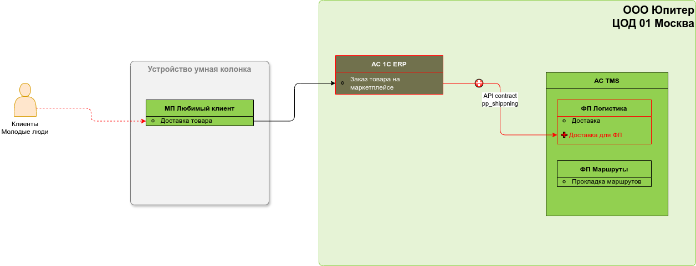

## Описание задачи

_Описывается проблема или задача, которую необходимо решить путем данных изменений_

## Бизнес-архитектура (БА)
### Текущая архитектура бизнес-ландшафта
_Схема ландшафта функциональной области\областей AS-IS_

### Долгосрочная целевая архитектура бизнес-ландшафта
_Схема ландшафта функциональной области\областей - далекая целевая TO-BE_

### Целевая архитектура бизнес-ландшафта на горизонт изменений
_Схема ландшафта функциональной области\областей - целевая в рамках данной итерации изменений TO-BE краткосрочная_

### Изменяемые объекты БА

## Архитетура данных (АД)
### Текущая архитектура данных
_Схема ландшафта функциональной области\областей AS-IS_

### Долгосрочная целевая архитектура данных
_Схема ландшафта функциональной области\областей - далекая целевая TO-BE_

### Целевая архитектура данных на горизонт изменений
_Схема ландшафта функциональной области\областей - целевая в рамках данной итерации изменений TO-BE краткосрочная_

### Изменяемые объекты АД

## Прикладная архитектура (ПА)
### Текущая архитектура прикладного ландшафта
_Схема прикладного ландшафта функциональной области\областей AS-IS_

### Долгосрочная целевая архитектура прикладного ландшафта
_Схема прикладного ландшафта функциональной области\областей - далекая целевая TO-BE_

### Целевая архитектура прикладного ландшафта на горизонт изменений
_Схема прикладного ландшафта функциональной области\областей - целевая в рамках данной итерации изменений TO-BE краткосрочная_

### Изменяемые объекты ПА

## Техническая архитектура (ТА)
### Текущая архитектура технического ландшафта
_Схема технического ландшафта функциональной области\областей AS-IS_

### Долгосрочная целевая архитектура технического ландшафта
_Схема технического ландшафта функциональной области\областей - далекая целевая TO-BE_

### Целевая архитектура технического ландшафта на горизонт изменений
_Схема технического ландшафта функциональной области\областей - целевая в рамках данной итерации изменений TO-BE краткосрочная_

### Изменяемые объекты ТА

## Ссылки на материалы
