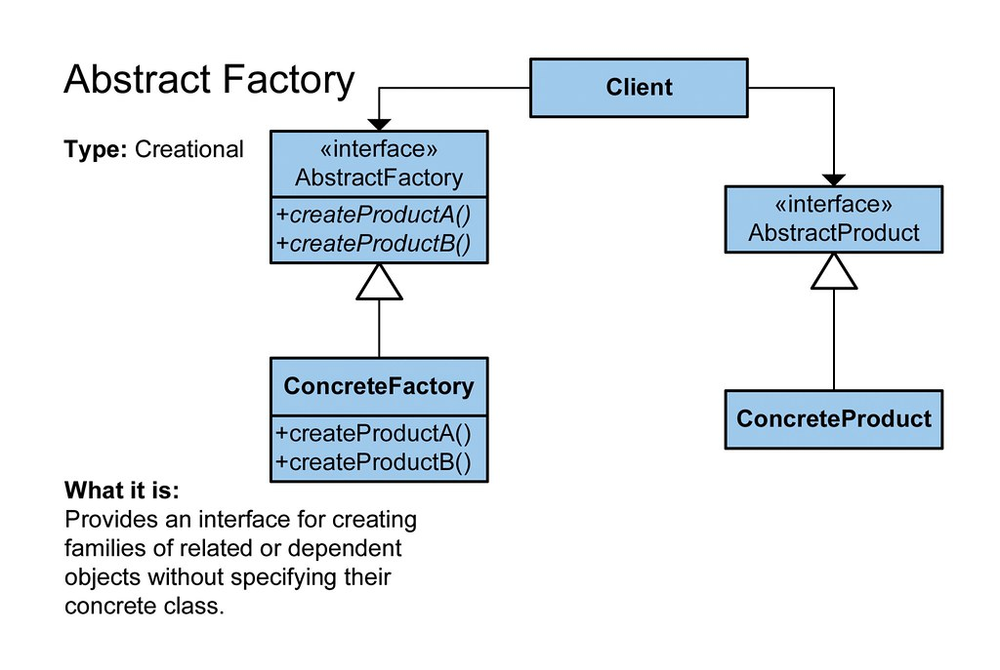

## Описание паттерна
Абстрактная фабрика (англ. Abstract factory) — порождающий шаблон проектирования, предоставляет интерфейс для создания 
семейств взаимосвязанных или взаимозависимых объектов, не специфицируя их конкретных классов. 
Шаблон реализуется созданием абстрактного класса Factory, который представляет собой интерфейс для создания компонентов 
системы (например, для оконного интерфейса он может создавать окна и кнопки). Затем пишутся классы, 
реализующие этот интерфейс.

### Плюсы
- изолирует конкретные классы; 
- упрощает замену семейств продуктов; 
- гарантирует сочетаемость продуктов.

### Минусы
- сложно добавить поддержку нового вида продуктов

## Требования по применению
Рекомендован к применению при использовании парадигмы ООП.
- Система не должна зависеть от того, как создаются, компонуются и представляются входящие в неё объекты.
- Входящие в семейство взаимосвязанные объекты должны использоваться вместе и вам необходимо обеспечить выполнение этого ограничения. 
- Система должна конфигурироваться одним из семейств составляющих её объектов. 
- Требуется предоставить библиотеку объектов, раскрывая только их интерфейсы, но не реализацию.

## Ссылки на материалы
